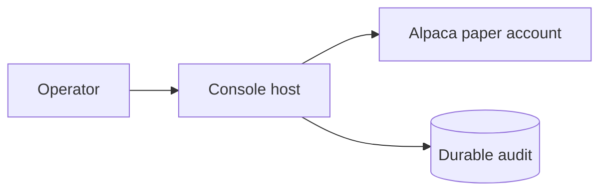
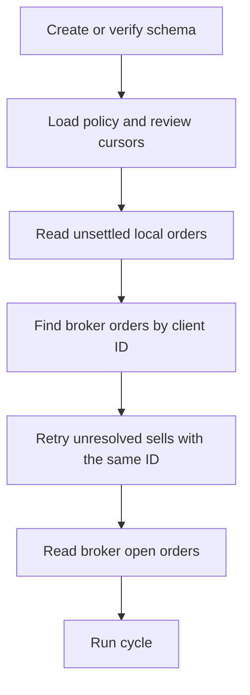

# Operations



```powershell
dotnet run --project src/Xakpc.Alpaca.NøIdea -- --audit
```

How the system starts, runs, fails, and gets tested.

## Deployment

The system does not run through a closed market. A normal live session stops when the Alpaca
clock reports that the market is closed. The operator starts a new process for the next
market session. This rule prevents an unattended process from spending model tokens tomorrow.

```csharp
if (!clock.IsOpen)
{
    break;
}
```

The operator starts the program. **After startup the system does not require trade
approval.**

The deployed image holds the .NET host and the pinned Alpaca MCP server. The host starts one
read-only `stdio` child inside its own container. The deployment needs no Docker socket and
no second container.

Development uses one permanent read-only MCP container over streamable HTTP on
`127.0.0.1:8100`. Keenable is a separate external HTTPS MCP service. See
[local development](local-development.md) and [Alpaca integration](../alpaca/mcp-integration.md).

## Accounts

The host trades one Alpaca paper account. The Alpaca MCP server and the typed SDK receive the
same paper credentials, and every SDK client is fixed to `Environments.Paper`. A second paper
account is the safe place for a rehearsal that must not touch the recorded one.

## Commands and effects

| Command | Current effect |
|---|---|
| `--live` | Run the live market-clock loop and permit paper orders. |
| `--live --dry-run` | Use live reads, write audit evidence, and intercept broker writes. |
| `--audit` | Open SQLite read-only, print evidence, and return nonzero for integrity faults. |
| `--recover-sittings` | Give every sitting a stopped process left open the `abandoned` status. |
| `--check-mcp` | Connect, list, and validate read-only Alpaca MCP tools. |
| `--smoke` | Submit a paper option buy, then cancel it or close a fill. This changes the paper account. |

Each process creates a timestamped plain log file before command routing. Therefore the audit
command does not change SQLite, but it does create a log file.

## Startup and recovery



Live startup calls `CreateSchemaAsync`. It does not call `AuditIntegrityAsync`. A sitting that a
stopped process left open stays `running` until `--recover-sittings` marks it `abandoned`. Run
that command, then `--audit`, between sessions. Do not run it while a live host is up.

Alpaca is the source of truth for positions and broker orders. The host restores policy and
position-review cursors from SQLite. It reconciles unsettled orders by client ID. An uncertain
buy is quarantined. An unresolved sell can be replayed with the same client ID.

Prior-close equity normally comes from Alpaca. Its safe fallback is process-local and does not
survive restart.

## Fault behavior

| Fault | Result |
|---|---|
| Missing or invalid market data | Exclude the row or hold new risk. |
| Agent failure | Record a hold when possible and skip new risk. |
| Required reviewer failure | Reject the proposal because quorum fails. |
| Uncertain buy | Keep its reservation and risk; do not replay it. |
| Uncertain sell | Reconcile and retry the same risk-reducing request. |
| Audit persistence failure | Throw `AuditPersistenceException` and stop the session. |
| Pre-close audit failure | Attempt one risk-reducing close, then stop. |

## Verification

```powershell
dotnet test Xakpc.Alpaca.NøIdea.slnx --no-restore --nologo
dotnet run --project src/Xakpc.Alpaca.NøIdea -- --audit --last 50
```

The deterministic suite currently has 195 passing tests.

## Human-facing documents

The repository root holds four documents for a person. No code reads them. Each one is a view
of the lode, so a change to a contract must also change the document that states it.

| File | Reader | Content |
|---|---|---|
| `README.md` | A visitor to the repository | Premise, architecture diagram, the AI logic, the risk gates, the Alpaca implementation, the commands, the measured sessions, and the known limits. |
| `DEVELOPMENT.md` | A developer on a workstation | Prerequisites, keys, the MCP container, the run commands, and the common faults. |
| `AGENTS.md` | A coding agent | Repository instructions. |
| `LICENSE` | A visitor to the repository | MIT, Pavel Osadchuk, 2026. The `README.md` footer links to it. |

`README.md` states no number that the lode does not support. Its sources are
[risk guardrails](../trading/risk-guardrails.md), [war-room summary](../war-room/summary.md),
[trading summary](../trading/summary.md), [storage schema](../storage/schema.md), and
[session results](session-results.md). Its "Known limits" section is the public view of
[improvements](../plans/improvements.md).

`docs/console.png` is the one image the README shows. It is a tracked copy of
`presentation/room-sitting.png`, because `presentation/` is git-ignored and a README image must
be tracked. It shows one complete war-room sitting from a 2026-09-03 dry run. Replace both files
together, and state no run figure in the README that this image alone must prove.

`DEVELOPMENT.md` and [local development](local-development.md) must agree.

## Related

- [Local development](local-development.md)
- [Observability](observability.md)
- [Session results](session-results.md)
- [Storage schema](../storage/schema.md)
- [Improvements](../plans/improvements.md)
