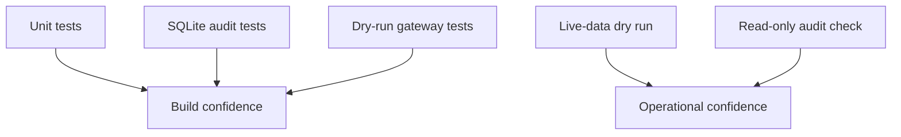

# Testing Strategy

One xUnit project tests deterministic rules, room behavior, storage links, dry-run isolation,
and transcript behavior. A live-data dry run verifies the external read path without sending
an order.



```powershell
dotnet test Xakpc.Alpaca.NøIdea.slnx --no-restore
dotnet run --project src/Xakpc.Alpaca.NøIdea -- --live --dry-run --once --agent stub
dotnet run --project src/Xakpc.Alpaca.NøIdea -- --audit
```

## Required coverage

- Quote, spread, expiration, capacity, and risk rejection.
- Proposal pre-validation and private vote behavior.
- Unique proposal IDs and immutable review passes.
- Tool request and result persistence.
- Decision and order linkage in one transaction.
- Hold and rejection persistence without an order.
- Audit integrity detection.
- Dry-run broker-write isolation.
- Mandatory exit behavior.
- Duplicate-close suppression and close lifecycle counters.
- Uncertain buy quarantine and same-ID sell recovery.
- Durable policy and position-review state.
- Mandatory exits on a blocked account.
- Exact account-wide halt reasons.
- Missing prior-close equity fallback for a new account with no position and no fill.
- Fail-closed behavior when prior-close equity is missing after a fill.

## Current result

The suite has 104 passing tests. The removed simulation-specific tests are not part of the
current product. The 2026-08-31 live-data dry run sent no order and the audit command reported
no fault.

## Related lodes

- [Risk guardrails](../trading/risk-guardrails.md)
- [Schema](../storage/schema.md)
- [Observability](observability.md)
- [Local development](local-development.md)
