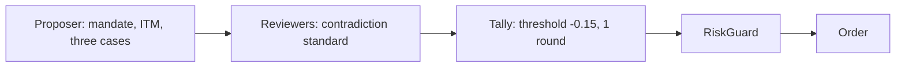

# Activity-First Room Plan

This plan makes the war room open positions on 2026-09-02. It is a plan for review. No item in
it is implemented until the user approves it.



## Measured problem

The 2026-09-01 live run held 4 sittings from 13:46 ET to the close. It opened no position.
Every sitting ended 0 approve, 3 reject, 1 abstain. The net vote was between -0.39 and -0.55.
The run had no warning and no error. It cost 5.67 USD.

| Sitting | Proposal | Proposer P(profit) | Initial LLM votes | Final net |
|---|---|---|---|---|
| 1 | AMZN 255 put, 4 Sep | 0.40 | 1 approve, 2 reject | -0.55 |
| 2 | GOOGL 335 put, 4 Sep | 0.40 | 0 approve, 2 reject, 1 fault | -0.53 |
| 3 | AAPL 325 call, 4 Sep | 0.42 | 0 approve, 3 reject | -0.55 |
| 4 | IWM 290 put, 4 Sep | 0.38 | 1 approve, 2 reject | -0.39 |

The causes are structural:

- The reviewer standard is "positive expected value against cash". Every permitted contract is
  a 1 to 3 day long option with a forced exit two sessions away. A reviewer can always show a
  negative value from time decay and spread. The standard rejects every trade.
- The market seat rejects a thesis that is "already in the price" or "an index move". The
  proposer only proposes continuation of the largest mover of the day. The two contracts do not
  agree.
- The proposer gives a profit probability of 0.38 to 0.42 and no payoff. Reviewers read this as
  "I expect a loss".
- The proposer selects at-the-money contracts. Most of the premium is time value. This is the
  quant objection.
- The discussion causes agreement. The skeptic approved AMZN and IWM alone, then changed to
  reject because "three reviews converge".
- The skeptic analysis in sitting 2 stopped at the 3,000 output-token limit and sent nothing.
- The launch profile uses `--no-rebuttal`. The proposer cannot change to a better strike.
- The process started at 13:46 ET, so only 4 sittings ran.

## Goal

Show activity on 2026-09-02, the last day a position can open before the 2026-09-03 15:30 ET
flatten. Profit is not required. At least one open position is required.

## Decisions

- Vote rule: change the reviewer standard and run with `--approve-threshold -0.15`.
- Start-up: no code change. The user starts the process at 9:30 ET.

## Change 1: reviewer standard

File: `Agents/Room/LlmPersona.cs`, the `VOTE AND CONFIDENCE` block.

- APPROVE when the thesis is coherent, the contract can express it, and no concrete
  contradiction exists.
- REJECT only for a false premise, a thesis that reversed with evidence, a contract that cannot
  express the thesis, or a fresh quote that breaks the thesis.
- These are not objections: a required move inside the implied-volatility range, time decay in
  the holding window, no scheduled catalyst, a move that already started. Continuation for one
  or two sessions is a valid thesis unless there is evidence of reversal.
- Profit probability stays a forecast. The confidence scale does not change.

Final vote phase: a vote change must give a fact or number the reviewer did not have before.
Agreement of other reviewers is not such a fact.

New-trade objective: the reviewer gives the exit bid for the loss, base, and gain cases, and
judges the asymmetry.

Raise `MaxOutputTokens` from 3000 to 8000. The skeptic used 4,840 output tokens when it failed.

```csharp
protected virtual int MaxOutputTokens => 8000;
```

## Change 2: seat prompts

Files: `Agents/Room/Personas/MarketPersona.cs`, `SkepticPersona.cs`, `QuantPersona.cs`.

- Market: "a catalyst after expiration cannot help" becomes "after the forced exit". Add: no
  scheduled catalyst is not an objection. A single-name move that occurs with an index move is
  tradeable when relative strength or weakness is confirmed. Reject only when the tape shows
  reversal.
- Skeptic: remove "news already reflected in the price" and "a move larger than the recent
  range" from the search list. Replace "makes the expected value negative" with "shows a false
  premise or a reversed thesis".
- Quant: keep the arithmetic role. Give the exit bid for a flat underlying and for the target.
  A flat-price loss is a cost to report, not a reason to reject. Reject on the contract only
  when a nearby strike or expiration is clearly better, or the contract cannot express the
  thesis.

## Change 3: proposer prompt

File: `Agents/Room/Personas/ProposerPersona.cs`, the new-trade task prompt.

- Add a `MANDATE` block. The system deploys capital when a coherent thesis exists. NO_TRADE is
  valid only when each inspected finalist has a concrete defect. "The move is uncertain" is not
  a defect.
- Option selection: for a hold of one or two sessions, prefer in-the-money contracts with delta
  between 0.60 and 0.75. The exit mark then follows the underlying, and time value is a small
  part of the premium. Per-trade capacity is 2 percent of equity, so a deeper contract fits.
- Thesis: give the loss, base, and gain cases as exit bids, and state the expected value in
  words. A probability below 0.5 is acceptable only when the gain is larger than the loss. Do
  not submit a proposal with a negative expected value. Change the contract or the finalist.
- `DO NOT REPEAT A REFUSED THESIS` stays.

`ProposalArguments` does not change. The cases go into the thesis and reasoning text.

## Change 4: launch profile

File: `Properties/launchSettings.json`.

```text
--live --rounds 1 --approve-threshold -0.15 --cycle-minutes 20
```

- `--no-rebuttal` is removed. The proposer can modify to a better strike.
- `--rounds 1` halves the debate cost and reduces agreement pressure.
- `--approve-threshold -0.15`. With four voters and the exposure seat abstaining, one 0.50
  reject gives net -0.125 and passes. One 0.75 reject gives -0.1875 and fails. Two rejects fail.
  `Program.cs` already parses a negative decimal. No code change.
- `--cycle-minutes 20`. A sitting takes 8 to 10 minutes. This gives 12 to 14 sittings in a
  session. Each sitting costs about 1.4 USD. The budget is up to 20 USD.

## Change 5: lode updates after the code

- `war-room/summary.md`: document the -0.15 margin and its arithmetic, and one round as the live
  default.
- `llm/persona-contracts.md`: rewrite "New trades" to the contradiction standard. Rewrite the
  last paragraph of "Price drift is not an objection" so a move that already started is an
  objection only with evidence of reversal. Add the in-the-money preference, the three-case exit
  bid, and `MaxOutputTokens` 8000.
- `plans/after-session-improvements.md`: mark the skeptic output-token item done. Record the
  four-sitting baseline.
- `summary.md`: update the verification paragraph.

## Verification

1. `dotnet build` and `dotnet test`. No test asserts prompt text.
2. Tally check without a model: `{Reject 0.5, Abstain, Abstain, Abstain}` with threshold -0.15
   approves. `{Reject 0.75, Abstain, Abstain, Abstain}` rejects. Add one test in `WarRoomTests`
   when none exists.
3. Dry rehearsal when the market is closed:

```powershell
dotnet run --project src/Xakpc.Alpaca.NøIdea -- --live --dry-run --once --rounds 1 --approve-threshold -0.15 --allow-stale-quotes
```

   Confirm in the log that the new prompt text is sent, the proposer gives three cases and
   prefers delta at or above 0.6, and a rejection gives a false premise or reversal, not time
   decay or "already in the price".
4. Live on 2026-09-02 from 9:30 ET with the launch profile. Success is one open order in a
   `CycleFinished` line and one position in a later `AccountRead` line. `--audit --last 20`
   must report no integrity issue after the session.

## Open items

- Typed expected-value fields on `ProposalAction`, so C# can check the proposer's cases.
- Counterfactual scoring of rejections. See
  [after-session improvements](after-session-improvements.md).
- Wait-for-open start-up. The user declined it for this session.

## Related lodes

- [After-session improvements](after-session-improvements.md)
- [War-room summary](../war-room/summary.md)
- [Persona contracts](../llm/persona-contracts.md)
- [Risk guardrails](../trading/risk-guardrails.md)
