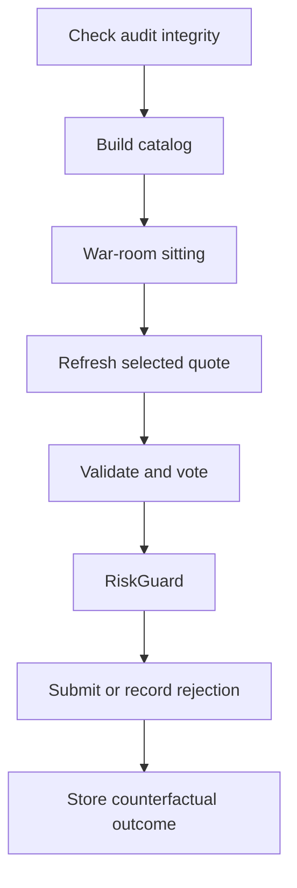
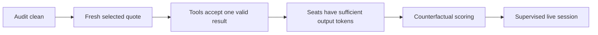

# After-Session Improvements

The 2026-08-31 live session is the current measured baseline for the war room. The zero-trade
result protected capital. The decision process also exposed faults that can block a valid
trade or hide an invalid process. This plan defines the repairs that must precede the next
trusted live session.



## Measured baseline

The 2026-09-01 single-cycle dry run is the current baseline for the room.

| Item | Measured value |
|---|---|
| Sitting duration | 8:30 |
| Proposal phase | 3:59 |
| Parallel analysis | 1:20 |
| One discussion round | 2:21 |
| Rebuttal | 0:48 |
| Model calls | 8 |
| Tokens | 825,883 |
| Estimated model cost | 0.7346 USD |
| Orders | 0 |

The proposer put forward a TSLA 370 call that expires on 2026-09-04. The skeptic rejected it
at 75 percent and showed that the Cybercab move of 5.5 percent was public on 31 August and
was already in the 6.63 premium, that break-even at 376.63 needs a further 2.32 percent, that
time decay of 1.29 each day removes 3.87 of the premium in three days, and that the event
occurs during the forced close instead of before it. The quant agreed at 50 percent and gave
the same arithmetic independently. The proposer then wrote a change to the 367.50 strike,
rejected its own change because the same problems remain, and withdrew.

**This result is correct.** The room found a negative expected value of about -260 USD and
refused the trade for 0.7346 USD. A refusal is a decision, not a fault.

The 2026-08-31 session gave the earlier baseline: 3 cycles, 21 model calls, 2,555,755 tokens,
4.6095 USD, and no order.

Network timeouts are controlled by the transport limit and not by the per-call limit. The
per-call limit only reports the fault after the retries finish. Grok seats lost 439.7, 474.2,
and 540.1 seconds to transport retries because the SDK gave one HTTP request 100 seconds while
a healthy Grok turn needs more. See [call limits](../llm/call-limits.md).

## P0 - Require a clean audit at live startup

The three live sittings are complete. The same database contains four older dry-run sittings
with status `running`, no review pass, and no decision. The audit command reports four
`incomplete_sitting` faults. Live startup creates the schema but does not run the integrity
check. A live process can therefore start and exit with code zero while the durable record is
already invalid.

**Contract:** A live session must not start when `AuditIntegrityAsync` returns an issue. A
separate recovery action must give an interrupted sitting a durable terminal status.

```csharp
var issues = await store.AuditIntegrityAsync(cancellationToken);
if (issues.Count > 0)
{
    throw new AuditPersistenceException("The audit store is not complete.");
}
```

**Order matters.** The gate cannot ship alone. The current database already holds
`incomplete_sitting` faults, so enabling the gate first stops every live start. Build the
recovery action first, clean the database with it, then enable the gate.

## P0 - Make structured submission safe

`submit_proposal` failed twice in cycle 2 and three times in cycle 3. The failed calls sent one
JSON string instead of a structured argument object. One `submit_analysis` call also failed.
The tools returned only `Error: Function failed.`

The proposer then recorded a minimal proposal with thesis and reasoning set to `test`. It
replaced that value with the real proposal. `ProposerPersona` keeps the last successful tool
result, so a model stop after the test call could send meaningless data to the room.

**Contract:** A proposal must contain a real thesis, at least one checkable condition, risks,
and one allowed action. The tool must reject placeholders. The model must submit one accepted
final proposal. A failure must return a useful validation message.

```csharp
if (captured is not null)
{
    throw new InvalidOperationException("A final proposal already exists.");
}
```

The fabrication half of this item is closed: stated market numbers are now compared with the
catalog and a difference above one percent returns `REJECT_FABRICATED_QUOTE`. The placeholder
and duplicate-submission halves stay open. The tool still converts an empty thesis to
`(no thesis given)` rather than refusing it.

## P1 - Give the skeptic sufficient output tokens

The skeptic reached its 3,000-token output limit twice on 2026-08-31 and submitted no
analysis. The call did not fail. The model used all of its output allowance on reasoning and
never called `submit_analysis`, so the seat became a fault and an abstention.

The seat runs on a reasoning profile with no sampling temperature. It did not hit the limit
on 2026-09-01, but the limit is unchanged, so the fault can return.

**Contract:** A reasoning seat must have sufficient output tokens to reason and then call its
submission tool. Measure the used output tokens before you select the value.

## P1 - Use a fixed cycle schedule

This item applies to the 30-minute war-room cycle only. The deterministic exits no longer use
that cadence: they run on a separate one-minute timer. See
[hard-exit loop](../trading/hard-exit-loop.md).

The code waits 30 minutes after a cycle completes. The measured cycle starts were 38 and 41
minutes apart because the sittings used 7 to 10 minutes. The Lode currently describes one
cycle every 30 minutes.

**Contract:** Choose one schedule and document it. A fixed schedule uses the next 30-minute
boundary and skips, rather than queues, a boundary when the prior cycle is still active.

```csharp
var next = previousScheduledStart + options.CycleInterval;
var delay = next - timeProvider.GetUtcNow();
if (delay > TimeSpan.Zero)
{
    await Task.Delay(delay, timeProvider, cancellationToken);
}
```

Starting at 18:07 UTC also limits the evidence to the last two hours of the US session. It is
not a full-day strategy test.

## P1 - Score the rejected contract after the session

A rejection now carries its evidence. The remaining work is the counterfactual: a later
process must mark each rejected contract at the planned exit rule, and compare the seat
probabilities with the observed result.

**Contract:** A stored rejection must produce a counterfactual P&L and a Brier score for each
seat without an order being sent. Use the option symbol, the quote, and the probabilities on
the decision row and the review pass.

## P1 - Require an edge over cash

The proposer selected the best available trade even when its own profit probability was at or
below 0.50. A low win probability can still have positive expected value, but the proposal did
not estimate payoff size or expected return.

**Contract:** A proposal must compare its expected value with cash. It must state the loss,
base, and gain cases. `NO_TRADE` is required when the estimated edge does not pay for spread,
theta, and likely volatility change.

The proposer must also verify price-path claims from bars. The AMZN statement "no intraday
bounce" was false. The market persona also called the Indicative option feed `OPRA` and called
the 2026-09-03 flatten time "tomorrow" on 2026-08-31. Prompts must receive the feed name and
exact remaining session count as typed context.

## P1 - Report the cost of a failed call

`TokenLedger` records a call from its response. A failed call has no response, so it records
nothing. The two failed runs on 2026-09-01 printed `Run cost 1 calls, 0 tokens, about
0.0000 USD` although each retry sent a prompt of about 400,000 tokens and was billed.

**Contract:** A cycle cost line must not report 0.0000 USD when a seat failed. Count the failed
attempt, and mark the token total as incomplete when a call returns no usage.

See [call limits](../llm/call-limits.md).

## P2 - Reduce cost after correctness repairs

The run used 2.56 million tokens for three hold decisions. The proposer used 1.20 million
tokens and cost about 2.70 USD. Anthropic calls reported no cached input. Repeated structured
submission failures resent the full context.

After P0 and P1 are complete:

1. Add supported cache breakpoints to stable prompts and tool schemas.
2. Limit tool-result size and repeated research.
3. Keep Grok on the research-heavy proposer path, OpenAI on the market and quant seats, and
   Anthropic on the skeptic seat while measurements support this assignment.
4. Measure total sitting time, tool calls, information gained, and cost for each seat before
   another role change or seat removal.

## Behaviors to keep

- Paper-only broker access and read-only agent tools worked.
- Catalog admission and final stale-quote rejection failed closed.
- The host stopped when the market closed.
- Reviewers corrected the false AMZN price-path claim.
- The quant compared premium, spread, delta, theta, and forced-exit timing.
- The three live sittings have complete review passes and decisions.
- Two seats on different providers found the same negative expected value independently.
- The proposer examined two other strikes before it withdrew, and gave a reason for each.

## Required decisions

Confirm whether a proposer withdrawal ends the sitting or whether reviewers must still
vote on the last trade proposal. The current code lets the proposer end the sitting alone.

Evidence from 2026-09-01: the withdrawal agreed with both reviewers, so a vote would have
changed no outcome. A vote would add five scored probabilities for each refusal. The vote
phase has not run in any observed sitting, so `VoteTally` quorum behaviour stays unmeasured.

## Completion criteria



- `--audit` reports no integrity issue before and after the session.
- A sitting that exceeds ten minutes can still use a newly refreshed valid quote.
- No placeholder proposal can enter pre-validation.
- No seat loses its analysis to its own output-token limit.
- A rejected proposal produces a counterfactual P&L and a Brier score for each seat.

## Related lodes

- [Live cycle](../trading/live-cycle.md)
- [Risk guardrails](../trading/risk-guardrails.md)
- [War-room summary](../war-room/summary.md)
- [Storage schema](../storage/schema.md)
- [Observability](../operations/observability.md)
- [LLM summary](../llm/summary.md)
- [Open strategy questions](open-strategy-questions.md)
