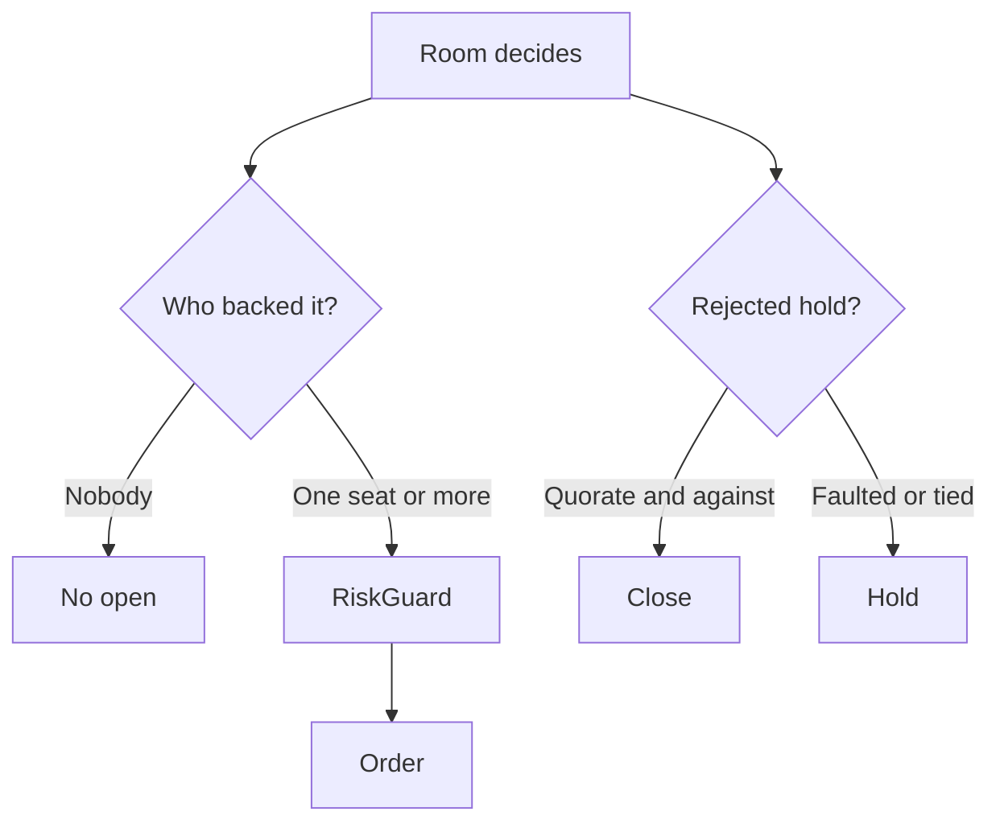
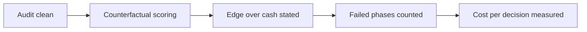

# After-Session Improvements

The open repairs. Measured numbers are in [session baselines](session-baselines.md); this file
holds only what is not yet done and why it matters.

## Closed since 2026-09-02

These were the four defects the first trading day exposed. All are repaired and covered by
tests.

- **Silence bought.** An open needed only `net > threshold`, and a room of four abstentions has
  a net of exactly zero. An open now also needs one seat that voted Approve. See
  [war-room summary](../war-room/summary.md).
- **A rejected hold did nothing.** A position review that voted against holding left the
  position open. It now closes, under four guards. See [live cycle](../trading/live-cycle.md).
- **No Anthropic cache.** The system block now carries a one-hour cache breakpoint. See
  [LLM summary](../llm/summary.md).
- **No way to end an interrupted sitting.** `--recover-sittings` gives it the `abandoned`
  status. See [storage schema](../storage/schema.md).

## P1 - Score the rejected contract after the session

A rejection carries its evidence: the option symbol, the quote, the seat probabilities, and the
rejection code are on the decision row and the review pass. The counterfactual is still missing.

**Contract:** A stored rejection must produce a counterfactual P&L and a Brier score for each
seat, without an order being sent. A refusal that is never scored teaches the system nothing.

## P1 - Require an edge over cash

A proposal states a profit probability but does not estimate payoff size or expected return. On
2026-09-02 two seats voted to abstain while they stated a probability of 0.41, and the room
still opened the position. The approval rule stops that particular result, but the proposal
contract is still weaker than it should be.

**Contract:** A proposal must compare its expected value with cash. It must state the loss,
base, and gain cases. `NO_TRADE` is required when the estimated edge does not pay for spread,
time decay, and a likely change in volatility.

## P1 - Report the cost of a failed call

`TokenLedger` records a call from its response. A failed call has no response, so it counts the
call and adds no tokens. A cycle can therefore report `0.0000 USD` for a seat that sent a large
prompt and was billed.

**Contract:** A cycle cost line must not report zero when a seat failed. Count the attempt, and
mark the token total as incomplete when a call returns no usage.

## P1 - Count a failed analysis

`VoteTally` counts a faulted vote, and one faulted vote fails quorum. A faulted **analysis** is
counted nowhere. On 2026-09-02 the skeptic analysis failed on a JSON conversion after 72.4
seconds and the verdict still read `0 faulted`. The room looked complete while a seat was
missing from the phase that forms the independent opinion.

**Contract:** A sitting must report how many seats lost a phase, not only how many lost a vote.

## P2 - The daily budget is spent first-come

`MaxNewPositionsPerDay` is 4. On 2026-09-02 it was consumed by 16:28, and the catalog then
dropped the whole universe on `daily-new-position-limit` for the remaining five cycles. Nothing
compares the quality of the fourth trade of the morning with a better one in the afternoon.

**Contract, when a full day is available again:** decide whether the day's opens are a budget
that any hour may spend, or a rate. Do not change the limit without that decision. See
[risk guardrails](../trading/risk-guardrails.md).

## P2 - No guard near the forced exit

`MandatoryExitReason` sells at the flatten instant. Nothing stops an open one minute before it.
A position bought at 19:29 UTC pays the full spread and is sold at 19:30.

**Contract:** refuse a new open inside a stated period before the flatten. This is an accepted
gap, not an invariant, until that period is chosen.

## P2 - Reduce cost further

After the cache breakpoint, in this order:

1. Measure the cache hit rate for each seat over a full session.
2. Limit tool-result size and repeated research.
3. Keep Grok on the research-heavy proposer path, OpenAI on the market and quant seats, and
   Anthropic on the skeptic seat while measurements support this assignment.
4. Measure total sitting time, tool calls, information gained, and cost for each seat before
   another role change or seat removal.

## Required decisions

Confirm whether a proposer withdrawal ends the sitting or whether reviewers must still vote on
the last trade proposal. The current code lets the proposer end the sitting alone. A withdrawal
produces an empty tally, so it can never escalate to a close.

## Completion criteria

- `--audit` reports no integrity issue before and after a session.
- A rejected proposal produces a counterfactual P&L and a Brier score for each seat.
- A proposal states its loss, base, and gain cases.
- A sitting reports a lost analysis as clearly as it reports a lost vote.

## Related lodes

- [Session baselines](session-baselines.md)
- [Live cycle](../trading/live-cycle.md)
- [Risk guardrails](../trading/risk-guardrails.md)
- [War-room summary](../war-room/summary.md)
- [Storage schema](../storage/schema.md)
- [LLM summary](../llm/summary.md)
- [Open strategy questions](open-strategy-questions.md)
