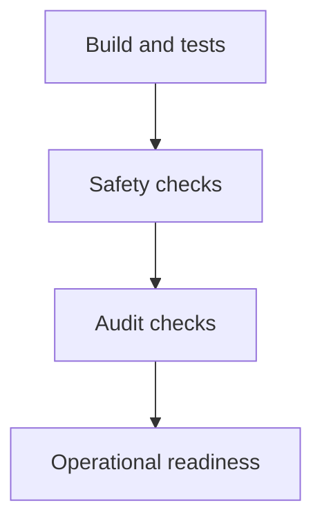

# Definition of Done



## Code

- [x] The solution builds without warnings.
- [x] The current test suite passes.
- [x] The runtime has only live-data operation modes.
- [x] Dry run intercepts all broker writes.

## Safety

- [x] Paper environment is fixed in code.
- [x] Models have no broker-write tool.
- [x] Current quote and hard risk checks fail closed.
- [x] Mandatory exits run before model work.
- [x] Order reservation precedes submission.
- [x] Pending sells prevent duplicate close requests.
- [x] A blocked account still runs mandatory exits before it skips model work.
- [x] Startup restores policy, review cursors, and unsettled order state.

## Audit

- [x] Sittings, review passes, and tool results persist.
- [x] Holds, rejections, opens, and closes persist.
- [x] Orders link to decision events.
- [x] Order audit rows reconcile terminal broker lifecycle changes.
- [x] Audit persistence failure stops the session.
- [x] `--audit` is read-only and checks integrity.
- [x] A clean live-data stub dry run produces a valid audit.
- [ ] A market-hours LLM dry run produces complete tool and decision evidence.

```powershell
dotnet test Xakpc.Alpaca.NøIdea.slnx --no-restore
dotnet run --project src/Xakpc.Alpaca.NøIdea -- --audit
```

## Related lodes

- [MVP roadmap](mvp-roadmap.md)
- [Testing strategy](../operations/testing-strategy.md)
- [Audit schema](../storage/schema.md)
