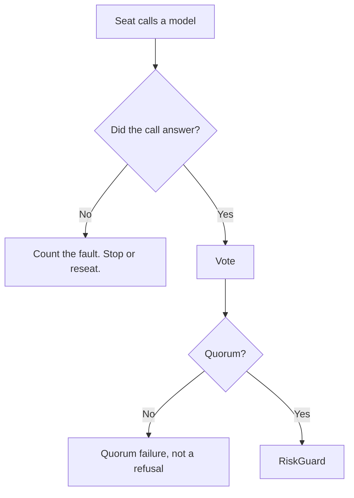

# Improvements

The only plan file. It holds what is not done and why it matters. Measured numbers are in
[session results](../operations/session-results.md). Completed work is not recorded here; it is
described as current state in the file that owns the contract.



## Before any future live run

**The flatten instant is in the past.** `RiskOptions.CompetitionFlattenUtc` is
2026-09-03 19:30 UTC and `RiskGuard.CheckContract` accepts an expiration through 2026-09-04. A
new run flattens immediately and admits no contract. Choose a new horizon, or make the horizon
a daily rule instead of a fixed instant. See [risk guardrails](../trading/risk-guardrails.md).

## P0 - A failed model call must not look like a decision

**A failed proposer call is recorded as `NO_TRADE`.** On 2026-09-03 the proposer failed five
times between 14:33 and 15:47 UTC. Each failure produced `Hold - the proposer found no trade`,
`0 rejected`, and `0.0000 USD`. Four cycles of the last trading day cannot be told apart from a
deliberate refusal in the audit.

**Contract:** a transport fault, a timeout, and a refusal are three different outcomes. Store
the fault with its own status. Retry the call at least once. Never write a decision row that
claims the model chose.

**A repeated provider fault has no breaker.** The same `HTTP 429 (insufficient_quota)` answer
came back 42 times over four hours, and cycle 9 called out exactly like cycle 1.

**Contract:** count identical faults for one provider. A quota or authorization fault is
permanent, so stop the seat after the second one. Then reseat the room or stop the run, and say
which in the log.

**A room that cannot reach quorum must not sit.** `RequireEveryVoter` makes one faulted seat an
outright rejection. With two dead seats, seven complete sittings on 2026-09-03 could not
approve anything, and the proposer and the skeptic were paid for all seven.

**Contract:** test the room before the proposer is paid. If the seats that must vote cannot
answer, end the cycle with a stated reason.

**A quorum failure is not a refusal.** Those seven rejections carry the code `ROOM_VOTE` and the
text "the room did not back it". A later score reads them as opinions about a contract.

**Contract:** give a quorum failure its own rejection code, and exclude it from any
counterfactual score.

## P1 - Score the rejected contract

A rejection carries the option symbol, the quote, the seat probabilities, and the rejection
code. The counterfactual is still missing.

**Contract:** a stored rejection must produce a counterfactual profit and loss and a Brier score
for each seat, without an order. A refusal that is never scored teaches the system nothing. This
is also the first step to any measured seat weighting. See
[dropped designs](../architecture/dropped-designs.md).

## P1 - Report the cost of a failed call

`TokenLedger` reads its numbers from a response. A failed call has none, so it counts the call
and adds no tokens. The 2026-09-03 run reported two seats at `0.0000 USD` after 42 billed
attempts.

**Contract:** a cost line must not report zero for a seat that failed. Count the attempt, and
mark the token total as incomplete when a call returns no usage.

## P1 - Count a failed analysis

`VoteTally` counts a faulted vote. A faulted **analysis** is counted nowhere. On 2026-09-02 the
skeptic analysis failed after 72.4 seconds and the verdict still read `0 faulted`.

**Contract:** a sitting must report how many seats lost a phase, not only how many lost a vote.

## P1 - Run the integrity audit at startup

Live startup verifies the schema version. It does not call `AuditIntegrityAsync`. A broken link
from an earlier process is found only when an operator runs `--audit` by hand.

**Contract:** verify the record before the session adds to it, or state in the log that the
check was skipped.

## P2 - The daily budget is spent first-come

`MaxNewPositionsPerDay` is 4. On 2026-09-02 it was consumed by 16:28, and the catalog then
dropped the whole universe on `daily-new-position-limit` for five cycles. Nothing compares the
quality of the fourth trade of the morning with a better one in the afternoon.

**Contract, when a full day is available again:** decide whether the day's opens are a budget
that any hour may spend, or a rate. Do not change the limit without that decision.

## P2 - No guard near the forced exit

`MandatoryExitReason` sells at the flatten instant. Nothing stops an open one minute before it.
On 2026-09-03 two cycles ran at 19:28 and 19:51 UTC and paid the proposer to find the same
answer the code already had: `hoursToForcedExit: 0`.

**Contract:** refuse a new open inside a stated period before the flatten, and do not open a
sitting that cannot produce a legal trade.

## P2 - The exit loop needs the process

The hard exits run inside the live process. On 2026-09-03 the market opened at 13:30 UTC and the
first process started at 14:33 UTC, so two positions were unmanaged for 63 minutes. Alpaca has
no stop order and no bracket order class for options, so there is no broker-side substitute.

**Contract:** decide whether an overnight or pre-open position is permitted at all. If it is,
the process must start before the open.

## P2 - Reduce cost further

In this order:

1. Measure the cache hit rate for each seat over a full session.
2. Limit tool-result size and repeated research.
3. Keep Grok on the research-heavy proposer path, OpenAI on the market and quant seats, and
   Anthropic on the skeptic seat while measurements support this assignment.
4. Measure sitting time, tool calls, information gained, and cost for each seat before another
   role change or seat removal.

## Open strategy questions

Real paper-trade outcomes must answer these. The code is not the place to guess.

- Do 2 to 10 days to expiration give enough liquidity and time?
- Are the 50 percent take-profit and 60 percent stop-loss defaults suitable?
- Does the 15 percent spread cap admit poor fills?
- Which personas add information after costs?
- Does confidence-weighted sizing improve account equity?
- When is a defined-risk multi-leg structure justified?

```sql
SELECT action, outcome, reason, risk_result
FROM decision_events
WHERE mode = 'live'
ORDER BY timestamp_utc;
```

## Required decisions

- Does a proposer withdrawal end the sitting, or must the reviewers still vote on the last
  proposal? The current code lets the proposer end the sitting alone, and a withdrawal produces
  an empty tally that can never escalate to a close.
- Is the standing new-trade threshold 0 or -0.15? The compiled default is 0. Every measured
  session used -0.15 from the debug profile. One of the two must become the default.

## Invariants that hold while these are open

- A risk appetite value is a human decision.
- A strategy calibration needs enough real outcomes.
- A model claim needs comparison with a simple reference.
- The agent can narrow policy within hard bounds but cannot widen risk.

## Related lodes

- [Session results](../operations/session-results.md)
- [Live cycle](../trading/live-cycle.md)
- [Risk guardrails](../trading/risk-guardrails.md)
- [War-room summary](../war-room/summary.md)
- [Votes to verdict](../war-room/vote-and-verdict.md)
- [Storage schema](../storage/schema.md)
