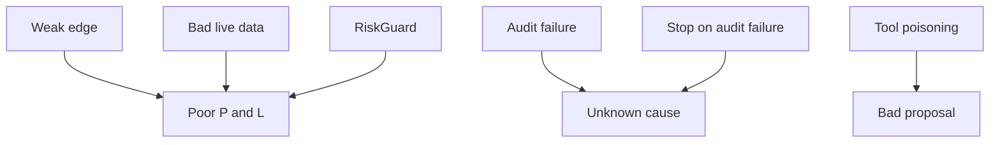

# Main Risks

The largest risk is weak trading judgment, not code mechanics. The second risk is incomplete
evidence that prevents diagnosis.



| Risk | Control |
|---|---|
| Models do not beat the market | Small long-option risk and real-outcome measurement. |
| Stale or poor quotes | Current two-sided quote, age, and spread gates. |
| Prompt injection in research | Read-only tools, typed output, and deterministic risk. |
| Duplicate or uncertain order | Durable client ID reservation before submission. |
| Rolling news count misses a replaced headline | Scheduled review remains active; headline-ID cursor is not built. |
| Missing evidence | Fatal audit persistence policy and integrity command. |
| Provider or tool outage | Fail closed and hold new risk. |

```csharp
if (!verdict.Allowed)
{
    await RecordDecisionAsync(..., outcome: "rejected", ...);
}
```

## Related lodes

- [Fault handling](../operations/fault-handling.md)
- [Risk guardrails](../trading/risk-guardrails.md)
- [Observability](../operations/observability.md)
- [Historical model evidence](../research/historical-model-evidence.md)
