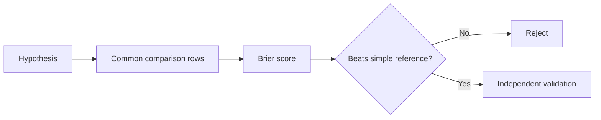

# ML Hypotheses

No historical model currently authorizes trades. The host must collect real-trade evidence
before it adds a learned strategy component.



## Rejected result

The measured historical model scored `0.17142`. The option-price reference scored `0.15345`
on the same rows. The model does not provide trade edge.

## Future acceptance contract

```text
candidate model score < simple reference score
and result holds on a later time split
and the feature is available before the decision
```

A future experiment must use real-trade audit outcomes when enough samples exist. It must
record the feature availability time. It must not use future data or different comparison
rows.

## Related lodes

- [Historical model evidence](../research/historical-model-evidence.md)
- [Open strategy questions](open-strategy-questions.md)
- [Audit schema](../storage/schema.md)
