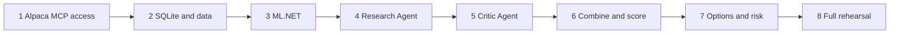

# MVP Roadmap

Eight phases. Each phase has an exit condition. Do not start a phase before the previous
exit condition is true.

**Current position: before Phase 1.** `Program.cs` prints `Hello, World!`.

## Phase 1: Alpaca MCP access

1. Create the .NET 10 console project. *(Done.)*
2. Add the C# MCP SDK (`ModelContextProtocol`).
3. Add the Alpaca MCP server as a git submodule at `external/alpaca-mcp-server`. Pin the
   commit.
4. Build and tag the Docker image. Pin the tag.
5. Configure a development paper account.
6. Start the read-only Alpaca MCP server from C# with `StdioClientTransport`.
7. Connect a read-only `McpClient`. List and filter the research tools.
8. Start a separate trading Alpaca MCP server. Connect a trading `McpClient`.
9. Confirm that the read-only connection exposes no trading tool.
10. Implement `IMarketDataGateway`.
11. Implement `ITradingGateway`.
12. Read the account state, bars, news, and option chains.
13. Submit one controlled test option order in the development paper account.
14. Read and close that position.

> **Exit:** C# can read research data through the read-only MCP connection and can perform
> the required paper-trading actions through the separate trading MCP connection.

## Phase 2: SQLite and historical data

1. Create the SQLite schema. Add `Microsoft.Data.Sqlite` and Dapper.
2. Download historical bars through the market-data gateway.
3. Download historical news through the market-data gateway.
4. Cache the data.
5. Implement replay time.
6. Implement the replay market and trading gateways.

> **Exit:** The program can replay a past market period with no live MCP call.

## Phase 3: ML.NET

1. Implement feature generation.
2. Generate the historical labels.
3. Split the data by time.
4. Train the SDCA logistic regression model.
5. Save the model.
6. Evaluate the probability quality.

> **Exit:** The Historical ML Expert returns a probability for a candidate event.

## Phase 4: Research Agent

1. Configure `IChatClient`.
2. Discover and filter the approved read-only MCP tools.
3. Add the approved MCP tools to `ChatOptions.Tools`.
4. Add `FunctionInvokingChatClient`.
5. Add a strict structured response.
6. Test current research and replay research.

> **Exit:** The Research Agent can choose approved Alpaca MCP tools and return one valid
> probability.

## Phase 5: Critic Agent

1. Add the critic prompt.
2. Give it the candidate and the prior evidence.
3. Give it the same approved read-only MCP tools.
4. Return one valid probability.

> **Exit:** The Critic can challenge a candidate and return a measurable forecast.

## Phase 6: Combine and score

1. Implement the Brier score.
2. Implement the expert history.
3. Implement equal weights for the cold start.
4. Implement reliability weights after the sample threshold.
5. Record all outputs.

> **Exit:** The system can produce one combined probability and show why.

## Phase 7: Options and risk

1. Implement option candidate selection.
2. Implement the market probability reference.
3. Implement the quote-quality checks.
4. Implement the risk rules.
5. Implement order idempotency.
6. Implement position management.

> **Exit:** The system can run a complete autonomous paper trade.

## Phase 8: Full rehearsal

1. Run a complete market session on the development paper account.
2. Restart the .NET host during an open position.
3. Restart an MCP server during a test.
4. Confirm recovery.
5. Review all skip records and trade records.
6. Tune the strategy parameters from the replay data.
7. Create the official $100,000 paper account.
8. **Do not use the official account for development trades.**

> **Exit:** [Definition of done](definition-of-done.md) is complete.

## Related

- [Open strategy questions](open-strategy-questions.md)
- [Main risks](main-risks.md)
