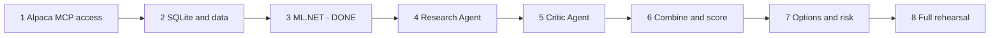

# MVP Roadmap

Eight phases. Each phase has an exit condition. Do not start a phase before the previous exit
condition is true, **unless the phase needs nothing from it**. Phase 3 needs no live Alpaca
connection, so it ran beside Phase 1.

**Current position: Phase 2 is the work.** Phase 1 is complete: the host reads the account,
submits a paper option order, and reads it back by client order id. Phase 3 is finished and its expert is excluded (ADR-013).

Phase 3 needs no live connection, so it did not wait for Phase 1. The rest of the roadmap does.

## Phase 1: Alpaca access — complete

1. Create the .NET 10 console project. *(Done.)*
2. Add the Alpaca MCP server as a git submodule at `external/alpaca-mcp-server`. Pin the
   commit. *(Done. `872abbf`.)*
3. Build the development MCP image and run the permanent server with `compose.dev.yaml`.
   *(Done. One service on port 8100.)*
4. Put the same pinned server into the application image for the deployed stdio mode.
   *(Done.)*
5. Confirm the read-only server exposes no order, position, or account tool. *(Done, and
   automated: `--check-mcp`.)*
6. Configure a development paper account and put the keys in `.env`. *(Done.)*
7. Add `ModelContextProtocol` and `Alpaca.Markets`. *(Done.)*
8. Connect the read-only `McpClient`. List and filter the research tools. *(Done. 34
   discovered, 25 approved.)*
9. ~~Connect a trading `McpClient`.~~ **Removed (ADR-001).** Deterministic C# uses the SDK.
10. Fail startup if the connection exposes a forbidden tool. *(Done, and measured: adding
    `account,trading` to the toolset makes the host refuse to start with 20 named tools.)*
11. ~~Implement `IMarketDataGateway`.~~ **Not built.** The SDK is already typed, and the
    interface existed to let a replay implementation substitute. Extract it when replay is
    actually built.
12. ~~Implement `ITradingGateway`.~~ Same reason. `AlpacaClients` exposes the three SDK
    clients directly.
13. Read the account state, bars, and option chains. *(Done.)*
14. Submit one controlled test option order in the development paper account. *(Done.)*
15. Read and close that position. *(Done. Read back by client order id.)*

> **Exit reached.** `--smoke` reads the account, selects a near-money call with a valid
> two-sided quote, reserves the client order id, submits, reads the order back by that id, and
> closes or cancels. Re-running with the same id resolves the existing order instead of
> submitting a second one. `--check-mcp` proves the tool isolation.

## Phase 2: SQLite and historical data

1. Create the SQLite schema. Add `Microsoft.Data.Sqlite` and Dapper.
2. Download historical bars through the market-data gateway.
3. Download historical news through the market-data gateway.
4. Cache the data.
5. Implement replay time.
6. Implement the replay market and trading gateways.

> **Exit:** The program can replay a past market period with no live MCP call.

## Phase 3: ML.NET — complete, and the expert is excluded

> Built and measured on branch `phase-3-historical-ml-expert`. That code is **not on this branch**; only the finding is.

1. Implement feature generation. *(Done. `FeatureGenerator` shared library.)*
2. Download the expired option contract catalog. *(Done. `scripts/acquire-contracts.sh`.)*
3. Generate the historical labels. *(Done. 1,361,525 rows from real strikes and expirations.)*
4. Split the data by time. *(Done. On decision dates, 70/15/15.)*
5. Train the SDCA logistic regression model. *(Done.)*
6. Save the model. *(Done. `data/historical-model.zip`.)*
7. Evaluate the probability quality. *(Done. `data/model-metrics.md`.)*

> **Exit reached.** The Historical ML Expert returns a calibrated probability for a candidate
> event. Test Brier 0.13988 against a 0.24959 base-rate baseline. The calibration is monotonic
> but under-confident in the middle of the range.

8. Compare the model with the option price. *(Done. `scripts/acquire-option-bars.sh` and the
   `market` step.)*

**The measured answer is negative.** The model beats ignorance and loses to the option price
in every period. The cheap filter cannot key on a model-versus-market gap, because that gap
tracks the model's own error. See [model against the market](../replay/model-vs-market.md).

The ladder-slope market probability is validated and survives as a reference. The minimum edge
and the cheap-filter threshold stay TBD, and now need a different signal to key on.

## Phase 4: Research Agent

1. Configure `IChatClient`.
2. Discover and filter the approved read-only MCP tools.
3. Add the approved MCP tools to `ChatOptions.Tools`.
4. Add `FunctionInvokingChatClient`.
5. Add a strict structured response.
6. Test current research and replay research.

> **Exit:** The Research Agent can choose approved Alpaca MCP tools and return one valid
> probability.

## Phase 5: Critic Agent

1. Add the critic prompt.
2. Give it the candidate and the prior evidence.
3. Give it the same approved read-only MCP tools.
4. Return one valid probability.

> **Exit:** The Critic can challenge a candidate and return a measurable forecast.

## Phase 6: Combine and score

1. Implement the Brier score.
2. Implement the expert history.
3. Implement equal weights for the cold start.
4. Implement reliability weights after the sample threshold.
5. Record all outputs.

> **Exit:** The system can produce one combined probability and show why.

## Phase 7: Options and risk

1. Implement option candidate selection.
2. Implement the market probability reference.
3. Implement the quote-quality checks.
4. Implement the risk rules.
5. Implement order idempotency.
6. Implement position management.

> **Exit:** The system can run a complete autonomous paper trade.

## Phase 8: Full rehearsal

1. Run a complete market session on the development paper account.
2. Restart the .NET host during an open position.
3. Restart an MCP server during a test.
4. Confirm recovery.
5. Review all skip records and trade records.
6. Tune the strategy parameters from the replay data.
7. Create the official $100,000 paper account.
8. **Do not use the official account for development trades.**

> **Exit:** [Definition of done](definition-of-done.md) is complete.

## What Phase 3 changed for the rest of the plan

Phase 6 combines three expert probabilities with reliability weights. One of the three is now
known to carry no information the option price does not already hold. The combiner still
works, but the alpha, if any exists, has to come from the Research and Critic agents, which
read news text rather than price history. That is a different information channel and is the
only remaining candidate.

## Related

- [Model against the market](../replay/model-vs-market.md)
- [ML hypotheses](ml-hypotheses.md)
- [Open strategy questions](open-strategy-questions.md)
- [Main risks](main-risks.md)
