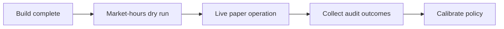

# MVP Roadmap

The live-only runtime is built. Remaining work is operational validation during market hours
and evidence collection from real paper trades.



## Remaining work

1. Run the full LLM war room during open option-market hours.
2. Confirm tool request and result rows for all model providers.
3. Confirm an accepted dry-run open has a linked order row.
4. Run `--audit` after each supervised validation session.
5. Start live paper operation only when the audit stays complete.
6. Use accumulated real-trade outcomes to review policy defaults.

```powershell
dotnet run --project src/Xakpc.Alpaca.NøIdea -- --live --dry-run --once
dotnet run --project src/Xakpc.Alpaca.NøIdea -- --audit --last 50
```

## Exit condition

The host completes a market-hours LLM dry run, sends no broker order, stores the full sitting
and tool evidence, and reports no audit integrity fault.

## Related lodes

- [Definition of done](definition-of-done.md)
- [Main risks](main-risks.md)
- [Observability](../operations/observability.md)
- [Historical model evidence](../research/historical-model-evidence.md)
