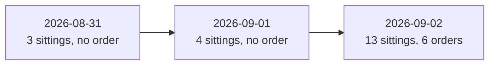

# Session Baselines

The measured numbers that a change is judged against. One row is one live process. Use these
values when you estimate cost, sitting time, or how much evidence a session produces.

## Current baseline: 2026-09-02

The first day the room traded. Two processes ran, because the operator stopped the first one to
start a new build. The forced flatten is 2026-09-03 19:30 UTC, so both positions that were open
at the end stayed open overnight.

| Item | 14:10-16:08 UTC | 16:11-20:02 UTC |
|---|---|---|
| Cycles | 4 (cut off in cycle 5) | 9 |
| Cycle interval | 20 minutes | 20 minutes |
| Opens | 3 (NVDA, GOOGL, MSFT) | 1 (META) |
| Closes | 1 (NVDA, take profit) | 1 (GOOGL, room vote) |
| Model calls | 44 through cycle 4 | 77 |
| Tokens | 4,201,813 through cycle 4 | 5,824,097 |
| Estimated cost | 6.8235 USD through cycle 4 | 9.3829 USD |
| End state | stopped by the operator | stopped when the market closed |

Equity moved from 100,000.00 to 100,199.84 for the day. The model spend for the day was about
17 USD of real money.

### What each seat cost

| Seat | Model | Calls | Tokens | Cost | Cache hit |
|---|---|---|---|---|---|
| skeptic | claude-sonnet-5 | 21 | 2,155,698 | 4.8993 USD | 0 percent |
| proposer | grok-4.6 | 14 | 1,456,860 | 1.9071 USD | 48 percent |
| market | gpt-5.6-terra | 21 | 1,442,246 | 1.6010 USD | 59 percent |
| quant | gpt-5.6-terra | 21 | 769,293 | 0.9755 USD | 59 percent |

The skeptic was 52 percent of the run cost. See [LLM summary](../llm/summary.md) for the cache
contract that this measurement produced.

### Sitting cost and duration

A sitting costs 0.80 to 2.09 USD and 11 model calls. A cycle with one position review and one
new-trade sitting used 17.5 of its 20 minutes. Cycle 1 is the worst case measured:

| Phase | Duration |
|---|---|
| Position review, complete sitting | 7:29 |
| New-trade sitting, complete | 9:27 |

## Results that the evidence supports

**The deterministic exit produced the day.** NVDA was bought at 4.59 and the hard-exit loop sold
it at a measured change of 54 percent, with no model in the path. That one exit is larger than
the day's net.

**The fresh quote at the gate saved 150 USD.** The room debated META at an ask of 15.42. The
gate read the quote again and the fill was 13.92. The stale number never authorised money.

**A delayed close costs money.** The room proposed closing GOOGL at a bid of 4.90 and the
proposal was rejected on a net of 0.00. The same close was approved two hours later and filled
near a bid of 4.43.

## Out-of-hours rehearsal

One `--live --dry-run --once --allow-stale-quotes` cycle on 2026-09-03 reviewed both open
positions and sent nothing: 28 calls, 1,600,948 tokens, 2.1162 USD, two sittings of about seven
minutes each. Both reviews voted to close.

The Anthropic cache was measured in that run. The first skeptic analysis reported 107,892 input
tokens with 47,550 cached, and the second 108,725 with 47,040, because the tool loop sends the
prefix again on every turn.

## Earlier baselines

| Session | Cycles | Model calls | Tokens | Cost | Orders |
|---|---|---|---|---|---|
| 2026-08-31 | 3 | 21 | 2,555,755 | 4.6095 USD | 0 |
| 2026-09-01 | 4 | 52 | 3,982,341 | 5.6665 USD | 0 |

Both sessions refused every trade. The 2026-09-01 verdicts were 4 rejected, each 0 approve,
3 reject, 1 abstain, at a net of -0.39 to -0.55. The cause was a reviewer standard that rejected
the whole eligible universe, and it is repaired. See
[persona contracts](../llm/persona-contracts.md).

A single 2026-09-01 dry-run sitting is the timing reference for one sitting: 8:30 in total,
3:59 to propose, 1:20 for the parallel analysis, 2:21 for one discussion round, 0:48 to rebut,
8 model calls, 825,883 tokens, 0.7346 USD.

## Related lodes

- [After-session improvements](after-session-improvements.md)
- [War-room summary](../war-room/summary.md)
- [LLM summary](../llm/summary.md)
- [Live cycle](../trading/live-cycle.md)
- [Hard-exit loop](../trading/hard-exit-loop.md)
