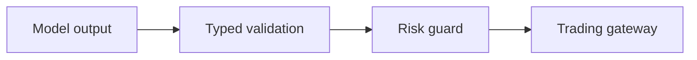

# Practices

AI researches and proposes. Deterministic C# controls risk and money.



## Engineering rules

- Use the simplest design that meets a current requirement.
- Do not remove a safety check to simplify code.
- Use `decimal` for prices, money, and probabilities.
- Use an injected `TimeProvider` for current time.
- Pass `CancellationToken` through asynchronous calls.
- Use project-owned records at Alpaca boundaries.
- Keep SQL in `Storage/` and use Dapper parameters.
- Use `apply_patch` for source edits.
- Add a test for each calculation that affects money or time.
- Write Lode text in ASD-STE100 Simplified Technical English.

```csharp
await connection.ExecuteAsync(new CommandDefinition(
    sql, new { proposalId }, cancellationToken: cancellationToken));
```

## Repository rules

The solution is `Xakpc.Alpaca.NøIdea.slnx`. The application is under `src/`. Tests are under
`tests/`. Build output goes under `build/`. Raw research files stay under `data/raw/` and do
not enter the live database.

The current host uses one read-only MCP connection for model research. Broker writes use the
typed Alpaca SDK through `ITradingGateway`.

## Related lodes

- [Technology stack](architecture/technology-stack.md)
- [Application structure](architecture/application-structure.md)
- [Testing strategy](operations/testing-strategy.md)
- [Storage summary](storage/summary.md)
