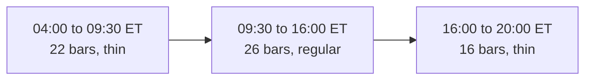

# Historical Dataset

> **The acquisition scripts are not on this branch.** They live on `phase-3-historical-ml-expert`. The data facts
> below are durable and worth keeping wherever the scripts sit.

The training data on disk. Two scripts build it. `data/raw/` is git-ignored, because the
scripts rebuild it byte for byte.

## What is on disk

| Item | Value | Built by |
|---|---|---|
| Symbols | The 13 in [universe](../trading/universe.md) | |
| Bar files | `data/raw/bars/<SYM>.15Min.json`, `<SYM>.1Day.json` | `acquire-history.sh` |
| News files | `data/raw/news/<SYM>.json` | `acquire-history.sh` |
| Contract files | `data/raw/contracts/<SYM>.<YYYY-MM>.json`, 416 files, 370 MB | `acquire-contracts.sh` |
| Option bar files | `data/raw/option-bars/<SYM>.<YYYY-MM>.json`, 416 files, 94 MB. Near-money call ladders, daily. | `acquire-option-bars.sh` |
| Bar range | 2023-01-03 to 2026-08-28, 133 MB | |
| Contract range | 2024-01-18 to 2026-08-28 | |
| SPY 15-minute bars | 58,434 | |
| SPY daily bars | 917 | |

## A raw file holds many API pages, not one JSON document

Each file is the raw API pages concatenated, one pretty-printed object for each page.
`SPY.15Min.json` holds 77 of them. **`JsonSerializer.Deserialize` over the whole file fails on
the second object.**

`RawJsonPages` reads them with `JsonReaderOptions.AllowMultipleValues = true`. That setting is
what makes the concatenated form readable.

The bar record uses the short Alpaca names: `o h l c v n vw t`. A contract record carries
`underlying_symbol`, `expiration_date`, `strike_price`, `type`, and `status`.

## The files have no duplicate bars

For `SPY.15Min.json` the count of bars and the count of unique timestamps are both 58,434.
A page token never repeats a bar.

The `--limit` value is a request, not a promise. The server returned about 760 bars for each
page although the script asked for 10,000. The loop follows `next_page_token` until it is
empty, so the page size does not matter.

## Extended hours: decided

**A session holds 64 15-minute bars. Only 26 of them are regular trading hours.** Alpaca
returns bars from 04:00 to 20:00 ET, and regular hours are 09:30 to 16:00 ET, so about 60% of
the 15-minute bars are pre-market or post-market.



> **Decision: the 15-minute features use regular-hours bars only.** `JsonBarSource` filters
> the intraday series on load, so a feature cannot read a thin bar.

The system trades in regular hours, so the label is a regular-hours event. Overnight movement
is not lost: the 1-day and 5-day features read the 1Day bars, which already span the gap.
A daily bar is a whole session, so the filter never applies to it.

## Two data faults that were found and fixed

**`NVDA.1Day.json` was truncated.** It held 63 bars from 2026-06-01 while every other symbol
held 917 from 2023-01-03. A partial early run left the file on disk, and the
`[ -s "$out" ]` resume check then skipped it forever. Every 1-day and 5-day feature for NVDA
was wrong. The repair is to delete the file first; a plain re-run cannot fix it.

**The last month failed to download.** A request with an end date at or after the current
session answers `subscription does not permit querying recent SIP data`. Both scripts now stop
at the last completed session: `END` in `acquire-history.sh`, `DATA_END` in
`acquire-contracts.sh`.

> Check a resumable download for a **short** file, not only for a missing one.

## News history is not usable

`acquire-history.sh` asks for `--limit 50` and does not page, so each news file holds about 50
articles from the last two days only. `content` and `summary` are empty strings.

This does not affect the ML expert, which reads numbers only. It does mean the **Research
Agent has no historical news for replay**. Paging the news download is the fix when replay
needs it.

## Derived files

| File | Content |
|---|---|
| `data/dataset.csv` | 1,361,525 labelled rows, 249 MB. Carries the identity columns (symbol, decision instant, spot, strike, expiration) so a row can be joined to an option price. Rebuildable. |
| `data/historical-model.zip` | The trained model, 5 KB. |
| `data/model-metrics.md` | The measured quality. Written by the Trainer. **Committed.** |
| `data/test-set-log.md` | Append-only record of every test-period reading. **Committed.** |
| `data/market-comparison.md` | The model-against-market verdict. **Committed.** |

`dataset.csv` and `historical-model.zip` are git-ignored, because they are rebuildable. The
two markdown files are committed: they are the evidence for the reported score. See
[model training](model-training.md).

## The scripts need the Alpaca CLI

`scripts/lib.sh` expects the CLI at `cli_0.0.14_windows_amd64/alpaca.exe`. That binary is
**not committed**: it is 9 MB, Windows only, and the deployed images are Linux. Download the
Alpaca CLI v0.0.14 windows-amd64 build into that folder before running any acquisition
script. No trading code calls it (ADR-001).

## How to rebuild

```bash
bash scripts/acquire-history.sh                       # bars and news
bash scripts/acquire-contracts.sh                     # expired option contracts
bash scripts/acquire-option-bars.sh                   # near-money call ladders
UNIVERSE="SPY QQQ" START=2024-01-01 bash scripts/acquire-history.sh
```

Both scripts skip a symbol that is already on disk, so they resume after an interruption.
The end date is a fixed past session, never today, so two runs give the same bytes.

## Related

- [Model training](model-training.md)
- [Option data availability](option-data-availability.md)
- [Replay mode](replay-mode.md)
- [Trading universe](../trading/universe.md)
- [Market data policy](../alpaca/market-data-policy.md)
