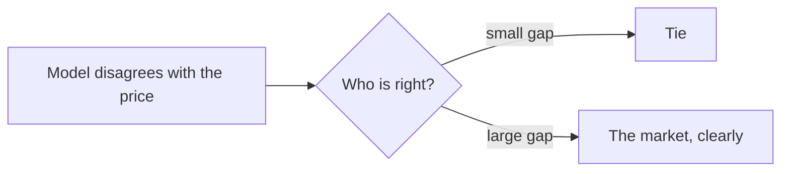

# Model Against the Market

> **The code that produced this is not on this branch.** The shared library, the Trainer and
> the acquisition scripts live on `phase-3-historical-ml-expert`. This file records the finding and the method,
> which stand on their own.

The measurement that decides whether the [Historical ML Expert](../replay/model-vs-market.md)
has an edge. **It does not.**

Run it with the `market` step of the Trainer. The report is `data/market-comparison.md`.

## The method

The market's own probability comes from the shape of the call ladder. A call is worth less as
the strike rises, and the rate of that fall is the chance of finishing above the strike:

```text
P(above K) = (C(K below) - C(K above)) / (K above - K below)
```

This needs **no implied volatility, no Black-Scholes solver, no interest rate and no dividend
assumption**. Only traded prices. `OptionPriceBook` computes it as a central difference around
each interior strike.

A ladder is rejected when a price rises with the strike (stale or broken), when any of the
three strikes traded fewer than 10 contracts that session, or when the result falls far
outside 0 to 1. One observed print sat below intrinsic value on a single contract, which is
why the volume floor exists.

The comparison runs at the **session close** only. The option bars are daily and close at the
last trade near 16:00 ET, so the matching decision instant is the final regular-hours 15-minute
bar, whose close is the same 16:00 price.

## The verdict

149,838 paired questions, 2024-01-18 to 2026-08-27, answered yes 44.5% of the time.

| Forecaster | Brier |
|---|---:|
| The model | 0.14925 |
| **The option market** | **0.13787** |
| Both averaged | 0.13842 |
| Always guess the base rate | 0.24697 |

**The market wins in every period, including the one the model was fitted on.**

| Period | Rows | Model | Market | Winner |
|---|---:|---:|---:|---|
| Train | 94,137 | 0.14276 | 0.13155 | market |
| Validation | 24,565 | 0.14599 | 0.14234 | market |
| Test | 31,136 | 0.17142 | 0.15345 | market |

Two details make the verdict stronger than the headline gap:

- **Losing in-sample.** Most rows fall on dates the model trained on. It still loses there.
- **The tilt favours the model.** An option price is a *risk-neutral* probability, carrying a
  drift of the risk-free rate rather than the underlying's expected return, so it understates
  the real-world chance slightly. The model is a real-world forecaster. The handicap runs in
  the model's favour and it still loses.

## The blend adds nothing

An equal average of the two scores **0.13842**, which is *worse* than the market alone
(0.13787). When two forecasts hold different information, averaging beats both. It does not
here, so the model carries no information the price does not already have.

## Disagreement makes the model worse, not better

This is the finding that matters for the architecture.

| Gap | Rows | Model Brier | Market Brier | Model said | Market said | Realized |
|---|---:|---:|---:|---:|---:|---:|
| 0.00-0.05 | 59,797 | 0.0860 | 0.0854 | 28% | 28% | 29% |
| 0.05-0.10 | 29,823 | 0.1471 | 0.1424 | 42% | 44% | 45% |
| 0.10-0.20 | 37,388 | 0.1964 | 0.1801 | 47% | 54% | 55% |
| 0.20+ | 22,830 | 0.2406 | 0.2002 | **54%** | **63%** | **67%** |

Read the last row. Where the two disagree most, the market said 63% and 67% happened. The
model said 54%. **The wider the disagreement, the more wrong the model is.**



> **A large model-versus-market gap is evidence of model error, not of opportunity.**

## What this breaks

The [cheap filter](../trading/live-cycle.md) step 5 compares the ML probability with the
market reference and continues only when they differ enough. On this evidence that filter
**selects for the model's own mistakes**. It would spend LLM money on the candidates the model
understands least, and pass a distorted probability into the combiner.

The filter cannot be used in that form.

## What survives

- **The ladder-slope market probability is good.** Brier 0.13787, monotonic calibration. It is
  a validated market reference and is worth using where the live path needs one.
- **The measurement machinery.** Leak-proof features, chronological splits, Brier and
  calibration scoring, reproducibility. Every other expert is scored with the same code.
- **The honest answer, before the competition rather than after it.**

## The honest exit condition, applied

[Model training](model-training.md) states: if the model shows no useful predictive value,
record the finding and do not keep the model because it exists.

The model beats ignorance easily (0.149 against 0.247). It does not beat the price. Since the
system trades against the price, not against ignorance, **the Historical ML Expert must not be
treated as a source of edge.** See [historical ML expert](../replay/model-vs-market.md)
for what its role becomes.

## Related

- [Model training](model-training.md)
- [Option data availability](option-data-availability.md)
- [Historical ML Expert](../replay/model-vs-market.md)
- [Forecast combination](../war-room/summary.md)
