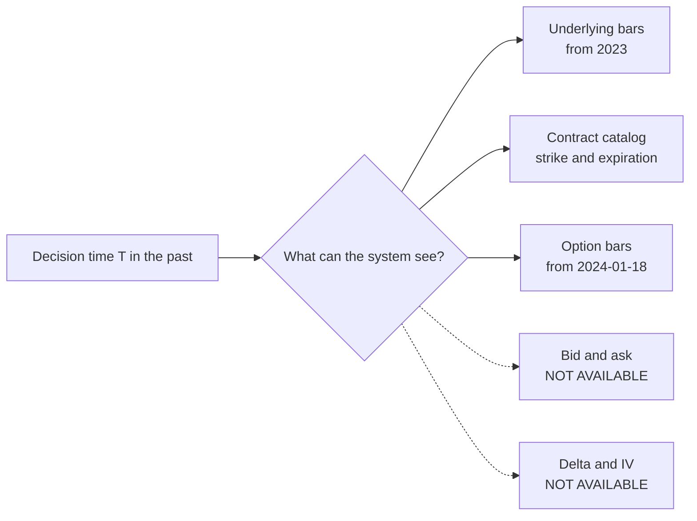

# Option Data Availability

> Measured with the Alpaca CLI. The acquisition scripts live on `phase-3-historical-ml-expert`.

What the Alpaca account gives for **historical** option data, and what it does not. Measured
on 2026-08-29 with `cli_0.0.14_windows_amd64/alpaca.exe`.

This file decides the shape of the training label and the limits of replay.

## What is available

| Source | Available | Measured |
|---|---|---|
| `option contracts --status inactive` | Yes | 21 SPY calls for the 2026-06-21 expiry |
| `data option bars` (OHLCV for one contract) | Yes, from **2024-01-18** | real bars for `SPY240621C00500000` |
| `data option trades` (tick) | Yes | trades from 2024-06-18 |

`SPY231215C00450000` returns `{}`. Two unrelated 2024 expirations both give a first bar on
exactly **2024-01-18**, so that date is a data floor, not a contract listing date.

## What is not available

| Source | State |
|---|---|
| Historical option **quotes** (bid and ask) | **Missing.** `/v1beta1/options/quotes` answers 404. |
| Historical **greeks** and implied volatility | **Missing.** `data option chain` and `data option snapshot` are latest-only. Neither has an as-of date. |



## The three consequences

**1. The training label is real, not synthetic.** The contract catalog gives strikes and
expirations that actually traded. The outcome comes from the 1Day bar of the expiration
session. No pseudo-strike grid is required. See [model training](model-training.md).

**2. The market probability reference can be rebuilt after all, from prices.** No historical
delta exists, but the **slope of the call ladder** gives the market probability directly:

```text
P(above K) = (C(K below) - C(K above)) / (K above - K below)
```

No implied volatility, no Black-Scholes, no interest rate. Option bars are enough, and
`scripts/acquire-option-bars.sh` downloads them. This is what made
[model against the market](model-vs-market.md) possible, and the reference it produces scores
Brier 0.13787 with monotonic calibration.

The **minimum edge** and the **cheap-filter threshold** still stay TBD, because the measured
model-versus-market gap turned out to track model error rather than opportunity. See
[strategy parameters](../trading/strategy-parameters.md).

**3. Replay cannot measure a spread.** The Options Evaluator rejects a wide, stale, one-sided,
or missing quote. None of those checks can run against history. Quote-quality rules are
testable in live paper trading only.

## The account also refuses recent SIP bars

A request with an end date at or after the current session fails:

```text
subscription does not permit querying recent SIP data
```

So every acquisition script must stop at the last completed session. `DATA_END` in
`scripts/acquire-contracts.sh` and `END` in `scripts/acquire-history.sh` hold that date.

## Related

- [Historical dataset](historical-dataset.md)
- [Model against the market](model-vs-market.md)
- [Model training](model-training.md)
- [Market data policy](../alpaca/market-data-policy.md)
- [Options evaluator](../experts/options-evaluator.md)
