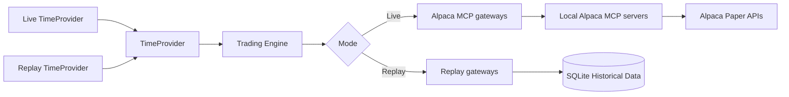

# Replay Mode

## Architecture

Three seams switch the mode. The strategy code does not change.



`ReplayRunner` drives the replay. `ReplayClock` gives the replay `TimeProvider`.
`ReplayMarketDataGateway` implements `IMarketDataGateway` over the SQLite tables.
`ReplayTradingGateway` implements `ITradingGateway`. It simulates an order. **It never sends
one.** It holds no Alpaca client at all, so it cannot reach a broker even if a defect tried.

The replay path does not start an Alpaca MCP server.

`ReplayRunner` owns time and nothing else. It steps the clock through the sessions that hold
data, and it calls one delegate at each step. It does not know what a cycle does, so the
trading loop can be given to it unchanged when Phase 7 builds it.

**A session comes from the data, not from a calendar.** A market holiday is a day with no
bars, so the project needs no holiday table.

## Replay data

`--import-history` loads `data/raw/` into the SQLite cache tables. The import is deterministic,
offline, and idempotent. **The replay process does not call Alpaca.**

| Table | Content | Measured for 2026-02-01 to 2026-08-28 |
|---|---|---|
| `bars` | 15Min and 1Day equity bars | 122,444 rows |
| `news` | Deduplicated news items | 16,088 rows |
| `option_contracts` | The expired contract catalog | 195,824 rows |
| `option_bars` | Daily option OHLCV | 151,718 rows |

### The step is one session

Historical option prices are daily closes. More than one cycle inside a session gives the
strategy no new option data, so `stepsPerSession` is 1 by default.

### Replay cannot see a quote

Alpaca serves no historical option quote and no historical greek. Every replayed candidate
carries `QuoteQuality.UnknownHistorical`, a null bid, a null ask, and a null delta, and
`IsTradeableQuote` is false (ADR-014). **The spread rule and the quote-age rule cannot be
tested offline.** They are live-only.

### A fill is optimistic

`ReplayTradingGateway` fills at the daily close and pays no spread. A live fill would be worse
by roughly the bid/ask on every trade. **Replay P&L is evidence about the logic. It is not a
forecast of live P&L.**

An order with no cached price at the replay instant is **rejected**, not filled at a guess.

## No future-data leak

> At replay time `T`, every expert must see only data that was available at or before `T`.

### The clamp is the clock, not the caller

Every query in `ReplayMarketDataGateway` carries `available_utc <= @asOf`, and `asOf` comes
from `ReplayClock.UtcNow`. A caller that asks for a range ending next week still sees nothing
past `T`. A leak cannot be introduced by passing a wider argument.

### Available, not stamped

**A bar is knowable when its interval ends, not when it starts** (ADR-015). The `bars` and
`option_bars` tables carry `available_utc` for this, and replay filters on that column only.

This is a measured fault, not a theory. The first replay run filtered on the bar timestamp. It
reported a market probability of 0% to 10% where about 50% was correct, because each cycle read
the closing premium of the session it was still inside. After the fix the same run reported 62%
to 71%, and 61 of 63 sessions produced a probability instead of 52.

`BarAvailabilityTests` holds the regression test.

This rule is mandatory. It applies to:

- ML feature generation.
- The Research Agent tools.
- The Critic Agent tools.
- The Options Evaluator.

The agent tools in replay mode must read from the replay data source. **They must not connect
to the live Alpaca MCP server.** The gateway injection gives this behavior for deterministic
code. For the LLM agents the host must register replay tool implementations, not the
discovered MCP tools. A replay run that starts an MCP client is a test failure.

A replay test must confirm that no future data is visible.

## Train and test split

The ML dataset must use a **time-based** split:

```text
Older period  -> Training
Later period  -> Validation
Newest period -> Test
```

**The system must not use a random train/test split for time-series market data.**

## Limits

Historical replay will not always reproduce the exact live options market. The free data
source has limits. Historical option-chain snapshots can differ from live option-chain data.

Therefore:

- Historical option bars and trades carry the 15-minute Basic-plan restriction and can be
  incomplete. Replay must account for that delay and for the availability limits.
- Replay is valid for model and agent calibration.
- Replay can test the strategy logic.
- Replay can test many order and risk rules.
- **Replay P&L is only as accurate as the stored historical option data.**

The project must state these limits in the submission. See
[market data policy](../alpaca/market-data-policy.md).

## LLM sample cost

LLM replay is slow and expensive. Mitigations:

- Run the ML expert on many historical samples.
- Run the LLM experts only on candidate samples that pass the cheap filter.
- Cache every LLM result.
- Do not repeat the same historical LLM request.

## Replay test checklist

- No future data is visible.
- The same live strategy code runs in replay.
- Agent tools use replay data, not live MCP data.
- ML training uses chronological splits.
- Forecast results are recorded.
- Expert scores update.
- Orders are simulated, not sent.

## Related

- [Model training plan](model-training.md)
- [Testing strategy](../operations/testing-strategy.md)
