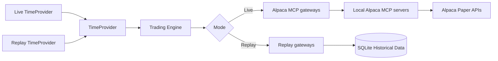

# Replay Mode

## Architecture

Three seams switch the mode. The strategy code does not change.



`ReplayRunner` drives the replay. `ReplayClock` gives the replay `TimeProvider`.
`ReplayMarketDataGateway` implements `IMarketDataGateway` over the SQLite tables.
`ReplayTradingGateway` implements `ITradingGateway`. It simulates an order. **It never sends
one.**

The replay path does not start an Alpaca MCP server.

## Replay data

Historical data can include stock bars, ETF bars, option bars when available, news, and
stored option snapshots when available.

The system must cache historical data in SQLite. **The replay process must not call Alpaca
for the same historical data on each run.**

## No future-data leak

> At replay time `T`, every expert must see only data that was available at or before `T`.

This rule is mandatory. It applies to:

- ML feature generation.
- The Research Agent tools.
- The Critic Agent tools.
- The Options Evaluator.

The agent tools in replay mode must read from the replay data source. **They must not connect
to the live Alpaca MCP server.** The gateway injection gives this behavior for deterministic
code. For the LLM agents the host must register replay tool implementations, not the
discovered MCP tools. A replay run that starts an MCP client is a test failure.

A replay test must confirm that no future data is visible.

## Train and test split

The ML dataset must use a **time-based** split:

```text
Older period  -> Training
Later period  -> Validation
Newest period -> Test
```

**The system must not use a random train/test split for time-series market data.**

## Limits

Historical replay will not always reproduce the exact live options market. The free data
source has limits. Historical option-chain snapshots can differ from live option-chain data.

Therefore:

- Historical option bars and trades carry the 15-minute Basic-plan restriction and can be
  incomplete. Replay must account for that delay and for the availability limits.
- Replay is valid for model and agent calibration.
- Replay can test the strategy logic.
- Replay can test many order and risk rules.
- **Replay P&L is only as accurate as the stored historical option data.**

The project must state these limits in the submission. See
[market data policy](../alpaca/market-data-policy.md).

## LLM sample cost

LLM replay is slow and expensive. Mitigations:

- Run the ML expert on many historical samples.
- Run the LLM experts only on candidate samples that pass the cheap filter.
- Cache every LLM result.
- Do not repeat the same historical LLM request.

## Replay test checklist

- No future data is visible.
- The same live strategy code runs in replay.
- Agent tools use replay data, not live MCP data.
- ML training uses chronological splits.
- Forecast results are recorded.
- Expert scores update.
- Orders are simulated, not sent.

## Related

- [Model training plan](model-training.md)
- [Testing strategy](../operations/testing-strategy.md)
