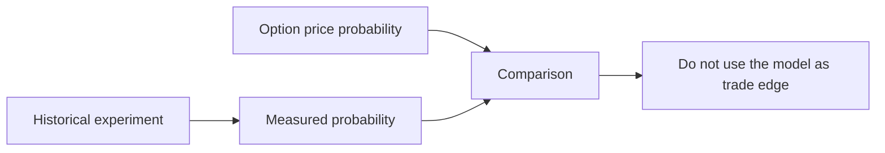

# Historical Model Evidence

Historical experiments are research evidence only. The application does not load this data
and does not simulate trading. The retained raw files can support a future research project
after enough real-trade audit data exists.



## Evidence

The old historical model had a test Brier score of `0.17142` on the common comparison rows.
The option-price reference had a better score of `0.15345`. Larger disagreement made the
model less accurate. This result rejects the historical model as a source of trade edge.

The retained data is under `data/raw/`. The live host does not import it into `trader.db`.

```text
data/raw/        # Retained research input. The live host does not read it.
data/trader.db   # Live and dry-run audit only.
```

## Invariants

- A historical score is not a competition result.
- Historical data does not enter the live execution path.
- A future model must be compared with the option-price reference on the same rows.
- Real-trade outcomes are the preferred future calibration source.

## Rationale

The old experiment contains a useful negative result. The removed simulation runtime does
not contain current product behavior. This lode keeps the evidence and removes the obsolete
runtime contract.

## Related lodes

- [Project summary](../summary.md)
- [Main risks](../plans/main-risks.md)
- [Storage schema](../storage/schema.md)
