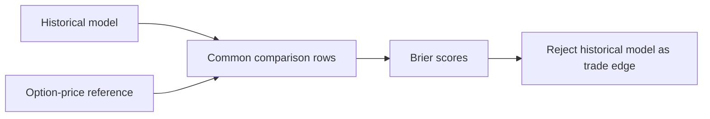

# Research Summary

Historical experiments are retained negative evidence only. The live host does not load raw
research data, simulate a market, or use a historical model to authorize a trade.



## Measured result

The historical model had a test Brier score of `0.17142`. The option-price reference had the
better score of `0.15345` on the same rows. A lower Brier score is better. Larger disagreement
also made the historical model less accurate.

```text
historical model: 0.17142
option-price reference: 0.15345
decision: no runtime historical forecaster
```

The result does not support a historical-data runtime feature or a model-versus-price edge
filter. `data/raw/` stays outside `trader.db` and outside the live host.

## Future acceptance contract

A future model must beat a simple reference on the same rows and on a later time split. Each
feature must be available before its decision time. Real paper-trade outcomes are the preferred
future calibration source.

Historical evidence is not a competition result. It cannot replace outcomes from the paper
account.

## Related lodes

- [Architecture decisions](../architecture/decisions.md)
- [Open strategy questions](../plans/open-strategy-questions.md)
- [Storage schema](../storage/schema.md)
- [Project summary](../summary.md)
