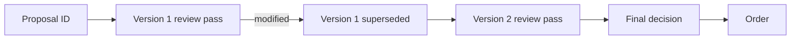

# Proposal Review Audit

The audit keeps each proposal version as an immutable row. A new version does not overwrite
the reviews for an old version.



## Contract

`proposal_review_passes` has one unique row for the tuple `proposal_id`, `proposal_version`,
and `review_pass`. The row stores these items:

- The superseded state and verdict.
- The selected contract, thesis, and thesis conditions.
- The complete proposed operation.
- Independent analyses.
- Discussion contributions.
- Private votes.
- A rejection code when one exists.

```sql
UNIQUE (proposal_id, proposal_version, review_pass)
```

An `INSERT OR IGNORE` makes a repeated persistence call safe. It does not edit the first
recorded evidence.

## Order link

Only `decisions` can link to `orders`. A superseded review pass has no direct order link. The
final decision reaches its proposal through `evaluation_runs.proposal_id`.

The original thesis of an open position is read with this path:

```text
orders -> decisions -> evaluation_runs -> final proposal_review_passes row
```

The query requires `superseded = 0`. A position review therefore receives the thesis and its
checkable conditions from the executed proposal.

## Invariants

- A modified rebuttal creates version 2 and review pass 2.
- Version 1 stays in storage with `superseded = 1`.
- Version 2 gets new analyses, discussion, and votes.
- A withdrawal and a pre-validation rejection also get a row.
- No audit failure can authorize or block a trade.

## Related

- [Storage schema](schema.md)
- [Staged war-room context](../war-room/staged-context.md)
- [Live cycle](../trading/live-cycle.md)
- [Observability](../operations/observability.md)
