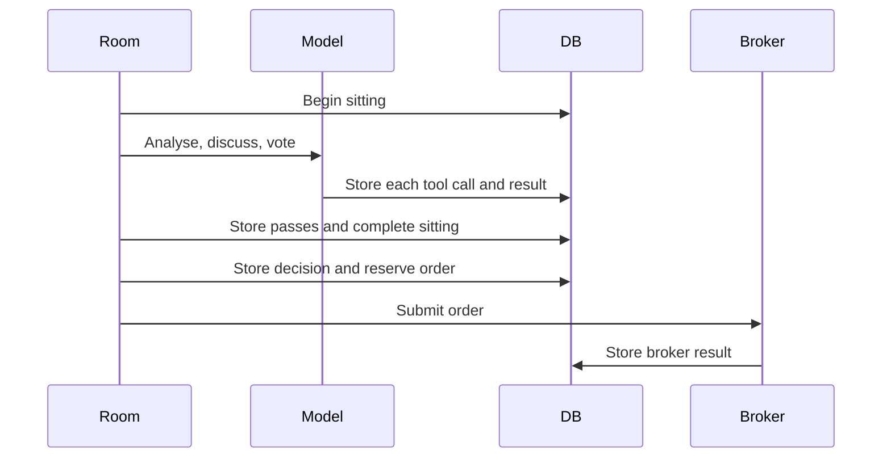

# Proposal Review Audit

Each war-room sitting gets a globally unique proposal ID. The ID connects model work,
review evidence, the final decision, and an optional order.



```csharp
var proposalId = $"proposal-{today:yyyyMMdd}-{Guid.NewGuid():N}";
```

## Contracts

- A proposal ID is unique across process restarts.
- Every sitting starts before the first model call.
- Every exit from the room completes the sitting and stores at least one review pass.
- A modified proposal keeps version 1 as superseded and stores version 2 separately.
- Tool arguments and results are stored with persona, phase, model, and call ID.
- Every action becomes a decision event, including hold and rejection.
- An accepted open and its order reservation use one transaction.

## Failure rule

An audit write throws `AuditPersistenceException`. Agent and cycle catch blocks do not convert
this exception into a normal hold. `LiveSession` rethrows it and the host exits with failure.

A mandatory close has one exception to write-before-action ordering. If its first audit write
fails, the host still attempts the risk-reducing close once. It then throws the audit failure
and stops.

## Thesis recovery

```sql
SELECT p.thesis, p.thesis_conditions_json
FROM orders o
JOIN decision_events e ON e.id = o.audit_event_id
JOIN proposal_review_passes p ON p.proposal_id = e.proposal_id
WHERE o.option_symbol = @symbol AND p.superseded = 0;
```

Position reviews use the final non-superseded thesis.

## Related lodes

- [Schema](schema.md)
- [War room](../war-room/summary.md)
- [Position lifecycle](../trading/position-lifecycle.md)
- [Observability](../operations/observability.md)
