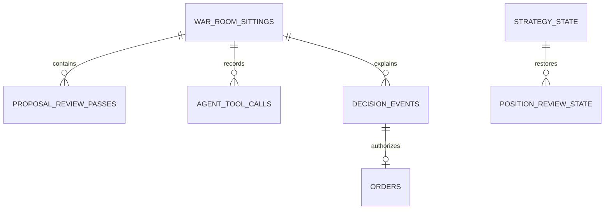

# Durable Audit Schema

The database has six audit tables and two runtime-state tables. It stores live and dry-run
evidence and the minimum state that must survive a process restart.



| Table | Contract |
|---|---|
| `war_room_sittings` | One unique proposal ID, mode, purpose, time, verdict, and status. |
| `proposal_review_passes` | Immutable operation, analysis, discussion, and vote JSON for each version. |
| `agent_tool_calls` | Model, persona, phase, request arguments, result, and completion status. |
| `decision_events` | Holds, invalid actions, risk rejections, accepted opens, and closes. |
| `orders` | Broker correlation and result linked by `audit_event_id`. |
| `equity_snapshots` | Account equity and cash by mode and time. |
| `strategy_state` | The active clamped policy for each run mode. |
| `position_review_state` | Last review time and news-count marker for each option. |

The `orders` table stores a required client order ID, canonical lifecycle, raw broker status,
fill quantity, average fill price, and reconciliation time. Canonical lifecycle values are
`Reserved`, `Uncertain`, `Open`, `PartiallyFilled`, `Filled`, `Canceled`, `Expired`, and
`Rejected`.

```sql
SELECT e.action, e.outcome, e.risk_result, o.status
FROM decision_events e
LEFT JOIN orders o ON o.audit_event_id = e.id
ORDER BY e.id DESC;
```

## Integrity checks

`TradingStore.AuditIntegrityAsync` reports:

- an unfinished sitting;
- a completed sitting with no review pass;
- a completed sitting with no decision;
- a tool call with no stored result;
- a live or dry-run order with no decision link;
- an order link whose decision does not exist.

`--audit` returns a nonzero exit code when any issue exists.

## Initialization

```csharp
await store.CreateSchemaAsync(cancellationToken);
```

Initialization is idempotent for schema version `3`. Schema version `2` does not migrate.
Startup gives an archive instruction and stops. The operator must archive `trader.db` and its
SQLite sidecars, then start with a clean file.

## Related lodes

- [Storage summary](summary.md)
- [Proposal review audit](proposal-review-audit.md)
- [Fault handling](../operations/fault-handling.md)
- [Historical model evidence](../research/historical-model-evidence.md)
