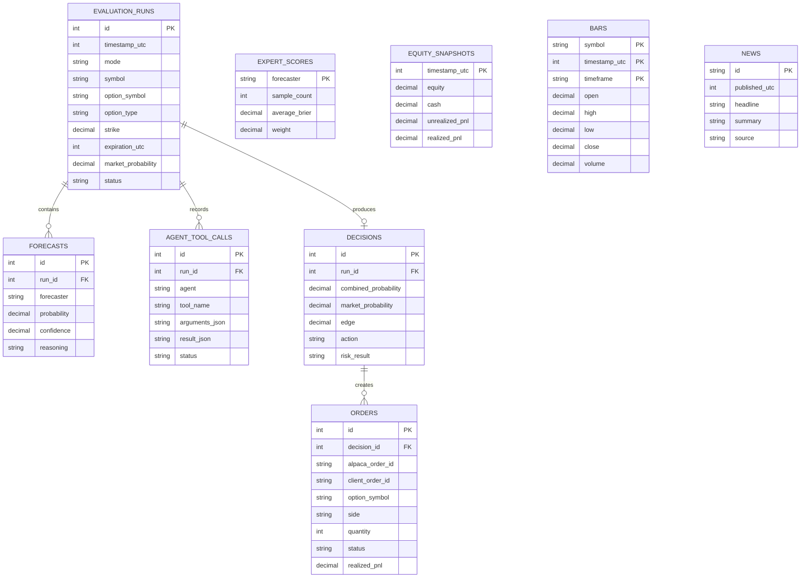

# SQLite Schema

The schema lives in `Storage/Schema.sql`. All timestamps are Unix seconds in UTC.

`TradingStore` runs every query with Dapper over `Microsoft.Data.Sqlite` (ADR-004). Column
names are snake_case, so a SELECT aliases each column to the record property name. See
[practices](../practices.md).



## Cache tables

Five tables hold the history that replay reads. `--import-history` fills them from
`data/raw/`. The composite primary keys make the import idempotent: a second run writes the
same rows and reports the same counts.

```sql
CREATE TABLE bars (
    symbol          TEXT NOT NULL,
    timeframe       TEXT NOT NULL,
    timestamp_utc   INTEGER NOT NULL,
    available_utc   INTEGER NOT NULL,
    open REAL, high REAL, low REAL, close REAL, volume REAL,
    trade_count     REAL,
    vwap            REAL,
    PRIMARY KEY (symbol, timeframe, timestamp_utc)
);

CREATE TABLE news (
    id              INTEGER PRIMARY KEY,   -- Alpaca sends a number, not a string
    published_utc   INTEGER NOT NULL,
    headline        TEXT NOT NULL,
    summary TEXT, source TEXT, author TEXT, url TEXT,
    symbols_json    TEXT NOT NULL
);

-- One news item names many symbols. This gives the per-symbol lookup.
CREATE TABLE news_symbols (
    news_id INTEGER NOT NULL, symbol TEXT NOT NULL,
    PRIMARY KEY (symbol, news_id)
);

CREATE TABLE option_contracts (
    contract_symbol TEXT PRIMARY KEY,
    underlying      TEXT NOT NULL,
    expiration      TEXT NOT NULL,   -- ISO date, a contract identity
    strike          REAL NOT NULL,
    option_type     TEXT NOT NULL,
    style TEXT, multiplier INTEGER
);

CREATE TABLE option_bars (
    contract_symbol TEXT NOT NULL,
    session_utc     INTEGER NOT NULL,
    available_utc   INTEGER NOT NULL,
    open REAL, high REAL, low REAL, close REAL, volume REAL,
    trade_count REAL, vwap REAL,
    PRIMARY KEY (contract_symbol, session_utc)
);

-- Replay must not pay twice for the same historical question.
CREATE TABLE llm_cache (
    cache_key       TEXT PRIMARY KEY,   -- hash of agent, model, instant, and prompt
    agent TEXT NOT NULL, model TEXT NOT NULL,
    as_of_utc       INTEGER NOT NULL,
    response_json   TEXT NOT NULL,
    created_utc     INTEGER NOT NULL
);
```

### `available_utc` is the no-leak column

**Every replay read filters on `available_utc`. No replay read filters on `timestamp_utc` or
on `session_utc`** (ADR-015).

A bar timestamp is the **start** of its interval. The bar carries the **close** of that
interval. A daily bar stamped `05:00Z` therefore holds the 16:00 ET price, and a filter on the
timestamp gives a 09:30 cycle six hours of the future.

`Storage/BarAvailability` computes the column at import time:

| Bar | Available at |
|---|---|
| Daily equity bar | 20:00 Eastern, after extended trading |
| Daily option bar | 16:15 Eastern; options do not trade in extended hours |
| Intraday bar | The end of its interval |

### `option_bars` has no bid, ask, or delta

The columns are absent on purpose. Alpaca serves no historical option quote and no historical
greek. A nullable column would invite code to treat a missing quote as a passing one. Replay
reports `QuoteQuality.UnknownHistorical` instead. See
[option data availability](../replay/option-data-availability.md).

## Audit tables

One `evaluation_runs` row represents one evaluated option event. `mode` separates `live`
from `replay` data.

```sql
CREATE TABLE evaluation_runs (
    id                      INTEGER PRIMARY KEY AUTOINCREMENT,
    timestamp_utc           INTEGER NOT NULL,
    mode                    TEXT NOT NULL,
    symbol                  TEXT NOT NULL,
    current_price           REAL NOT NULL,
    option_symbol           TEXT NOT NULL,
    option_type             TEXT NOT NULL,
    strike                  REAL NOT NULL,
    expiration_utc          INTEGER NOT NULL,
    market_probability      REAL,
    status                  TEXT NOT NULL,
    market_snapshot_json    TEXT
);

CREATE TABLE forecasts (
    id                  INTEGER PRIMARY KEY AUTOINCREMENT,
    run_id              INTEGER NOT NULL,
    forecaster          TEXT NOT NULL,
    probability         REAL NOT NULL,
    confidence          REAL,
    reasoning           TEXT,
    evidence_json       TEXT,
    created_utc         INTEGER NOT NULL,
    FOREIGN KEY (run_id) REFERENCES evaluation_runs(id)
);

CREATE TABLE agent_tool_calls (
    id                  INTEGER PRIMARY KEY AUTOINCREMENT,
    run_id              INTEGER NOT NULL,
    agent               TEXT NOT NULL,
    tool_name           TEXT NOT NULL,
    arguments_json      TEXT NOT NULL,
    result_json         TEXT,
    started_utc         INTEGER NOT NULL,
    duration_ms         INTEGER,
    status              TEXT NOT NULL,
    FOREIGN KEY (run_id) REFERENCES evaluation_runs(id)
);

CREATE TABLE decisions (
    id                      INTEGER PRIMARY KEY AUTOINCREMENT,
    run_id                  INTEGER NOT NULL,
    combined_probability    REAL NOT NULL,
    market_probability      REAL,
    edge                    REAL,
    action                  TEXT NOT NULL,
    reason                  TEXT,
    risk_result             TEXT,
    created_utc             INTEGER NOT NULL,
    FOREIGN KEY (run_id) REFERENCES evaluation_runs(id)
);

CREATE TABLE orders (
    id                  INTEGER PRIMARY KEY AUTOINCREMENT,
    decision_id         INTEGER NOT NULL,
    alpaca_order_id     TEXT,
    client_order_id     TEXT NOT NULL UNIQUE,
    option_symbol       TEXT NOT NULL,
    side                TEXT NOT NULL,
    quantity            INTEGER NOT NULL,
    order_type          TEXT NOT NULL,
    limit_price         REAL,
    submitted_utc       INTEGER NOT NULL,
    closed_utc          INTEGER,
    status              TEXT NOT NULL,
    realized_pnl        REAL,
    FOREIGN KEY (decision_id) REFERENCES decisions(id)
);
```

**`client_order_id TEXT NOT NULL UNIQUE` is the idempotency guarantee.** The application
writes this row before or with the order attempt. A duplicate submit then fails at the
database, not at the broker.

`alpaca_order_id` is nullable because the row can exist before Alpaca confirms the order.

**`decision_id` is nullable in the code and carries no foreign key.** The `--smoke` path
reserves an order with no decision behind it. A synthetic `decisions` row would put a decision
the agent never made into the audit trail. A NULL `decision_id` means an operator check, not an
agent decision.

The `orders` and `equity_snapshots` tables also carry a `mode` column. It separates `live` rows
from `replay` rows, the same way `evaluation_runs.mode` does.

## Score tables

```sql
CREATE TABLE expert_scores (
    forecaster          TEXT PRIMARY KEY,
    sample_count        INTEGER NOT NULL,
    average_brier       REAL,
    weight              REAL NOT NULL,
    updated_utc         INTEGER NOT NULL
);

CREATE TABLE equity_snapshots (
    timestamp_utc       INTEGER PRIMARY KEY,
    equity              REAL NOT NULL,
    cash                REAL NOT NULL,
    unrealized_pnl      REAL,
    realized_pnl        REAL
);
```

`forecaster` in `forecasts` and in `expert_scores` uses the same value set: the weighted
experts, which are now the Research Agent and the Critic Agent. See [forecast combination](../war-room/summary.md).

## Startup

The application verifies the schema at startup. See
[restart and recovery](../operations/restart-recovery.md).

## Related

- [Storage summary](summary.md)
