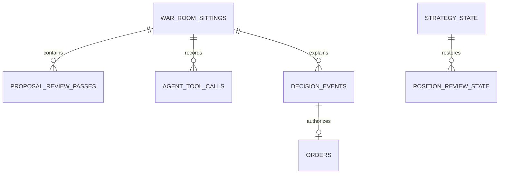
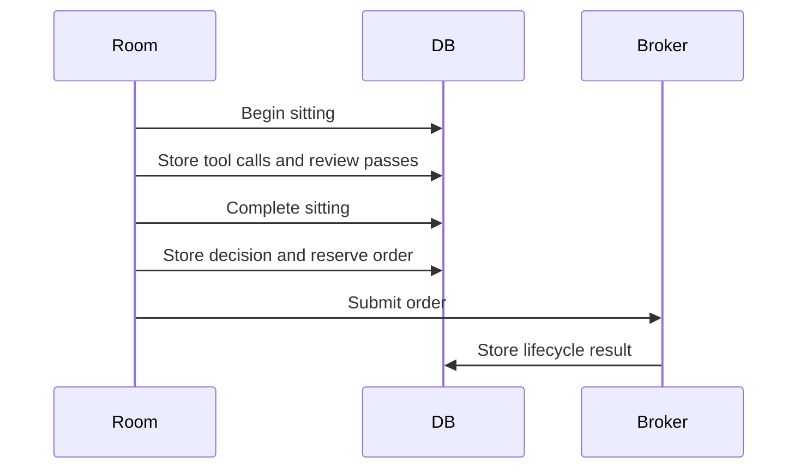

# Durable Audit Schema

The database has six audit tables and two runtime-state tables. It stores live and dry-run
evidence and the minimum state that must survive a process restart.



| Table | Contract |
|---|---|
| `war_room_sittings` | One unique proposal ID, mode, purpose, time, verdict, and status. |
| `proposal_review_passes` | Immutable operation, analysis, discussion, and vote JSON for each version. |
| `agent_tool_calls` | Model, persona, phase, request arguments, result, and completion status. |
| `decision_events` | Holds, invalid actions, risk rejections, accepted opens, and closes. |
| `orders` | Broker correlation and result linked by `audit_event_id`. |
| `equity_snapshots` | Account equity and cash by mode and time. |
| `strategy_state` | The active clamped policy for each run mode. |
| `position_review_state` | Last review time and news-count marker for each option. |

The `orders` table stores a required client order ID, canonical lifecycle, raw broker status,
fill quantity, average fill price, and reconciliation time. Canonical lifecycle values are
`Reserved`, `Uncertain`, `Open`, `PartiallyFilled`, `Filled`, `Canceled`, `Expired`, and
`Rejected`.

```sql
SELECT e.action, e.outcome, e.risk_result, o.status
FROM decision_events e
LEFT JOIN orders o ON o.audit_event_id = e.id
ORDER BY e.id DESC;
```

## Integrity checks

`TradingStore.AuditIntegrityAsync` reports:

- an unfinished sitting;
- a completed sitting with no review pass;
- a completed sitting with no decision;
- a tool call with no stored result;
- a live or dry-run order with no decision link;
- an order link whose decision does not exist.

`--audit` returns a nonzero exit code when any issue exists.

A sitting has three statuses. `BeginSittingAsync` writes `running`, `CompleteSittingAsync`
writes `completed`, and `--recover-sittings` writes `abandoned` with the reason in the `fault`
column. An interruption after `BeginSittingAsync` leaves the row at `running` forever, which
the integrity check reports as an unfinished sitting; the recovery command is what ends it.

```sql
UPDATE war_room_sittings
SET status = 'abandoned', completed_utc = @completedUtc, fault = @fault
WHERE status = 'running'
```

The row is updated and never deleted. `decision_events` and `agent_tool_calls` hold a foreign
key to `proposal_id`, and an interrupted sitting is evidence: an audit that proves the record
complete by erasing the inconvenient row proves nothing. `abandoned` is terminal, so the two
checks that look for a missing review pass and a missing decision correctly ignore it, and they
are scoped to `completed` for that reason.

Live startup does not call `AuditIntegrityAsync` and does not repair anything. Run
`--recover-sittings` and then `--audit` between sessions.

## Proposal and order evidence

One proposal ID connects a sitting, tool calls, immutable review passes, a decision, and an
optional order.



- A modified proposal keeps version 1 as superseded and stores version 2 separately.
- Tool arguments and results store the proposal, persona, phase, model, and call ID.
- A normal room return completes the sitting. A cancellation or process fault can leave it
  incomplete.
- Holds and rejections become decision events. A room rejection stores outcome `rejected`, the
  stage in `risk_result`, the option symbol, and the proposer probability, so it can be scored
  later. A hold with no proposal stores outcome `held` and no symbol.
- A review pass stores the operation the room judged, not the operation after the vote scaled
  it. A rejecting tally sizes every action to zero, so the sized form would erase the contract.
- An accepted open and its order reservation use one transaction.
- A mandatory close can make one risk-reducing broker attempt after its first audit write
  fails. The session then stops.

Position reviews recover the final non-superseded thesis through the order, decision, and
review-pass links.

```sql
SELECT p.thesis, p.thesis_conditions_json
FROM orders o
JOIN decision_events e ON e.id = o.audit_event_id
JOIN proposal_review_passes p ON p.proposal_id = e.proposal_id
WHERE o.option_symbol = @symbol AND p.superseded = 0;
```

## Initialization

```csharp
await store.CreateSchemaAsync(cancellationToken);
```

Initialization is idempotent for schema version `3`. Schema version `2` does not migrate.
Startup gives an archive instruction and stops. The operator must archive `trader.db` and its
SQLite sidecars, then start with a clean file.

## Concurrent access

The cycle loop and the hard-exit loop both write. The store opens one connection for each
operation, so two settings are required:

| Setting | Where | Why |
|---|---|---|
| `PRAGMA journal_mode = WAL` | `CreateSchemaAsync` | A reader can run while a writer holds the file. The mode stays in the database file. |
| `PRAGMA busy_timeout` | `OpenAsync` | A pragma applies to the connection that runs it. Each new connection must set it again. |

`TradingStore.BusyTimeout` is five seconds. Without both settings the second concurrent writer
fails immediately with `SQLITE_BUSY`. WAL adds `-wal` and `-shm` sidecar files beside
`trader.db`. `JournalModeAsync` reports the current mode. `--audit` opens the database
read-only and works normally against WAL.

See [hard-exit loop](../trading/hard-exit-loop.md).

## Related lodes

- [Storage summary](summary.md)
- [Hard-exit loop](../trading/hard-exit-loop.md)
- [Operations](../operations/summary.md)
- [Research summary](../research/summary.md)
- [After-session improvements](../plans/after-session-improvements.md)
