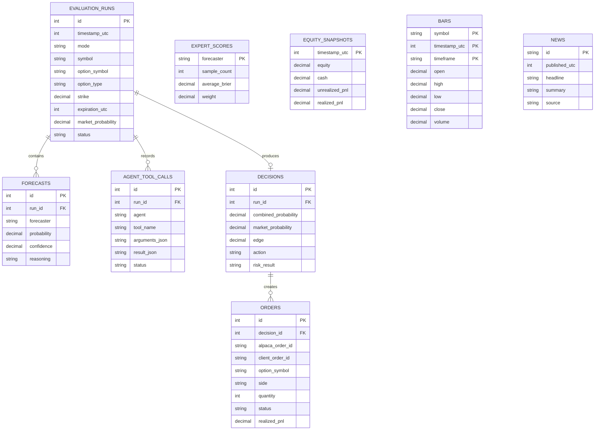

# SQLite Schema

The schema lives in `Storage/Schema.sql`. All timestamps are Unix seconds in UTC.

`TradingStore` runs every query with Dapper over `Microsoft.Data.Sqlite` (ADR-004). Column
names are snake_case, so a SELECT aliases each column to the record property name. See
[practices](../practices.md).



## Cache tables

```sql
CREATE TABLE bars (
    symbol          TEXT NOT NULL,
    timestamp_utc   INTEGER NOT NULL,
    timeframe       TEXT NOT NULL,
    open            REAL NOT NULL,
    high            REAL NOT NULL,
    low             REAL NOT NULL,
    close           REAL NOT NULL,
    volume          REAL NOT NULL,
    PRIMARY KEY (symbol, timeframe, timestamp_utc)
);

CREATE TABLE news (
    id              TEXT PRIMARY KEY,
    published_utc   INTEGER NOT NULL,
    headline        TEXT NOT NULL,
    summary         TEXT,
    source          TEXT,
    symbols_json    TEXT NOT NULL
);
```

The composite primary key on `bars` makes the historical download idempotent.

## Audit tables

One `evaluation_runs` row represents one evaluated option event. `mode` separates `live`
from `replay` data.

```sql
CREATE TABLE evaluation_runs (
    id                      INTEGER PRIMARY KEY AUTOINCREMENT,
    timestamp_utc           INTEGER NOT NULL,
    mode                    TEXT NOT NULL,
    symbol                  TEXT NOT NULL,
    current_price           REAL NOT NULL,
    option_symbol           TEXT NOT NULL,
    option_type             TEXT NOT NULL,
    strike                  REAL NOT NULL,
    expiration_utc          INTEGER NOT NULL,
    market_probability      REAL,
    status                  TEXT NOT NULL,
    market_snapshot_json    TEXT
);

CREATE TABLE forecasts (
    id                  INTEGER PRIMARY KEY AUTOINCREMENT,
    run_id              INTEGER NOT NULL,
    forecaster          TEXT NOT NULL,
    probability         REAL NOT NULL,
    confidence          REAL,
    reasoning           TEXT,
    evidence_json       TEXT,
    created_utc         INTEGER NOT NULL,
    FOREIGN KEY (run_id) REFERENCES evaluation_runs(id)
);

CREATE TABLE agent_tool_calls (
    id                  INTEGER PRIMARY KEY AUTOINCREMENT,
    run_id              INTEGER NOT NULL,
    agent               TEXT NOT NULL,
    tool_name           TEXT NOT NULL,
    arguments_json      TEXT NOT NULL,
    result_json         TEXT,
    started_utc         INTEGER NOT NULL,
    duration_ms         INTEGER,
    status              TEXT NOT NULL,
    FOREIGN KEY (run_id) REFERENCES evaluation_runs(id)
);

CREATE TABLE decisions (
    id                      INTEGER PRIMARY KEY AUTOINCREMENT,
    run_id                  INTEGER NOT NULL,
    combined_probability    REAL NOT NULL,
    market_probability      REAL,
    edge                    REAL,
    action                  TEXT NOT NULL,
    reason                  TEXT,
    risk_result             TEXT,
    created_utc             INTEGER NOT NULL,
    FOREIGN KEY (run_id) REFERENCES evaluation_runs(id)
);

CREATE TABLE orders (
    id                  INTEGER PRIMARY KEY AUTOINCREMENT,
    decision_id         INTEGER NOT NULL,
    alpaca_order_id     TEXT,
    client_order_id     TEXT NOT NULL UNIQUE,
    option_symbol       TEXT NOT NULL,
    side                TEXT NOT NULL,
    quantity            INTEGER NOT NULL,
    order_type          TEXT NOT NULL,
    limit_price         REAL,
    submitted_utc       INTEGER NOT NULL,
    closed_utc          INTEGER,
    status              TEXT NOT NULL,
    realized_pnl        REAL,
    FOREIGN KEY (decision_id) REFERENCES decisions(id)
);
```

**`client_order_id TEXT NOT NULL UNIQUE` is the idempotency guarantee.** The application
writes this row before or with the order attempt. A duplicate submit then fails at the
database, not at the broker.

`alpaca_order_id` is nullable because the row can exist before Alpaca confirms the order.

## Score tables

```sql
CREATE TABLE expert_scores (
    forecaster          TEXT PRIMARY KEY,
    sample_count        INTEGER NOT NULL,
    average_brier       REAL,
    weight              REAL NOT NULL,
    updated_utc         INTEGER NOT NULL
);

CREATE TABLE equity_snapshots (
    timestamp_utc       INTEGER PRIMARY KEY,
    equity              REAL NOT NULL,
    cash                REAL NOT NULL,
    unrealized_pnl      REAL,
    realized_pnl        REAL
);
```

`forecaster` in `forecasts` and in `expert_scores` uses the same value set: the weighted
experts, which are now the Research Agent and the Critic Agent. See [forecast combination](../experts/forecast-combination.md).

## Startup

The application verifies the schema at startup. See
[restart and recovery](../operations/restart-recovery.md).

## Related

- [Storage summary](summary.md)
