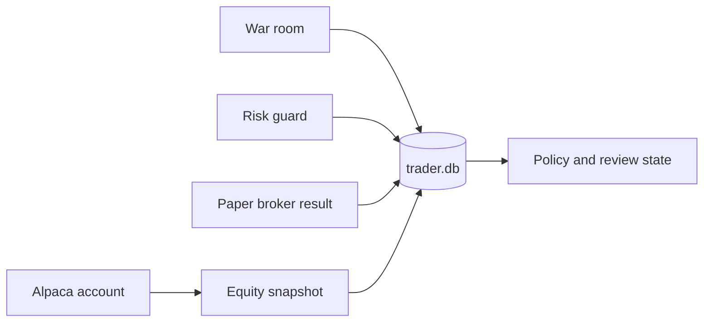

# Storage Summary

SQLite is a durable audit store. It is not a market-data cache and it is not the source of
truth for the Alpaca account.



`TradingStore` uses Dapper and `Microsoft.Data.Sqlite`. Money values use `decimal` in C# and
SQLite numeric columns. JSON columns keep full typed evidence when a relational projection
would lose structure.

```csharp
await store.RecordDecisionAndReserveAsync(decision, order, cancellationToken);
```

The call above commits the accepted decision and the order reservation in one transaction.
A broker call cannot occur before that transaction succeeds for new risk. A mandatory close
still gets one attempt if this pre-close transaction fails. All buys and sells use a required
client order ID.

## Invariants

- Schema version is `3`.
- Startup accepts an empty database or schema version `3` only.
- The host does not migrate an obsolete database.
- `data/raw/` is not imported.
- Live and dry-run orders must link to a decision event.
- Active policy and review cursors are durable per run mode.
- Reconciliation stores canonical and raw broker order state.
- Audit write failure stops the session.
- `--audit` opens SQLite in read-only mode. Process startup still creates a plain log file.

## Related lodes

- [Schema](schema.md)
- [Observability](../operations/observability.md)
- [Project summary](../summary.md)
