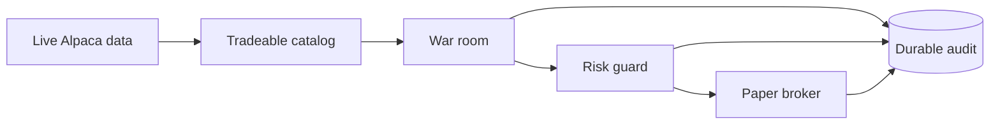

# Project Summary

`Xakpc.Alpaca.NøIdea` is a .NET 10 autonomous options trader for an Alpaca paper
account. It uses current Alpaca market data only. A multi-model war room proposes and reviews
actions. Deterministic C# owns contract admission, risk limits, order submission, and exits.
SQLite stores the durable evidence for every sitting, tool call and result, review pass,
decision, order, and equity snapshot. A failed audit write stops the live session.



## Current runtime

```powershell
dotnet run --project src/Xakpc.Alpaca.NøIdea -- --live --dry-run --once --agent stub
dotnet run --project src/Xakpc.Alpaca.NøIdea -- --live --dry-run --cheap
dotnet run --project src/Xakpc.Alpaca.NøIdea -- --audit --last 20
```

The host supports `--live`, `--smoke`, `--check-mcp`, read-only `--audit`, and the
`--recover-sittings` maintenance operation.
`--dry-run` replaces only the trading gateway. It still reads live data and writes the audit.
The host has no data-import or market-simulation operation. A Spectre.Console operator view
shows run, cycle, account, catalog, risk, order, war-room, and model-wait events in aligned
columns. The live view animates while a seat waits for a model and counts down the gap between
cycles. Each process writes the complete clipped information log to a timestamped plain file
under `data/logs/`.
Live stock requests use IEX. Live option-chain requests use the Indicative feed.
A normal live process stops when the Alpaca clock reports that the market is closed.

`--smoke` is a paper-account mutation. It submits an option buy and then cancels the order or
closes a fill. `--check-mcp` is the read-only MCP diagnostic.

## Current storage

`data/trader.db` starts with schema version `3`. It contains six audit tables:

- `war_room_sittings`
- `proposal_review_passes`
- `agent_tool_calls`
- `decision_events`
- `orders`
- `equity_snapshots`

It also contains two runtime-state tables:

- `strategy_state`
- `position_review_state`

The database does not migrate an obsolete schema. Startup requires an empty file or schema
version `3`. `data/raw/` remains separate research input and is not read by the live host.

## Safety contracts

- Agents have read-only research tools and have no broker tool.
- The typed Alpaca SDK is the only broker-write path.
- `RiskGuard` validates every open action after the war-room vote, on an account snapshot read
  immediately before submission and not on the snapshot the room debated.
- An open needs a room vote above the threshold and one seat that voted Approve. A position
  review that votes against holding closes the position, but only from a complete vote with no
  faulted seat.
- The deterministic exits run on a one-minute timer, separate from the war-room cycle. Alpaca
  has no stop order type and no bracket order class for options, so no broker-side exit is
  possible. One broker gate stops the two loops from sending two sells for one position.
- Open decisions and order reservations commit in one SQLite transaction.
- Close decisions use the same client-ID reservation and broker reconciliation path as buys.
- Pending sells block duplicate mandatory and war-room close requests.
- Policy, review cursors, and order lifecycle survive restart. Alpaca supplies prior-close
  equity and daily fills. The missing-prior-close fallback is process-local only.
- A risk-reducing close is attempted once even if its first audit write fails. The session
  stops after that attempt.
- `--audit` opens SQLite read-only and returns failure when it finds an incomplete or broken
  link. Process startup still creates the normal plain log file.
- Live startup verifies the schema but does not run the integrity audit. This is an active
  repair item.

## Current verification

The solution has 195 passing tests. The 2026-09-02 live session is the current full-session
baseline and the first day the room traded: 13 sittings, 4 opens, 2 closes, and equity from
100,000.00 to 100,199.84 for about 17 USD of model spend. A sitting costs 0.80 to 2.09 USD.
See [session baselines](plans/session-baselines.md).

A refusal that carries its reasons is a decision, not a fault. A standard that refuses every
contract the system may buy is a fault, and that is what four unanimous rejections exposed on
2026-09-01. A new-trade reviewer now rejects only on a concrete contradiction and abstains
otherwise, and the new-trade approve threshold is -0.15 while closes stay at 0.

Dilution is not consent. Because the threshold is negative, a room where every seat abstains
clears it on silence, which opened one position that no seat backed. A new trade now also needs
one seat that voted Approve. A close keeps the threshold alone, because a position must stay
easy to leave. See [persona contracts](llm/persona-contracts.md) and
[war-room summary](war-room/summary.md).

A refusal is counted and stored as a rejection. The cycle count, the decision row, and the
review pass keep the option symbol, the probability, and the rejection code, so the refusal
can be scored later. A proposal that never existed stays a hold and is not counted.

The room deadline is 13 minutes, and each model call has its own limit. Because a sitting can
last longer than the ten-minute quote age, the loop reads a current quote for the selected
contract before the final risk check, and rejects the trade when it cannot. Numbers the
proposer states are compared with the catalog before any seat is paid. See
[war-room summary](war-room/summary.md) and [live cycle](trading/live-cycle.md).

The database is audit-clean: `--audit` returns success. A sitting that a stopped process left
open is given the `abandoned` status by `--recover-sittings`. The `strategy_state` table holds
no policy, so the policy defaults apply. Counterfactual scoring stays open. See
[after-session improvements](plans/after-session-improvements.md).

## Related lodes

- [Lode map](lode-map.md)
- [Live cycle](trading/live-cycle.md)
- [Audit schema](storage/schema.md)
- [Observability](operations/observability.md)
- [Research summary](research/summary.md)
