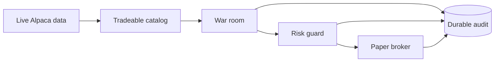

# Project Summary

`Xakpc.Alpaca.NøIdea` is a .NET 10 autonomous options trader for an Alpaca paper
account. It uses current Alpaca market data only. A multi-model war room proposes and reviews
actions. Deterministic C# owns contract admission, risk limits, order submission, and exits.
SQLite stores the durable evidence for every sitting, tool call and result, review pass,
decision, order, and equity snapshot. A failed audit write stops the live session.



## Current runtime

```powershell
dotnet run --project src/Xakpc.Alpaca.NøIdea -- --live --dry-run --once --agent stub
dotnet run --project src/Xakpc.Alpaca.NøIdea -- --audit --last 20
```

The host supports `--live`, `--smoke`, `--check-mcp`, and read-only `--audit` operations.
`--dry-run` replaces only the trading gateway. It still reads live data and writes the audit.
The host has no data-import or market-simulation operation.

## Current storage

`data/trader.db` starts with schema version `3`. It contains six audit tables:

- `war_room_sittings`
- `proposal_review_passes`
- `agent_tool_calls`
- `decision_events`
- `orders`
- `equity_snapshots`

It also contains two runtime-state tables:

- `strategy_state`
- `position_review_state`

The database does not migrate an obsolete schema. Startup requires an empty file or schema
version `3`. `data/raw/` remains separate research input and is not read by the live host.

## Safety contracts

- Agents have read-only research tools and have no broker tool.
- The typed Alpaca SDK is the only broker-write path.
- `RiskGuard` validates every open action after the war-room vote.
- Open decisions and order reservations commit in one SQLite transaction.
- Close decisions use the same client-ID reservation and broker reconciliation path as buys.
- Pending sells block duplicate mandatory and war-room close requests.
- Policy, review cursors, order lifecycle, prior-close equity, and daily fills survive restart.
- A risk-reducing close is attempted once even if its first audit write fails. The session
  stops after that attempt.
- `--audit` is read-only and returns failure when it finds an incomplete or broken link.

## Current verification

The solution has 104 passing tests. A live-data dry run on 2026-08-31 read the paper account,
sent no order, and wrote one hold decision and one equity snapshot. The audit integrity check
reported no fault.

## Related lodes

- [Lode map](lode-map.md)
- [Live cycle](trading/live-cycle.md)
- [Audit schema](storage/schema.md)
- [Observability](operations/observability.md)
- [Historical model evidence](research/historical-model-evidence.md)
