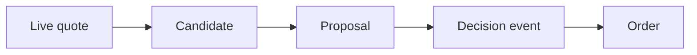

# Terminology



- **Ask** - The lowest current offer price.
- **Bid** - The highest current purchase price.
- **Spread** - Ask minus bid.
- **Premium risk** - Ask price times contract count times 100 for a long option.
- **Call** - An option that usually gains value when its underlying price rises.
- **Put** - An option that usually gains value when its underlying price falls.
- **Strike** - The exercise price in an option contract.
- **Expiration** - The date when the option contract ends.
- **OCC symbol** - A contract symbol with underlying, expiration, type, and strike.
- **Tradeable catalog** - Contracts that pass current mechanical and hard-risk checks.
- **War-room sitting** - One propose, review, discuss, rebut, and vote process.
- **Proposal ID** - A unique identifier for one sitting.
- **Review pass** - Immutable evidence for one proposal version.
- **Decision event** - A durable hold, rejection, open, or close decision.
- **Correlation ID** - The application identifier that connects an order reservation and result.
- **Audit integrity** - Required completion and relational links in `trader.db`.
- **Fail closed** - Skip new risk when a required input is missing or invalid.
- **Dry run** - Live market reads with a trading gateway that sends no broker order.
- **Read-only MCP** - Research tools that cannot change the Alpaca account.
- **Guardrail** - A hard C# rule that model output cannot change.
- **Approving seat** - A reviewer that voted Approve. One is necessary to open a position.
- **Rejected hold** - A position review that voted against holding. It closes the position.
- **Abandoned sitting** - A sitting a stopped process left open, given a terminal status later.
- **Brier score** - `(probability - outcome)^2`; lower is better.

```csharp
decimal premiumRisk = ask * contracts * 100m;
```

## Related lodes

- [Project summary](summary.md)
- [War room](war-room/summary.md)
- [Schema](storage/schema.md)
- [Risk guardrails](trading/risk-guardrails.md)
