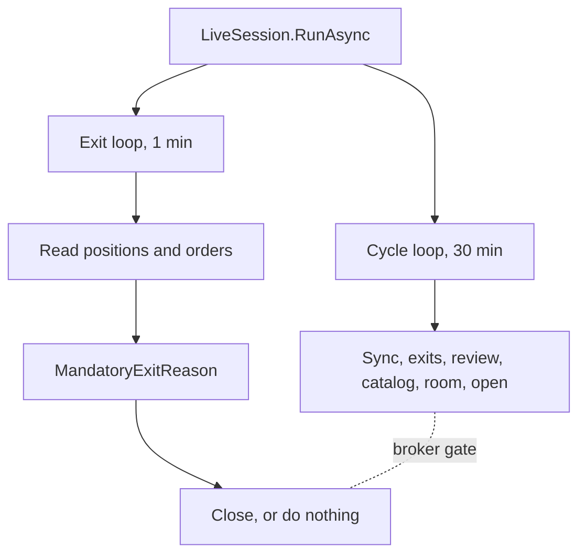

# Hard-Exit Loop

The deterministic exits run on their own timer. They do not wait for the war-room cycle.



## Why there are two timers

The stop-loss, the take-profit, and the competition flatten are C# rules. They consult no model.
At the cycle cadence they were sampled only once for each cycle, and the measured start-to-start
spacing is 38 to 41 minutes.

At that spacing a 40 percent stop is a poll and not a stop. On the measured QQQ 705 put the
premium was 0.89 and the delta was -0.28:

```text
40 percent of 0.89   = 0.36 premium
0.36 / 0.28          = 1.27 QQQ points
1.27 / 708           = 0.18 percent underlying move
```

A 0.18 percent move takes minutes. Each position is one to three days from expiration, where the
gap risk is largest. The flatten instant had the same fault: it could be missed by 41 minutes,
and a missed measurement point cannot be recovered.

## Alpaca cannot hold this line

Broker-side exits are not available for options. Alpaca supports brackets for equities only.

| Parameter | `place_stock_order` | `place_option_order` |
|---|---|---|
| `order_class` | `simple`, `bracket`, `oco`, `oto` | `mleg` only |
| `take_profit_limit_price` | yes | does not exist |
| `stop_loss_stop_price` | yes | does not exist |
| `type` | market, limit, stop, stop-limit, trailing-stop | market or limit |
| `time_in_force` | many | day only |

`LiveTradingGateway.SubmitOrderAsync` sends the only shape options accept: a simple market or
limit day order. There is no stop order type to attach. **This loop is the only mechanism.**

A resting limit sell at the take-profit price is possible and is not used. A pending sell makes
`HasPendingClose` true, and `ManageOpenPositionsAsync` skips a symbol that has a pending close.
A permanent resting sell therefore disables the stop-loss. Do not add one before the
pending-close rules change.

## Contracts

- `TradingOptions.HardExitInterval` is one minute. `CycleInterval` stays 30 minutes.
- `TradingLoop.RunHardExitsAsync` reads positions, reads pending orders, and calls the same
  `ManageOpenPositionsAsync` the cycle calls. There is no second copy of the exit rules.
- A pass costs two Alpaca reads and no tokens. It reads no option chain, because
  `MandatoryExitReason` judges the price on the position payload.
- A pass with no open position does not read orders.
- `RunHardExitsAsync` does not call `InitializeAsync`. That method guards itself with a plain
  boolean, which two threads must not enter. An uninitialised loop reports no work.
- `--once` starts no exit loop. A diagnostic run must leave nothing that can reach the broker.
- **The loop lives inside the process.** Nothing watches a position while the host is down, and
  the host stops itself when the Alpaca clock reports the market closed. A host started while
  the market is closed reads the clock, stops, and never runs one pass. The flatten therefore
  happens only if the process is running at that minute.
- A transient fault is logged and the loop continues. An `AuditPersistenceException` stops the
  session and is thrown from `RunAsync` after both loops stop.
- A pass that closes nothing logs at Debug. Information each minute would hide the cycle
  narrative in the operator view.

## The broker gate

`TradingLoop._brokerGate` is one `SemaphoreSlim(1, 1)`. It makes each check-then-act region
atomic. The race it prevents: two paths read "no pending close for this symbol" and both send a
sell.

| Region | Gated | Reason |
|---|---|---|
| `RunHardExitsAsync` | yes | read, judge, close |
| `RunCycleAsync` steps 1 and 2 | yes | read, judge, close |
| `TryCloseAsync` | yes | reads positions and orders again inside the gate |
| `TryOpenAsync` | yes | quote, snapshot, risk, reserve, and submit are one decision |
| Catalog build, news, war-room sitting | **no** | data only |

**The war room never holds the gate.** A sitting takes 8 to 10 minutes. A gate held across it
would put the stop-loss behind a model answer again, which is the fault this design removes.

```csharp
await _brokerGate.WaitAsync(cancellationToken);
try
{
    var positions = await _trading.ListPositionsAsync(cancellationToken);
    if (positions.Count == 0)
    {
        return new CloseBatchResult();
    }

    var pendingOrders = await coordinator.ReconcileAndListPendingAsync(
        replayMissingSells: false, cancellationToken);

    return await ManageOpenPositionsAsync(positions, pendingOrders, cancellationToken);
}
finally
{
    _brokerGate.Release();
}
```

`_policy` is an immutable record that is replaced by reference, so a concurrent read is safe. A
pass can use the previous policy for one tick. This is accepted.

## The snapshot that authorises money

`TryOpenAsync` rebuilds the `RiskSnapshot` inside the gate with `RefreshRiskSnapshotAsync`. It
does not use the snapshot from the start of the cycle.

The room debates for 8 to 10 minutes, and an exit can close a position and change equity while
it debates. The first snapshot is evidence for the room. Only a snapshot read immediately before
the risk check can authorise an order.

## Storage requirement

Two loops write to SQLite. `TradingStore` opens one connection for each operation, so:

- `CreateSchemaAsync` sets `PRAGMA journal_mode = WAL`. The mode stays in the database file.
- `OpenAsync` sets `PRAGMA busy_timeout` on **each** connection. A pragma applies to the
  connection that runs it, not to the file.

Without both, the second of two concurrent writers fails immediately with `SQLITE_BUSY`. WAL adds
`-wal` and `-shm` sidecar files. `--audit` opens the database read-only and still works.

## Related lodes

- [Live cycle](live-cycle.md)
- [Risk guardrails](risk-guardrails.md)
- [Trading summary](summary.md)
- [Storage schema](../storage/schema.md)
- [Alpaca integration](../alpaca/mcp-integration.md)
