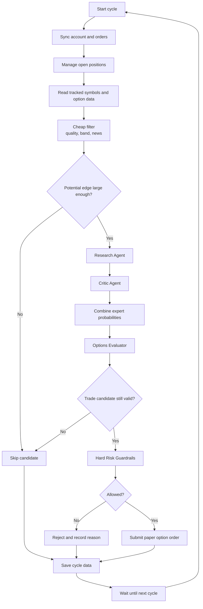

# Live Trading Cycle

The target cycle time is about 30 minutes during regular US market hours. The exact interval
is configuration. The loop uses the Alpaca market clock.



## The twelve steps

### 1. Sync account

Deterministic. Read the current equity, the cash, the open positions, the open orders, and
the Alpaca market clock. Alpaca is the source of truth. The LLM takes no part in this step.

### 2. Manage existing positions

Primarily deterministic. The policy checks the profit target, the loss limit, the time to
expiration, the quote validity, strategy invalidation, and the competition close rules.

An LLM re-check runs only when the system has a reason. Possible triggers: important new
news, a large price change, a large change in the numerical forecast, or a scheduled
long-interval review. **The system must not call the LLM for every position on every
cycle.** See [position lifecycle](position-lifecycle.md).

### 3. Read candidate option contracts

Get the option chain for each tracked symbol. Limit the number of contracts that the system
evaluates. The exact selection rule is **TBD**, but it must require a valid bid and ask, an
acceptable quote age, a supported expiration, a supported option type, and no obviously bad
or missing data.

### 4. Historical ML Expert — removed

**This step no longer exists (ADR-013).** The model was measured against the option price and
lost in every period, so it gives no forecast and no gate. See
[model against the market](../replay/model-vs-market.md).

### 5. Cheap filter

The filter still has to exist, because the system must not call an LLM for every contract.
What it can no longer do is key on a **model-versus-market gap**: that gap was measured and
tracks the model's own error, so filtering on it would select the candidates the model
understands least.

The replacement gates are deterministic and need no forecast:

- **Contract quality.** Valid two-sided quote, acceptable age and spread, greeks present.
- **A tradeable market-probability band.** From the option ladder. A contract that is nearly
  certain either way is not worth an LLM call.
- **Fresh news for the symbol.** The remaining alpha hypothesis is the LLM agents reading
  text, so spend the budget where text exists.

The exact thresholds are **TBD**. See [strategy parameters](strategy-parameters.md).

### 6. Research Agent

The [Research Agent](../experts/research-agent.md) receives the candidate question and
chooses which read-only tools to call.

### 7. Critic Agent

The [Critic Agent](../experts/critic-agent.md) receives the question, the ML result, the
research result, and the research evidence. It returns its own probability.

### 8. Combine forecasts

Combine the three probabilities with reliability weights, or with equal weights during the
cold start. See [forecast combination](../experts/forecast-combination.md).

### 9. Options Evaluator

Revalidate the contract: the current quote, the spread, the quote age, the market
probability proxy, the type, the strike, the expiration, and the data quality. The evaluator
can reject a contract because the contract is poor even when the forecast is good.

### 10. Hard risk guardrails

C# rules. An LLM cannot change them. See [risk guardrails](risk-guardrails.md).

### 11. Submit order

Only deterministic C# can submit an order. The order goes through the typed
[trading gateway](../alpaca/mcp-integration.md). The system must create a unique
`client_order_id` and save it before or with the order attempt. This protects the system
from a duplicate order after an uncertain retry.

Alpaca MCP supports market, limit, stop, and stop-limit option orders. It supports single-leg
and multi-leg option orders. **It does not support a trailing stop for options.** The exact
order type is a [strategy parameter](strategy-parameters.md).

### 12. Persist result

Record the input data, the expert outputs, the tool calls, the market reference, the
combined probability, the final decision, the risk decision, the order ID, the position
result, and the equity snapshot. See [storage schema](../storage/schema.md).

## Sequence

```mermaid
sequenceDiagram
    autonumber
    participant Loop as TradingLoop
    participant Trade as Trading MCP
    participant Market as Read-only MCP
    participant ML as ML.NET Expert
    participant Research as Research Agent
    participant Critic as Critic Agent
    participant Eval as Options Evaluator
    participant Risk as Risk Guard
    participant DB as SQLite

    Loop->>Trade: Get account, positions, orders, clock
    Trade-->>Loop: Current state
    Loop->>Market: Get option chain and market data
    Market-->>Loop: Quotes and option data
    Loop->>ML: Predict price event probability
    ML-->>Loop: Probability
    Loop->>Eval: Get initial market probability reference
    Eval-->>Loop: Market reference

    alt Difference is too small
        Loop->>DB: Record SKIP
    else Candidate needs research
        Loop->>Research: Investigate candidate
        Research->>Market: Select read-only tools as required
        Market-->>Research: Market and news data
        Research-->>Loop: Probability and evidence
        Loop->>Critic: Challenge candidate
        Critic->>Market: Select read-only tools as required
        Market-->>Critic: Market and news data
        Critic-->>Loop: Probability and risks
        Loop->>Loop: Combine expert probabilities
        Loop->>Eval: Validate option and market reference
        Eval-->>Loop: Valid or invalid
        alt Candidate is invalid
            Loop->>DB: Record SKIP
        else Candidate is valid
            Loop->>Risk: Apply hard limits
            alt Risk fails
                Risk-->>Loop: Reject
                Loop->>DB: Record rejection
            else Risk passes
                Risk-->>Loop: Allow
                Loop->>Trade: Submit paper option order
                Trade-->>Loop: Order result
                Loop->>DB: Save forecasts, decision, and order
            end
        end
    end
```

## Related

- [Trading summary](summary.md)
- [Restart and recovery](../operations/restart-recovery.md)
