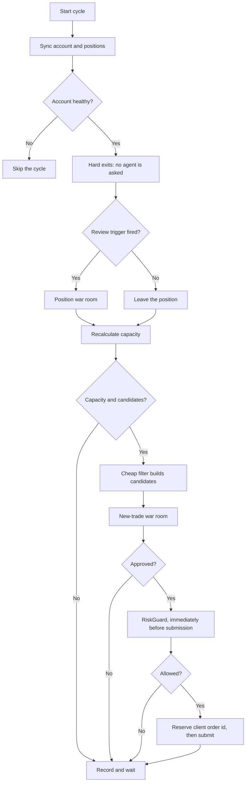

# Live Trading Cycle

One cycle every 30 minutes during regular US market hours. The interval is configuration and
the loop reads the Alpaca market clock. `TradingLoop.RunCycleAsync` is the code.

> **Existing positions are handled first. New trades are considered only after the current
> positions are safe.**

## The order is the safety property

1. **Hard exits run before anything is asked of an agent.** A stop-loss, a take-profit and the
   competition flatten are deterministic and consult nobody, so a hung or broken model can
   never delay one.
2. **The war room sits in the middle.** It only ever produces data.
3. **`RiskGuard` runs last, immediately before submission.** The market moves during a debate,
   so a proposal that passed pre-validation can still fail here. That is the design, not a
   redundancy.

## 1. Sync

Read equity, cash, positions, open orders and the market clock. **Alpaca is the source of
truth**; SQLite holds what the agent thought and did. A blocked account skips the cycle.

## 2. Hard exits

`RiskGuard.MandatoryExitReason` closes a position on the take-profit level, the stop-loss
level, or the competition flatten time. The first two come from the `StrategyPolicy` the agent
writes; the flatten time does not, because missing the measurement point cannot be recovered
from.

A position with no current price is **held**, not closed blindly.

## 3. Position review

`PositionReviewTriggers` decides whether a position needs judgement. A trigger does not close
anything — it asks whether the original thesis still holds. Five are built:

| Trigger | Fires when |
|---|---|
| Expiration | Two days or fewer remain |
| Profit milestone | Up 30% |
| Loss milestone | Down 20%, short of the hard stop |
| New news | Three or more fresh headlines since the last review |
| Scheduled | 90 minutes since the last review |

A triggered position goes to the **same** `WarRoomSession` a new trade goes to, with
`AllowedActions = [ClosePosition]`. `ADJUST` stays disabled until adjustment code is
validated.

A review that fails leaves the position alone. It is still covered by the hard exits.

## 4. Recalculate capacity

Position count, positions opened today, exposure against equity, the daily loss state, and
the remaining position slots.

## 5. Cheap filter

The filter decides what is **worth an agent call**. Whether a trade could legally exist is a
different question, answered by `ProposalPreValidator` inside the room.

For each tracked symbol the loop reads the spot price, requires fresh news when the policy
asks for it, pulls the call and put chains inside the policy expiration window and a strike
band around spot, computes the ladder market probability, drops anything already held, and
keeps the 40 cheapest that fall inside the tradeable probability band.

## 6. The war room

See [war room](../war-room/summary.md). Propose, pre-validate, analyse independently, debate,
rebut, vote privately, tally to a verdict and a size.

## 7. Risk and submission

`RiskGuard.CanOpen` checks per-trade risk, total exposure, position counts, the daily limit,
contract quality, and the expiration window. Then the loop **reserves the client order id in
SQLite before submitting**, so an uncertain result can be resolved by asking the broker
instead of sending a second order.

## 8. Persist

Every cycle writes an equity snapshot. Rejections are recorded with their reason: the
rejected path matters as much as the executed one.

## Related

- [War room](../war-room/summary.md)
- [Risk guardrails](risk-guardrails.md)
- [Position lifecycle](position-lifecycle.md)
- [Strategy parameters](strategy-parameters.md)
