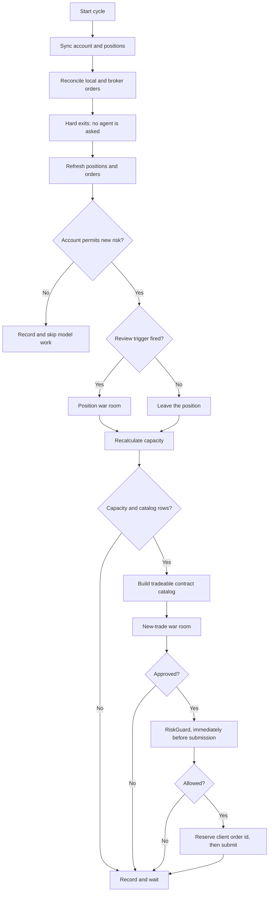

# Live Trading Cycle

One cycle every 30 minutes during regular US market hours. The interval is configuration and
the loop reads the Alpaca market clock. `TradingLoop.RunCycleAsync` is the code.

> **Existing positions are handled first. New trades are considered only after the current
> positions are safe.**



## The order is the safety property

1. **Hard exits run before anything is asked of an agent.** A stop-loss, a take-profit and the
   competition flatten are deterministic and consult nobody, so a hung or broken model can
   never delay one.
2. **The war room sits in the middle.** It only ever produces data.
3. **`RiskGuard` runs last, immediately before submission.** The market moves during a debate,
   so a proposal that passed pre-validation can still fail here. That is the design, not a
   redundancy.

## 1. Sync

Read equity, cash, positions, open orders and the market clock. Reconcile all unsettled local
orders by client ID. **Alpaca is the source of truth** for the current account. SQLite holds
the durable decision, order intent, policy, and review cursors.

## 2. Hard exits

`RiskGuard.MandatoryExitReason` closes a position on the take-profit level, the stop-loss
level, or the competition flatten time. The first two come from the `StrategyPolicy` the agent
writes; the flatten time does not, because missing the measurement point cannot be recovered
from.

A position with no current price is **held**, not closed blindly.

Hard exits run before the account restriction check. A blocked account or disabled options
level stops model work and new risk, but it does not stop a mandatory close attempt. The loop
refreshes positions and orders after a close attempt. It does not review that position again
in the same cycle.

## 3. Position review

`PositionReviewTriggers` decides whether a position needs judgement. A trigger does not close
anything — it asks whether the original thesis still holds. Five are built:

| Trigger | Fires when |
|---|---|
| Expiration | Two days or fewer remain |
| Profit milestone | Up 30% |
| Loss milestone | Down 20%, short of the hard stop |
| New news | Rolling headline count rises to three or more |
| Scheduled | 90 minutes since the last review |

A triggered position goes to the **same** `WarRoomSession` a new trade goes to, with
`AllowedActions = [ClosePosition]`. `ADJUST` stays disabled until adjustment code is
validated.

A review that fails leaves the position alone. It is still covered by the hard exits.
Review time and the current news-count marker persist in SQLite. The news trigger does not yet
compare stable headline IDs or publication times. This can miss replacement headlines in a
capped rolling window.

## 4. Recalculate capacity

Position count, filled buy orders for the current US market day, exposure against equity,
the prior-close equity baseline, and the remaining position slots.

Alpaca prior-close equity is the normal daily-loss baseline. A new account can omit this
value. The loop uses current equity as a process-local fallback only when the account has no
position and no fill for the current US market day. It logs this fallback. If the fallback is
not safe, the loop skips catalog construction and logs the exact failed risk check.

```csharp
var verdict = _riskGuard.CanConsiderNewPositions(snapshot);
var halted = !verdict.Allowed;
```

## 5. Tradeable contract catalog

C# reads one broad call-and-put chain for each tracked symbol. It uses all API pages. The
20 percent moneyness boundary controls request size. It is not a trade-quality rule.

The builder keeps each contract that has a current tradeable quote, acceptable spread,
allowed expiration, no held or pending duplicate, and one-contract risk that fits the
account. Missing delta or implied volatility does not reject a row. C# does not use news,
market probability, premium rank, or a quality score to choose rows.

```csharp
if (_riskGuard.CanOpen(oneContract, view, snapshot, policy).Allowed)
{
    catalog.Add(view);
}
```

The proposer receives the full compact catalog when it is at most 60,000 TOON characters.
A larger catalog becomes a summary index. The proposer can query the immutable local catalog
with symbol, type, expiration, strike bounds, and offset filters.

## 6. The war room

See [war room](../war-room/summary.md). Propose, pre-validate, analyse independently, debate,
rebut, vote privately, tally to a verdict and a size. A modified rebuttal creates version 2
and gets a new independent analysis, discussion, and private vote.

## 7. Risk and submission

`RiskGuard.CanOpen` checks per-trade risk, total exposure, position counts, the daily limit,
contract quality, and the expiration window. Then the loop **reserves the client order id in
SQLite before submitting**, so an uncertain result can be resolved by client ID. This rule
applies to buys and risk-reducing market sells.

## 8. Persist

Every cycle writes an equity snapshot. Each proposal version keeps its operation, thesis,
analyses, discussion, votes, verdict, review pass, and superseded state. Only the final
decision can link to an order. Rejections remain with their reason.

## Related

- [War room](../war-room/summary.md)
- [Risk guardrails](risk-guardrails.md)
- [Position lifecycle](position-lifecycle.md)
- [Strategy parameters](strategy-parameters.md)
- [Tradeable contract catalog](tradeable-contract-catalog.md)
- [Staged war-room context](../war-room/staged-context.md)
