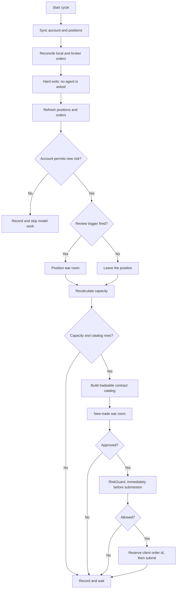
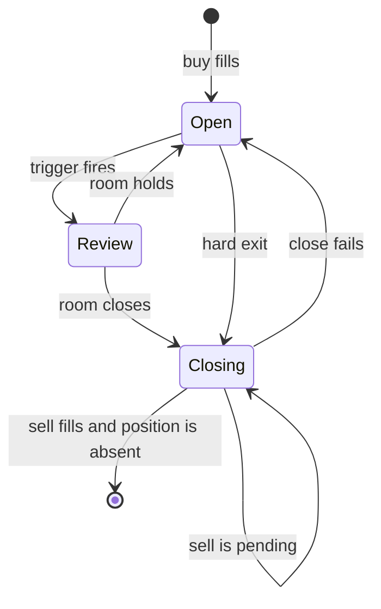

# Live Trading Cycle

The loop reads the Alpaca market clock during regular US market hours. After each completed
cycle, it waits the configured 30 minutes. A normal session stops when the clock reports a
closed market. `--once` is the explicit out-of-hours diagnostic override.

The deterministic exits also run on a separate one-minute timer, in parallel with this cycle.
See [hard-exit loop](hard-exit-loop.md). The order below is the order inside one cycle.

> **Existing positions are handled first. New trades are considered only after the current
> positions are safe.**



## The order is the safety property

1. **Hard exits run before anything is asked of an agent.** A stop-loss, a take-profit and the
   competition flatten are deterministic and consult nobody, so a hung or broken model can
   never delay one. They also run on their own one-minute timer, so they do not wait for the
   next cycle either. See [hard-exit loop](hard-exit-loop.md).
2. **The war room sits in the middle.** It only ever produces data.
3. **`RiskGuard` runs last, immediately before submission.** `TryOpenAsync` first reads the
   current quote for the selected contract and judges that, not the catalog row. The catalog is
   built at the start of the cycle and the room can debate for longer than `MaxQuoteAge`, so
   the catalog row is usually stale by this point. The limit price also comes from the
   refreshed quote.

   The refresh is a safety read through the typed market-data gateway. It reuses the ordinary
   chain read with both strike bounds and both expiration bounds pinned to the selected
   contract, so it returns one row.

   **It fails closed.** A read that throws, returns nothing, or returns no matching symbol
   rejects the trade with the `quote refresh` reason. A transient fault costs one trade. A
   stale quote must not reach the broker.

## 1. Sync

Read equity, cash, positions, open orders and the market clock. Reconcile all unsettled local
orders by client ID. **Alpaca is the source of truth** for the current account. SQLite holds
the durable decision, order intent, policy, and review cursors.

## 2. Hard exits

`RiskGuard.MandatoryExitReason` closes a position on the take-profit level, the stop-loss
level, or the competition flatten time. The first two come from the `StrategyPolicy` the agent
writes; the flatten time does not, because missing the measurement point cannot be recovered
from.

`TradingLoop.RunHardExitsAsync` calls the same `ManageOpenPositionsAsync` on the one-minute
timer. There is one copy of the exit rules and two callers. A broker gate makes sure that only
one of them can act on a position at a time.

A position with no current price is **held**, not closed blindly.

Hard exits run before the account restriction check. A blocked account or disabled options
level stops model work and new risk, but it does not stop a mandatory close attempt. The loop
refreshes positions and orders after a close attempt. It does not review that position again
in the same cycle.

## 3. Position review

`PositionReviewTriggers` decides whether a position needs judgement. A trigger does not close
anything — it asks whether the original thesis still holds. Five are built:

| Trigger | Fires when |
|---|---|
| Expiration | Two days or fewer remain |
| Profit milestone | Up 30% |
| Loss milestone | Down 20%, short of the hard stop |
| New news | Rolling headline count rises to three or more |
| Scheduled | 90 minutes since the last review |

A triggered position goes to the **same** `WarRoomSession` a new trade goes to, with
`AllowedActions = [ClosePosition]`. `ADJUST` stays disabled until adjustment code is
validated.

A review that fails leaves the position alone. It is still covered by the hard exits.
Review time and the current news-count marker persist in SQLite. The news trigger does not yet
compare stable headline IDs or publication times. This can miss replacement headlines in a
capped rolling window.

## 4. Recalculate capacity

Position count, filled buy orders for the current US market day, exposure against equity,
the prior-close equity baseline, and the remaining position slots.

Alpaca prior-close equity is the normal daily-loss baseline. A new account can omit this
value. The loop uses current equity as a process-local fallback only when the account has no
position and no fill for the current US market day. It logs this fallback. If the fallback is
not safe, the loop skips catalog construction and logs the exact failed risk check.

```csharp
var verdict = _riskGuard.CanConsiderNewPositions(snapshot);
var halted = !verdict.Allowed;
```

## 5. Tradeable contract catalog

C# reads one broad call-and-put chain for each tracked symbol. It uses all API pages. The
20 percent moneyness boundary controls request size. It is not a trade-quality rule.

The builder keeps each contract that has a current tradeable quote, acceptable spread,
allowed expiration, no held or pending duplicate, and one-contract risk that fits the
account. Missing delta or implied volatility does not reject a row. C# does not use news,
market probability, premium rank, or a quality score to choose rows.

```csharp
if (_riskGuard.CanOpen(oneContract, view, snapshot, policy).Allowed)
{
    catalog.Add(view);
}
```

The proposer receives the full compact catalog when it is at most 60,000 TOON characters.
A larger catalog becomes a summary index. The proposer can query the immutable local catalog
with symbol, type, expiration, strike bounds, and offset filters.

## 6. The war room

See [war room](../war-room/summary.md). Propose, pre-validate, analyse independently, debate,
rebut, vote privately, tally to a verdict and a size. A modified rebuttal creates version 2
and gets a new independent analysis, discussion, and private vote.

## 7. Risk and submission

The loop reads the current quote for the selected contract first, then judges that row.

```csharp
if (await RefreshAsync(candidate, cancellationToken) is not { } refreshed)
{
    // Reject. A stale quote must not reach the broker.
}

candidate = refreshed;
var verdict = _riskGuard.CanOpen(action, candidate, snapshot, Policy);
```

The account view is refreshed with the quote. `RefreshRiskSnapshotAsync` builds a new
`RiskSnapshot` inside the broker gate immediately before the risk check. The snapshot from the
start of the cycle is 8 to 10 minutes old by then, and a hard exit can close a position and
change equity while the room debates. The first snapshot is evidence for the room. Only the
refreshed one can authorise an order.

`RiskGuard.CanOpen` checks per-trade risk, total exposure, position counts, the daily limit,
contract quality, quote age, and the expiration window. A refreshed quote that is itself too
old is still rejected, so the refresh is not a way around the quote-age rule. Then the loop
**reserves the client order ID in SQLite before submitting**, so an uncertain result can be
resolved by client ID. This rule applies to buys and risk-reducing market sells.

Alpaca is the source of truth for open positions. A pending or uncertain sell blocks another
close and blocks review of that position. An open or partially filled sell is a submitted
close. Only a fill or a later broker position read confirms that the position is closed.



## 8. Persist

A normal completed path writes an equity snapshot. A provider or process fault can end a path
before that write. Each completed proposal version keeps its operation, thesis, analyses,
discussion, votes, verdict, review pass, and superseded state. Only the final decision can
link to an order. The current new-trade rejection path loses some proposal detail when it
converts the result to a hold. The active improvement plan records that defect.

## Related

- [War room](../war-room/summary.md)
- [Risk guardrails](risk-guardrails.md)
- [Trading summary](summary.md)
- [Storage schema](../storage/schema.md)
- [After-session improvements](../plans/after-session-improvements.md)
