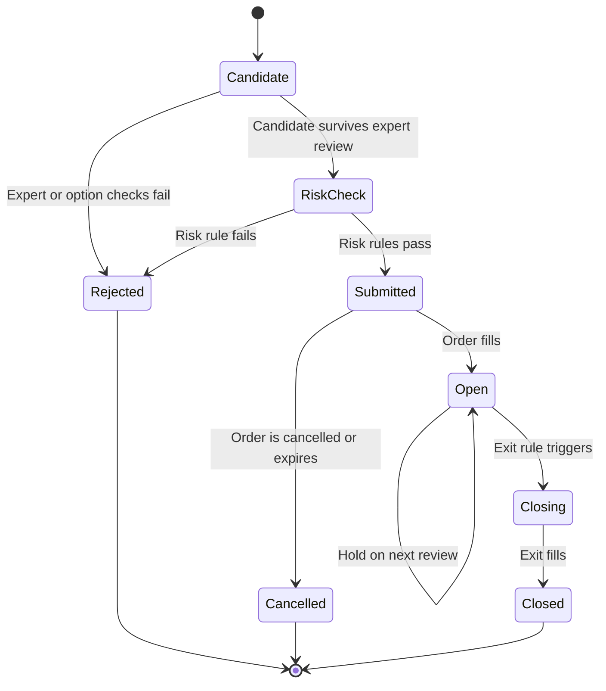

# Position Lifecycle

## States

| State | Meaning |
|---|---|
| `Candidate` | One option contract and one price question under evaluation. |
| `Rejected` | An expert check, an option check, or a risk rule failed. The reason is stored. |
| `RiskCheck` | The candidate is at the [risk guardrails](risk-guardrails.md). |
| `Submitted` | The order went to Alpaca. The fill is not confirmed. |
| `Open` | The position exists in the account. |
| `Closing` | An exit rule triggered. The exit order is not filled. |
| `Closed` | The exit filled. The realized P&L is known. |
| `Cancelled` | The order did not fill and it is no longer active. |

## Exit policy

The `PositionManager` reviews open positions in step 2 of every
[cycle](live-cycle.md). It can check:

- The profit target.
- The loss limit.
- The time to expiration.
- The quote validity.
- Strategy invalidation.
- The competition end rule. See below.

The exact values are **TBD** until replay tests are complete. See
[strategy parameters](strategy-parameters.md).

## The competition end rule

Alpaca evaluates total equity as of **end of day Thursday 2026-09-03**. Thursday-expiring
exercises and assignments appear in that value. Friday 09:30 ET only closes the window
formally.

> Thursday end of day is the effective final portfolio state.

**The `PositionManager` must not wait for a Friday quote or a Friday fill to improve the
result.** The Thursday exit policy is a strategy parameter: close everything before the
Thursday close, or allow a supported Thursday-expiration outcome. The choice must be
deliberate and tested. See
[competition constraints](../operations/competition-constraints.md).

## Exit order types

Alpaca supports market, limit, stop, and stop-limit orders for options. **It does not
support a trailing stop for options.** A trailing exit must be a `PositionManager` check
that submits a market or limit close order.

## Two rules

1. **The system does not close a position only because time passed.** The exit policy must
   match the strategy.
2. **The system must prevent accidental option expiration** if expiration handling is not
   part of the strategy. The one exception is a deliberate, tested Thursday-expiration
   policy.

## LLM re-check

An LLM re-check of an open position runs only when a trigger exists: important new news, a
large price change, a large change in the numerical forecast, or a scheduled long-interval
review. Do not call the LLM for every position on every 30-minute cycle.

## Persistence

The `Rejected` path is as important as the `Closed` path. Every skip and every rejection
gets a row with a reason. This audit trail is required for the hackathon demo. See
[observability](../operations/observability.md).

## Related

- [Live cycle](live-cycle.md)
- [Storage schema](../storage/schema.md)
