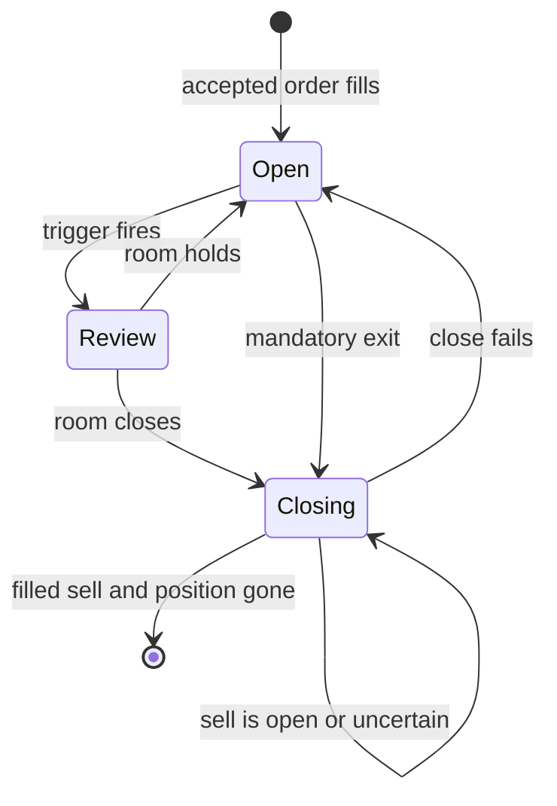

# Position Lifecycle

Alpaca is the source of truth for open positions. The loop applies mandatory exits before it
asks a model to review or open anything.



```csharp
var reason = riskGuard.MandatoryExitReason(position, policy, position.CurrentPrice);
```

Mandatory reasons include take profit, stop loss, and competition flatten time. Review
triggers include material P&L change, expiration approach, and new headline context.

A close is a reserved market sell with a client order ID. A pending or uncertain sell blocks
another close and blocks war-room review for that position. An open or partially filled sell
is a submitted close. Only a fill or a broker position refresh confirms a closed position.

## Audit contract

- A hold stores the reviewed position and reason.
- An invalid close stores a rejection.
- A close stores a decision and linked market-order reservation.
- Reconciliation updates the order and decision through fill, cancel, expiry, or rejection.
- A pre-close audit failure does not prevent one risk-reducing close attempt.
- The session stops after any close-path audit failure.

## Related lodes

- [Live cycle](live-cycle.md)
- [Risk guardrails](risk-guardrails.md)
- [Proposal review audit](../storage/proposal-review-audit.md)
- [Restart recovery](../operations/restart-recovery.md)
