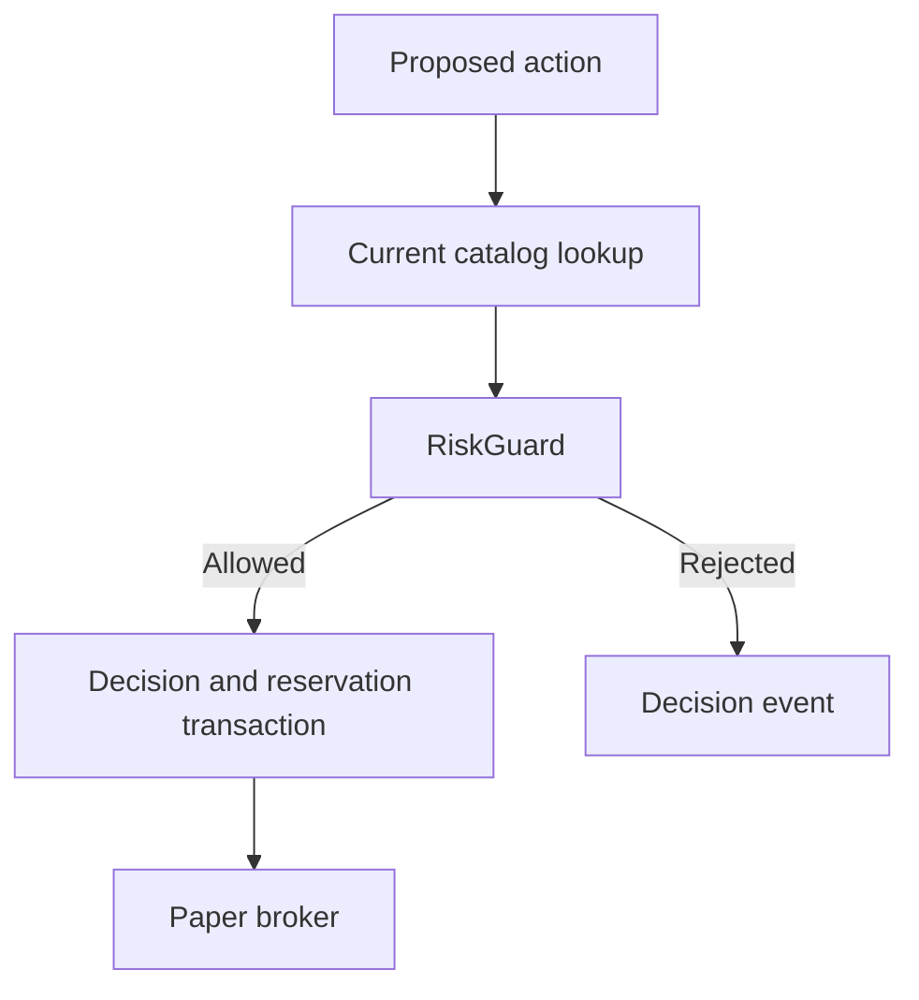

# Risk Guardrails

Deterministic C# owns every permission to add account risk. A model can request an action or
narrow a strategy policy. It cannot change `RiskOptions` or bypass `RiskGuard`.



```csharp
var verdict = riskGuard.CanOpen(action, candidate, snapshot, policy);
if (!verdict.Allowed) return;
```

## Verdict shape

A verdict carries two texts. `Reason` explains one candidate and can contain a measured
value. `Code` names the rule that decided and never contains a value, so a caller can count
thousands of rejections into a small number of groups.

```csharp
RiskVerdict.Reject("quote-too-old", $"quote is {age.TotalMinutes:N0} minutes old");
```

An allowed verdict has the code `allowed`. A code is kebab-case letters only. A test enforces
this shape, because a code that holds a number makes each row a separate group and the count
gives no information.

## Hard limits

| Limit | Current value |
|---|---:|
| Risk per trade | 2% of equity |
| Total premium exposure | 10% of equity |
| Daily loss halt | 5% from prior-close equity |
| Concurrent open and pending positions | 4 |
| Filled opening positions per US market day | 4 |
| Hard DTE range | 1 to 21 days |
| Maximum contracts per trade | 5 |
| Spread divided by ask | 15% |
| Maximum quote age | 10 minutes |
| Competition flatten | 2026-09-03 19:30 UTC |

The opening policy defaults to 1–10 DTE, 50 percent take profit, 40 percent stop loss, and
one contract. `StrategyPolicy.ClampTo` keeps every revision inside the hard limits.

## Contract and account rules

- Only long calls and long puts can open.
- The contract must exist in the current catalog and have a tradeable quote.
- Premium paid is the maximum risk for a long option.
- Held contracts, pending buys, cash, total exposure, slot count, and daily opens all apply.
- Prior-close equity is the normal daily baseline. If Alpaca omits it, current equity is a
  process-local fallback only when the account has no position and no fill today.
- Unknown prior-close equity after a position or fill fails closed.
- Unknown pending buy risk fails closed.

## The exit horizon

The expiration check permits a contract date through 2026-09-04. It rejects a later date.
`MandatoryExitReason` forces an exit at 2026-09-03 19:30 UTC. A Friday contract is therefore
permitted while a Thursday close is required.

**Every position is sold before it expires.** The flatten is 30 minutes before a close, and no
permitted contract expires earlier than the flatten day. This is a property of the system, not
a defect in one candidate. The room is told so directly: `TradingConstraints` carries
`PositionsExitAtUtc`, `HoursToForcedExit`, and `ExitIsAlwaysPreExpiry`, and each seat is
instructed to judge the mark-to-market value at the exit. Expiration-payoff and
break-even-at-expiry arguments do not apply.

A seat that judges expiration payoff rejects the entire eligible universe, because no contract
can pass. Three consecutive live cycles produced no order for this reason.

`StrategyPolicy.MinDaysToExpiration` is 1. `ClampTo(risk, today)` additionally lowers the floor
to fit the flatten, because the floor is persisted in `strategy_state` and a saved value inside
the hard bounds cannot be lowered by the hard-bound clamp.

## Order and exit rules

Hard exits for take profit, stop loss, and competition flatten run before model work. A
missing current position price holds the position instead of closing it without a price.

An accepted decision and order reservation commit before broker submission. A pending sell
blocks a duplicate close. An uncertain buy is not replayed. An uncertain risk-reducing sell
can be retried with the same client ID after broker reconciliation.

Dry run uses the same market reads and risk checks. `DryRunTradingGateway` intercepts broker
writes. `--allow-stale-quotes` is valid only with dry run. It skips only quote-age checks in
the catalog, proposal pre-validation, and final risk validation. A missing timestamp and all
other quote-quality failures still reject.

## Related lodes

- [Trading summary](summary.md)
- [Live cycle](live-cycle.md)
- [Storage schema](../storage/schema.md)
- [Fault and recovery behavior](../operations/summary.md)
- [Open strategy questions](../plans/open-strategy-questions.md)
