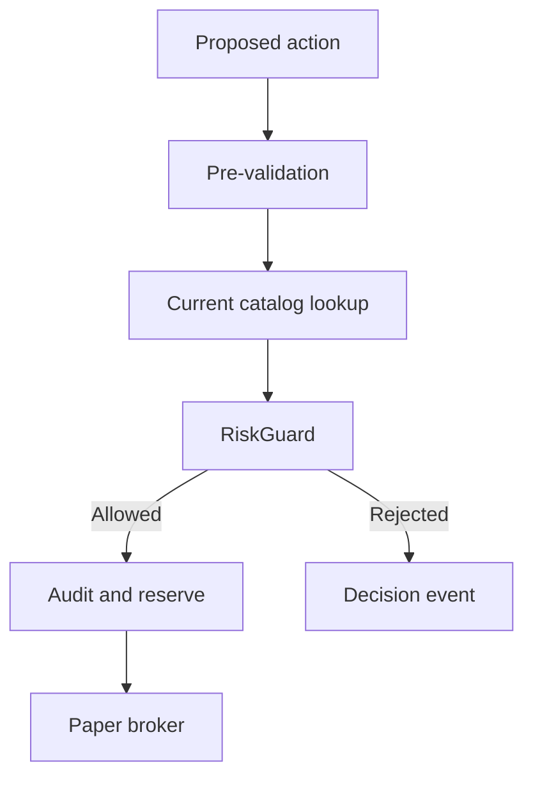

# Risk Guardrails

Deterministic C# owns every permission to add account risk. The model can request an action,
but it cannot bypass a guardrail.



```csharp
var verdict = riskGuard.CanOpen(action, candidate, snapshot, policy);
if (!verdict.Allowed) return;
```

## Hard rules

- Paper environment only.
- Long calls and long puts only.
- Current two-sided quote required.
- Spread and quote age must pass.
- Contract must exist in the current catalog.
- No duplicate held or pending contract.
- Per-trade, total, daily-loss, position-count, and daily-open limits apply.
- An account-wide halt gives an exact reason. The reason identifies a missing equity baseline,
  unknown pending risk, or the measured daily loss.
- Prior-close equity is the daily-loss baseline. If Alpaca does not supply it, the loop can use
  current equity only when the account has no position and no fill for the current US market day.
  The loop keeps this fallback value for the rest of the process. All other missing-baseline
  cases fail closed.
- Expiration must finish before the competition flatten boundary.
- An accepted decision and order reservation commit before broker submission.
- A failed audit write stops the session.

Dry run uses the same rules and current data. It replaces the trading gateway with a gateway
that records planned orders and sends none.

```csharp
var accountVerdict = riskGuard.CanConsiderNewPositions(snapshot);
if (!accountVerdict.Allowed)
{
    logger.LogWarning("New positions halted: {Reason}", accountVerdict.Reason);
}
```

## Related lodes

- [Strategy parameters](strategy-parameters.md)
- [Contract catalog](tradeable-contract-catalog.md)
- [Fault handling](../operations/fault-handling.md)
- [Audit schema](../storage/schema.md)
