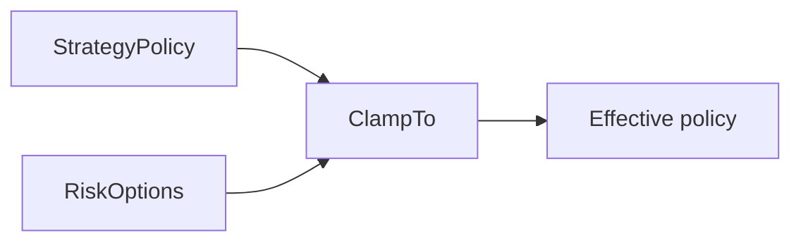

# Strategy Parameters

`StrategyPolicy` contains agent-owned policy values. `RiskOptions` contains human-owned hard
bounds. `ClampTo` prevents a model from widening those bounds.



```json
{
  "CycleMinutes": 30,
  "MaxConcurrentPositions": 4,
  "MaxNewPositionsPerDay": 4,
  "MaxRiskPerTradeFraction": 0.02,
  "MaxTotalRiskFraction": 0.10,
  "MaxDailyLossFraction": 0.05,
  "MaxSpreadFraction": 0.15,
  "MaxQuoteAge": "00:10:00",
  "CompetitionFlattenUtc": "2026-09-03T19:30:00Z"
}
```

Opening policy defaults are 2 to 10 days to expiration, 50% take profit, 40% stop loss,
and one contract per trade. Hard bounds allow 1 to 21 days and at most five contracts.

## Invariants

- A hard bound changes only by an explicit human decision.
- A policy revision stores its rationale in the decision evidence.
- Premium paid is maximum risk for a long option.
- Live quote measurements set spread and age checks.
- Real-trade audit data is the future calibration source.

## Related lodes

- [Risk guardrails](risk-guardrails.md)
- [Contract catalog](tradeable-contract-catalog.md)
- [Historical model evidence](../research/historical-model-evidence.md)
- [Observability](../operations/observability.md)
