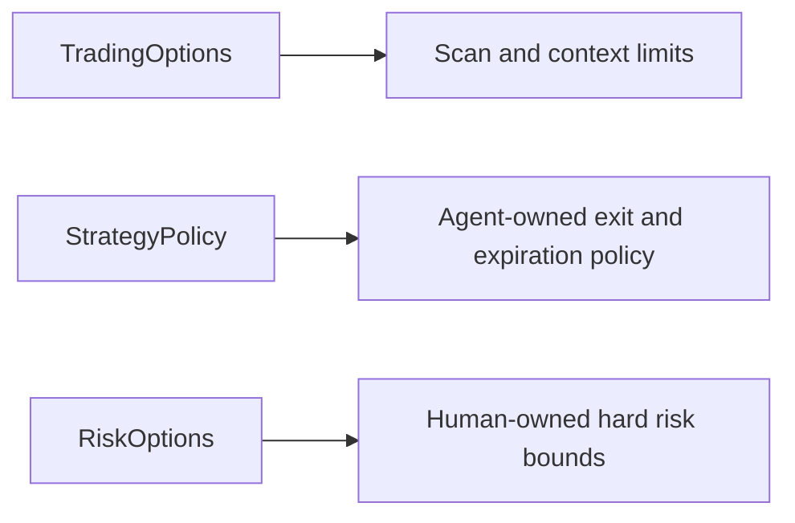

# Strategy Parameters

The architecture separates strategy parameters from code. A strategy number must never
appear in a C# file. It belongs in `TradingOptions`, `RiskOptions`, or `AgentOptions`.



## Decided values

```json
{
  "CycleMinutes": 30,
  "TrackedSymbols": [
    "SPY", "QQQ", "IWM", "AAPL", "MSFT", "NVDA", "AMZN",
    "META", "GOOGL", "TSLA", "AMD", "MU", "INTC"
  ],
  "MaxConcurrentPositions": 4,
  "MaxNewPositionsPerDay": 4,
  "OptionScanMaxMoneynessFraction": 0.20,
  "InlineCatalogCharacterLimit": 60000,
  "CatalogToolPageSize": 200,
  "HeadlineLimit": 25,
  "MaxHeadlinesPerSymbol": 3,
  "MinExpertSamplesForAdaptiveWeight": 20
}
```

`MaxConcurrentPositions`, `MaxNewPositionsPerDay`, and `CycleMinutes` are development
defaults. They are not final strategy values.

`TrackedSymbols` is **measured**, not chosen. It is the output of the four admission rules in
[universe](universe.md). Rebuild it with `scripts/screen-universe.sh`; do not edit the list
by hand.

Trailing stop is **not** a valid order type for options. See
[MCP integration](../alpaca/mcp-integration.md).

## The agent owns the strategy values (ADR-016)

**There is no TBD list waiting on replay any more.** ADR-013 left the project with no
forecaster that beats the option price, so there was no signal to calibrate a threshold
against. Rather than freeze guessed constants, the agent owns these values in
`StrategyPolicy`, rewrites them from its own measured results, and `ClampTo` bounds every
revision.

These are the **opening defaults**. They are chosen, not measured.

```json
{
  "MinDaysToExpiration": 2,
  "MaxDaysToExpiration": 10,
  "TakeProfitFraction": 0.50,
  "StopLossFraction": 0.40,
  "MaxContractsPerTrade": 1
}
```

Market probability, fresh news, contract count caps, and low-premium rank are not catalog
rules. The war room judges trade quality. `OptionLadder` remains available for replay and
research, but the live catalog does not use it.

## The hard bounds the agent cannot cross

`RiskOptions` is C# only. No model output can change a value here.

```json
{
  "MaxRiskPerTradeFraction": 0.02,
  "MaxTotalRiskFraction": 0.10,
  "MaxDailyLossFraction": 0.05,
  "MaxConcurrentPositions": 4,
  "MaxNewPositionsPerDay": 4,
  "HardMinDaysToExpiration": 1,
  "HardMaxDaysToExpiration": 21,
  "HardMaxContractsPerTrade": 5,
  "MaxSpreadFraction": 0.15,
  "MaxQuoteAge": "00:10:00",
  "CompetitionFlattenUtc": "2026-09-03T19:30:00Z"
}
```

**These are chosen, not measured, and that is correct.** Risk appetite is a decision, not a
prediction; no amount of history measures how much of the account to put at risk.

A long option cannot lose more than its premium, so the premium paid **is** the risk. That
makes `MaxRiskPerTradeFraction` exact rather than an estimate.

## What still cannot be measured offline

| Value | Why |
|---|---|
| `MaxSpreadFraction` | Alpaca serves no historical option quote. Replay reports `UnknownHistorical` and skips the rule. |
| `MaxQuoteAge` | Same reason. |

Both are testable in live paper trading only. See
[option data availability](../replay/option-data-availability.md).

## Rule

A **hard bound** changes only by an explicit human decision, recorded here.
A **policy value** may change whenever the agent justifies it; the rationale is written to
the audit trail.

## Related

- [Risk guardrails](risk-guardrails.md)
- [Replay mode](../replay/replay-mode.md)
- [Tradeable contract catalog](tradeable-contract-catalog.md)
