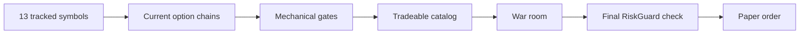

# Trading Summary

The trading domain contains deterministic money logic. Models propose typed actions. C# builds
the allowed contract set, checks risk, reserves orders, and submits through the paper gateway.



```csharp
public IReadOnlyList<string> TrackedSymbols { get; init; } =
    ["SPY", "QQQ", "IWM", "AAPL", "MSFT", "NVDA", "AMZN",
     "META", "GOOGL", "TSLA", "AMD", "MU", "INTC"];
```

## Current universe

`TradingOptions` fixes the 13 symbols above. The runtime has no market-wide scanner and no
dynamic admission process. Retained historical screening data does not change this list at
run time.

For each symbol, the gateway reads an option chain within 20 percent of the current
underlying price. This boundary controls request size. It is not a trade-quality score.

## Tradeable catalog

The catalog is the complete set that passed the current mechanical checks for one cycle.
It does not rank rows. A row requires:

- a tracked underlying and a call or put contract;
- an expiration inside the policy, hard, and competition code limits;
- a positive, current, two-sided, non-crossed quote;
- spread divided by ask of at most 15 percent;
- no held or pending duplicate contract; and
- one-contract premium that fits cash, slots, and exposure limits.

Delta and implied volatility are optional metadata. A missing value does not reject the row.
Market probability, news, premium rank, and a quality score do not select catalog rows.

Each removed contract is counted against the first gate that refused it. The cycle prints the
counts under event `2007`. See [observability](../operations/observability.md).

A measurement on 2026-09-01 out of hours examined 7,994 contracts and admitted none:
`expires-after-flatten` 3,188, `over-per-trade-risk` 2,936, `quote-too-old` 802,
`spread-too-wide` 668, `quote-not-two-sided` 400. The competition flatten date and the
2-percent per-trade limit therefore remove more of the chain than any quote rule does. The
scan window asks for up to 21 days to expiration while the flatten date permits four, so the
loop reads thousands of contracts each cycle that no gate can admit.

The proposer receives full TOON when the payload is at most 60,000 characters. A larger
catalog becomes an index. The local catalog tool reads the same immutable catalog in pages of
at most 200 rows.

## Cadence

`LiveSession` runs during regular US market hours. After a cycle completes, it waits the
configured 30 minutes. The start-to-start interval therefore includes the sitting time plus
30 minutes. A recoverable cycle fault changes the next wait to five minutes.

## Related lodes

- [Live cycle](live-cycle.md)
- [Risk guardrails](risk-guardrails.md)
- [War room](../war-room/summary.md)
- [Market-data policy](../alpaca/market-data-policy.md)
