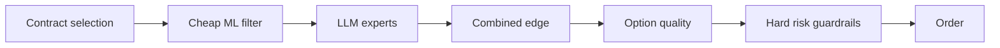

# Trading

This domain holds all money logic. It is deterministic C#. No LLM call and no MCP tool name
belongs here.

## The loop

The `TradingLoop` runs one cycle about every 30 minutes during regular US market hours. The
exact interval is configuration. The loop uses the Alpaca market clock. **It must not assume
that every weekday is a trading day.**

The twelve steps are in [live cycle](live-cycle.md).

## Tracked symbols

The first version uses a fixed list of liquid symbols (ADR-008):

```text
SPY  QQQ  AAPL  MSFT  NVDA  AMZN  META  GOOGL  TSLA  AMD
```

The list is configuration data. The architecture does not require these exact symbols. The
benefits are: a small implementation, active options markets, frequent news, and no need for
a market-wide scanner. The system focuses on the quality of the decision process.

## The gate order

A candidate must pass every gate. The order matters: the cheap gates run first.



## Related

- [Live cycle](live-cycle.md)
- [Position lifecycle](position-lifecycle.md)
- [Risk guardrails](risk-guardrails.md)
- [Strategy parameters](strategy-parameters.md)
- [TUI](tui.md)
