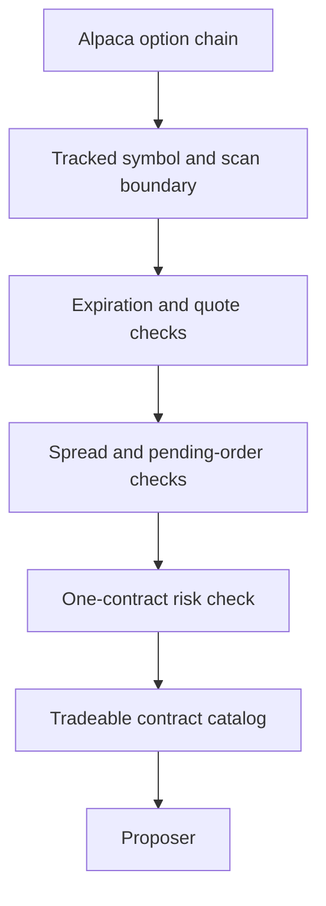

# Tradeable Contract Catalog

The tradeable contract catalog is the authoritative option set for one cycle. C# checks if a
contract exists and if the system can trade it safely. An agent decides if the contract is a
good trade. The catalog does not rank contracts.



## Contract

The scan uses all tracked symbols. It uses the policy expiration window. It uses a 20 percent
moneyness boundary only to control the API request size.

```csharp
public sealed record TradeableContractView
{
    public required OptionCandidate Contract { get; init; }
    public required decimal UnderlyingPrice { get; init; }
    public decimal CostPerContract => Contract.ReferencePrice * 100m;
}
```

`Delta` and `ImpliedVolatility` are nullable metadata. A missing value does not reject a
contract. A missing or invalid quote does reject a contract.

The catalog has these invariants:

- The contract has a tracked underlying.
- The contract is a call or a put.
- The expiration is inside the policy and hard windows.
- A live quote is fresh, positive, two-sided, and not crossed.
- The spread is inside the hard limit.
- The contract is not held and has no pending buy order.
- One contract fits the cash, exposure, slot, and hard risk limits.
- Market probability, news, cost rank, and a quality score do not select catalog rows.

The live gateway reads all option-chain pages. It requests 1,000 rows on each page. A page
failure rejects the symbol for that cycle. The builder must not use a partial chain.

## Payload boundary

The catalog stays complete in memory. The proposer receives the full TOON catalog when the
encoded catalog is at most 60,000 characters. A larger catalog becomes a per-symbol index.
The local `get_tradeable_contracts` tool reads the same immutable catalog.

```text
get_tradeable_contracts(
    underlying: "SPY",
    option_type: "call",
    expiration: "2026-09-02",
    strike_from: 620,
    strike_to: 650,
    offset: 0)
```

The tool returns at most 200 rows. Paging limits one answer. It does not remove a contract
from the catalog. The tool does not call Alpaca and cannot change state.

## Rationale

A fixed contract count can hide a valid trade. A cheapest-first list selects low-premium
contracts and becomes a strategy. The complete catalog keeps the safety boundary in C# and
keeps trade judgment in the war room.

## Related

- [Live cycle](live-cycle.md)
- [Risk guardrails](risk-guardrails.md)
- [Staged war-room context](../war-room/staged-context.md)
- [Alpaca integration](../alpaca/mcp-integration.md)
