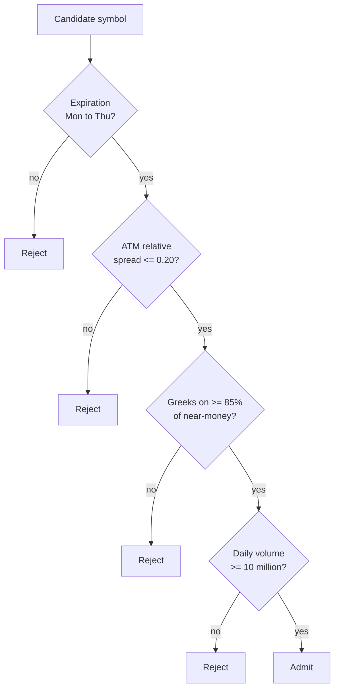

# Trading Universe

The universe is the set of symbols that the system can trade. A symbol enters the universe
only if measured data shows that it obeys all four admission rules.

Do not add a symbol by opinion. Run [screen-universe.sh](../../scripts/screen-universe.sh)
and use the result.

## The admission rules



| Rule | Value | Why |
|---|---|---|
| 1. Expiration in the window | >= 1 between Monday and Thursday | Friday is after the finish line. A Friday-only symbol keeps unrealized time value at Thursday EOD. See [competition constraints](../operations/competition-constraints.md). |
| 2. ATM relative spread | <= 0.20 | `(ask - bid) / mid`. A wider spread takes too much of the move. |
| 3. Greeks coverage | >= 0.85 of near-money contracts | The market probability reference needs delta. A contract with no delta is not usable. |
| 4. Average daily volume | >= 10,000,000 | Thin underlying data gives weak features. |

Rule 1 is the hard rule. It comes from the four-day competition window, not from market
quality.

## The current universe

13 symbols. Measured on 2026-08-29 against the expiration window 2026-08-31 to 2026-09-03.

| Symbol | Volume | Near-money contracts | Greeks ok | ATM spread | Expirations |
|---|---|---|---|---|---|
| SPY | 44.1M | 376 | 324 | 0.170 | 4 |
| QQQ | 37.5M | 352 | 329 | 0.125 | 4 |
| IWM | 19.2M | 154 | 145 | 0.160 | 4 |
| TSLA | 37.6M | 32 | 31 | 0.041 | 2 |
| AMZN | 43.4M | 24 | 23 | 0.072 | 2 |
| NVDA | 128.6M | 20 | 20 | 0.076 | 2 |
| INTC | 111.5M | 24 | 23 | 0.083 | 2 |
| AMD | 25.2M | 48 | 48 | 0.092 | 2 |
| MU | 38.5M | 44 | 44 | 0.105 | 2 |
| META | 16.6M | 56 | 56 | 0.124 | 2 |
| MSFT | 33.2M | 48 | 46 | 0.143 | 2 |
| AAPL | 49.8M | 36 | 33 | 0.165 | 2 |
| GOOGL | 28.6M | 32 | 30 | 0.176 | 2 |

## The two tiers

**SPY, QQQ, and IWM have an expiration on each day of the window.** The other ten have two.

This is a structural difference, not a small one. A daily-expiry symbol lets the system open
a position with 0 to 3 days to expiration on any day and close or expire it before Thursday
EOD. A two-expiry symbol gives fewer choices near the finish line.

> Prefer a daily-expiry symbol when the decision is late in the window.

## The rejected symbols

| Symbol | Failed rule | Measured value |
|---|---|---|
| DIA | 1 | 0 expirations in the window |
| NFLX | 1 | 0 expirations in the window |
| COIN | 1 | 0 expirations in the window |
| PLTR | 1 | 0 expirations in the window |
| BAC | 1 | 0 expirations in the window |
| AVGO | 2 | spread 0.439 |
| XLF | 2 | spread 0.468 |

XLF passes rule 1 with four expirations, but its spread is the worst measured. Volume in the
underlying does not predict option spread quality.

## Greeks are reliable only near the money

Across a full SPY chain of 500 contracts, only 101 carry non-zero greeks. Near the money the
data is good. The ATM delta ladder for SPY at 769.28 is clean and monotonic:

```text
strike 765  delta 0.8493      strike 770  delta 0.4536
strike 766  delta 0.7711      strike 771  delta 0.3624
strike 767  delta 0.7074      strike 772  delta 0.2689
strike 768  delta 0.6342      strike 773  delta 0.1958
strike 769  delta 0.5467      strike 774  delta 0.1233
                              strike 775  delta 0.0741
```

Delta is 0.5467 at the strike nearest to spot. This is correct behavior.

**Therefore `OptionCandidateSelector` must reject a contract with delta 0.** A zero delta
means no usable quote, not a zero probability. See
[options evaluator](../trading/risk-guardrails.md).

## How to rebuild this file

```bash
bash scripts/screen-universe.sh            # writes data/raw/universe-screen.csv
```

Change `EXP_FROM` and `EXP_TO` when the window moves. The rules stay the same.

## Related

- [Strategy parameters](strategy-parameters.md)
- [Options evaluator](../trading/risk-guardrails.md)
- [Market data policy](../alpaca/market-data-policy.md)
- [Competition constraints](../operations/competition-constraints.md)
