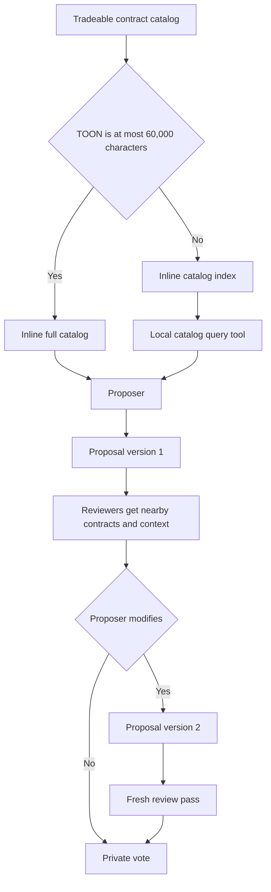

# Staged War-Room Context

The war room receives information in stages. Basic portfolio and market facts are direct
context. Research tools provide deeper evidence. This design prevents repeated option-chain
discovery and prevents the full catalog from reaching every reviewer.



## Proposer context

The proposer always receives these items:

- Account equity and cash.
- Remaining risk and free position slots.
- Enriched open positions and their original thesis.
- Pending orders.
- The tracked symbols.
- Underlying last price, timestamp, one-day return, and five-day return.
- Hard constraints.
- A 25-row headline index.
- The full catalog or the catalog index.

`ProposerPersona` owns the prompts, context payloads, and model turn flow. `ProposerTools`
owns all local proposer tools and their schemas. The local catalog tool reads only the
catalog for the current cycle.

```csharp
var tools = [
    .. ResearchTools,
    _tools.CreateCatalogTool(market),
    proposalTool,
];
```

The headline index uses unique article IDs. Each tracked symbol nominates its newest article.
The system merges the nominations by article ID. It fills free places by global recency. In
the fill phase, it does not let a symbol occur in more than three selected articles.

## Reviewer context

Each reviewer receives the same basic context for analysis, discussion, and voting:

```text
proposal and thesis
proposed contract
two lower and two higher strikes for the same type and expiration
nearest strike in the prior and next expiration
selected underlying, SPY, and QQQ snapshots
portfolio capacity
open positions
pending orders
relevant headline index entries
```

Reviewers can use read-only MCP tools for exact snapshots, trades, bars, news, corporate
actions, market context, and web research. They do not receive the full catalog. Alpaca option
chain and option contract discovery tools are not available to an agent.

## Proposal versions

A rebuttal can defend, withdraw, or make one change inside the reviewed contract
neighborhood. A change creates version 2. C# validates version 2. The reviewers then perform
a new independent analysis, discussion, and private vote. There is no second rebuttal.

The active version controls execution. The audit keeps all versions.

```csharp
public sealed record ProposalReviewPass
{
    public required int ProposalVersion { get; init; }
    public required int ReviewPass { get; init; }
    public required bool Superseded { get; init; }
}
```

A superseded pass is not deleted. Its analyses and discussion explain why the proposer
changed the contract. Only the final active pass can link to an order.

## Related

- [War room](summary.md)
- [Tradeable contract catalog](../trading/tradeable-contract-catalog.md)
- [Tool policy](../llm/tool-policy.md)
- [Observability](../operations/observability.md)
