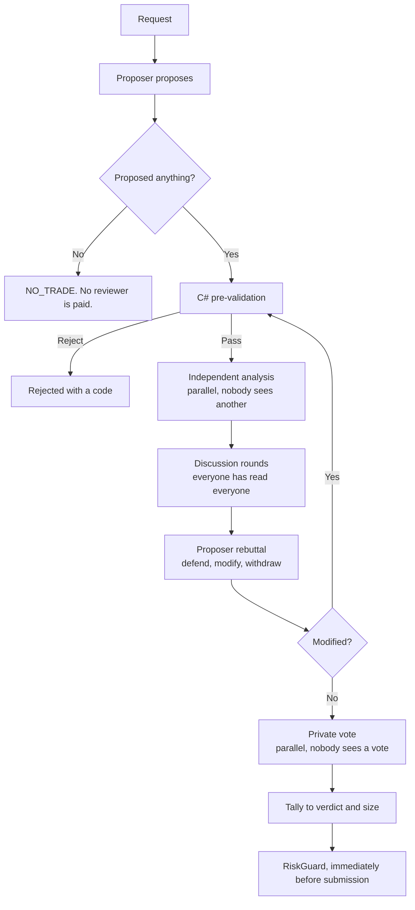

# The War Room

The decision process. One class, `WarRoomSession`, serves both new trades and position
reviews. See ADR-019 to ADR-022.

> **Agents decide what they want to do. C# decides what they are permitted to do.**

## The five phases



## The two properties that matter

**Independence.** Analyses are formed in parallel and each reviewer sees nothing from the
others. Sharing first lets the earliest speaker anchor the room, and a room that agrees
because it was anchored is pure cost. Initial votes are recorded before the debate, so a
change of mind is visible.

**Privacy.** `RoomContext` **has no votes field.** Final votes stay hidden until every vote is
in, and leaving the field out of the type means no future edit can leak one vote into another
persona's prompt. `WarRoomTests` asserts the property does not exist.

## The seats

A persona is a class, not a configuration row (ADR-020). Every LLM seat gets the **same**
read-only tools and differs by model, because a room of one model arguing with itself shares
that model's blind spots.

| Seat | Provider | Role |
|---|---|---|
| `proposer` | Claude Sonnet 5 | Searches the allowed universe. Carries the full research toolset. Can answer NO_TRADE. |
| `skeptic` | Claude Sonnet 5 | Assumes the proposal is wrong and looks for the strongest reason to reject it. |
| `quant` | GPT-5.6-terra | Judges the contract: strike, expiration, spread, liquidity, maximum loss. |
| `market` | Grok 4.6 | Price action, market context, news and scheduled events. |
| `exposure` | **none** | Portfolio arithmetic in plain C#. Costs nothing and cannot hallucinate. |

`ExposureRiskPersona` is the proof that `IPersona` is not an LLM interface. It does not
replace `RiskGuard`: RiskGuard enforces the hard limits and cannot be outvoted, while this
seat votes on whether a *legal* trade is a sensible use of the remaining capacity.

## Votes to size

`VoteTally`, deterministic C#. No model touches it.

```text
net = Σ(+confidence approve, −confidence reject, 0 abstain) ÷ every voter

net ≤ ApproveThreshold  → rejected
net >  ApproveThreshold → approved, contracts = max(1, round(desired × net))
```

`ApproveThreshold` is **0** today. A faulted voter dilutes conviction rather than vanishing,
so a half-broken room cannot look unanimous, and under `RequireEveryVoter` a fault rejects
outright.

## Nothing that fails may decide anything

| Failure | Result |
|---|---|
| A reviewer throws | Fault, counted as an abstention, **never an approval** |
| The proposer throws | NO_TRADE |
| The rebuttal throws | The original proposal stands and is still voted on |
| A position review throws | The position is left alone, still covered by the hard exits |

Without these a broken seat would silently cancel every trade, which is the veto power the
design denies it.

## Cost

`TokenLedger` records `ChatResponse.Usage` per persona and model; `ModelPricing` converts to
US dollars.

> **Token counts are fact. Dollars are an estimate and a floor.** The rate table is hardcoded
> and goes stale, an unpriced model is excluded from the total and named, and hosted web
> search normally bills per call outside token counts.

Rate state, checked 2026-08-31:

| Model | Seat | Rate |
|---|---|---|
| `claude-sonnet-5` | proposer, skeptic | 2.00 / 10.00, cache read 0.20. **Was wrong**: the table held 3.00 / 15.00 and over-reported by 50%. |
| `gpt-5.6-terra` | quant | 2.00 / 12.00, cache read 0.20. Output is 6x input, a steeper ratio than the others. |
| `grok-4.6` | market | 2.00 / 6.00, cache read 0.50, standard tier. |

Three known undercounts, all silent:

- **A cache write** bills above fresh input (2.50 or 4.00 against 2.00 on Sonnet 5, by TTL).
  `CachedInputPerMillion` is the cache **read** rate and the usage figures do not separate
  the two.
- **xAI doubles every rate above 200K input tokens** in one call. The table holds the cheaper
  tier. Tiering properly has to happen when a call is recorded: by the time the ledger totals
  a persona the per-call context length is gone, and a cumulative total crossing 200K does
  not mean any single call did.
- **Web research** is an ordinary MCP tool call, so its tokens are counted here, but the
  Keenable service bills on its own terms, outside this table.

> **A stale table over-reported Opus by 3x.** `claude-opus-5` held 15.00 / 75.00 / 1.50,
> which is the **retired Opus 4.1 and Opus 4** rate: an old price list carried forward under
> a new model name. It is 5.00 / 25.00 / 0.50. No seat uses it.

### The proposer is the seat that spends

The tool loop resends the whole conversation on each turn: the prompt, the candidate payload,
the 25 tool schemas, and each earlier tool result. Only the proposer loops like this, so it
bills more input than the other four seats together. Two measured searches, in cycles where
the room never sat:

| Run | Input | Output | On Opus 5 | On Sonnet 5 |
|---|---|---|---|---|
| web research on | ~158,000 | ~7,300 | 0.98 USD | 0.39 USD |
| `--no-web-search` | ~341,000 | ~7,200 | 1.88 USD | 0.75 USD |

Input is 96 to 98 percent of that, and output is nearly constant. The seat runs on Sonnet 5
for this reason: 2.00 against 5.00 per million input.

**The payload is TOON, not JSON.** Forty candidates of nine fields and twenty-five headlines
repeat each field name in JSON, and this seat resends them on each turn. `Toon.Encode` writes
a uniform array one time as a header and then as rows. Only this seat does it, and the saving
is not measured (ADR-028).

**Nothing sets `cache_control`.** The part of a request that does not change between turns —
the prompt, the payload, the tool schemas — is billed again at the full rate on every turn,
when a cache read costs 0.20. That is the larger correction and it is not made.

One proposal costs roughly: 1 proposal + 3 analyses + (3 × rounds) discussion + 1 rebuttal +
3 votes. With two rounds that is about **14 model calls**, before the tool calls behind them.

## Position review

The same session, a different request: `Purpose = PositionReview`, `AllowedActions =
[ClosePosition]`. `ADJUST` stays disabled until adjustment code is validated.

Triggers are deterministic and live in `PositionReviewTriggers`. Five of the specification's
sixteen are built: time to expiration, profit milestone, loss milestone, fresh news, and the
scheduled interval. **Hard exits run first and consult nobody**, so a stop-loss never waits on
a model answering.

## Related

- [Architecture decisions](../architecture/decisions.md) — ADR-019 to ADR-022
- [Critic agent](critic-agent.md) — the skeptic seat
- [Live cycle](../trading/live-cycle.md)
- [Risk guardrails](../trading/risk-guardrails.md)
- [Strategy parameters](../trading/strategy-parameters.md)
