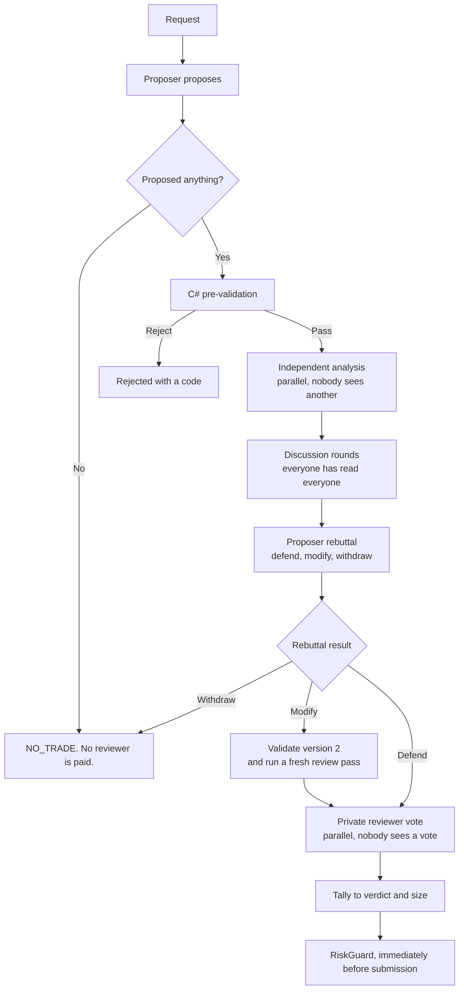

# The War Room

One `WarRoomSession` serves new trades and position reviews. See ADR-019 and ADR-021.

> **Agents decide what they want to do. C# decides what they are permitted to do.**

## The five phases



## Stated numbers are checked, not trusted

The proposer copies the bid, ask, underlying last price, delta, and implied volatility it
reasoned from into fields on its action. `ProposalPreValidator` compares each supplied value
with the catalog row and returns `REJECT_FABRICATED_QUOTE` when one differs by more than one
percent. This runs before any reviewer is paid.

A model that writes its arithmetic only into prose cannot be checked, because prose has no
field to compare. The room also cannot find a false premise by debating it: every seat reads
the same number. The check is arithmetic and costs nothing.

Every field is optional, and an absent claim is not checked. A claim the catalog cannot answer
also passes, because a missing delta or implied volatility is ordinary on the Indicative feed
and is not evidence of invention.

```csharp
private const decimal ClaimTolerance = 0.01m;
```

## The two properties that matter

**Independence.** Analyses are formed in parallel and each reviewer sees nothing from the
others. Sharing first lets the earliest speaker anchor the room, and a room that agrees
because it was anchored is pure cost. Initial votes are recorded before the debate, so a
change of mind is visible.

**Privacy.** `RoomContext` **has no votes field.** Final votes stay hidden until every vote is
in, and leaving the field out of the type means no future edit can leak one vote into another
persona's prompt. `WarRoomTests` asserts the property does not exist.

## Time limits

Two limits apply, and they are independent.

The room deadline is 13 minutes. It stops the room from starting a new discussion round. It
does not stop a phase that is already in progress, and it does not apply to the proposal, the
analysis, the rebuttal, or the vote.

Each model call has its own limit. `LlmPersona.CallTimeout` is 6 minutes, and the proposer
uses 9 minutes because its search is the longest phase. A call that passes its limit is
cancelled and becomes a persona fault, which is an abstention. It does not stop the sitting.
Provider retries occur below this application, so a linked cancellation token is the only
available control.

```csharp
using var call = CancellationTokenSource.CreateLinkedTokenSource(cancellationToken);
call.CancelAfter(CallTimeout);
```

The tool loop permits a maximum of 25 iterations for each request. This limits the token cost
of a model that repeats tool calls.

Measured sitting on 2026-09-01: 8 minutes 30 seconds in total. The proposal used 3 minutes 59
seconds, the parallel analysis 1 minute 20 seconds, one discussion round 2 minutes 21 seconds,
and the rebuttal 48 seconds.

## The seats

A persona is a class, not a configuration row (ADR-020). Every LLM seat gets the same
external read-only research list. The proposer also gets the local catalog and typed proposal
tools. Each phase has a typed output tool. These local tools do not change external state.

| Seat | Provider | Role |
|---|---|---|
| `proposer` | Grok 4.6 | Searches the allowed universe. Carries the full research toolset. Can answer NO_TRADE. |
| `skeptic` | Anthropic | Tries to falsify the strongest claims and approves them when they survive. |
| `quant` | OpenAI | Judges the contract: strike, expiration, spread, liquidity, maximum loss. |
| `market` | OpenAI | Judges price action, market context, news, and scheduled events. |
| `exposure` | **none** | Portfolio arithmetic in plain C#. Costs nothing and cannot hallucinate. |

The proposer uses Grok for the initial search, position review, and rebuttal. The market and
quant reviewers use the OpenAI profile model in parallel. The skeptic uses the Anthropic
profile model as an independent critic. The standard profile uses Claude Sonnet 5 and
GPT-5.6-terra. The `--cheap` profile uses Claude Haiku 4.5 and GPT-5.4-nano. Both profiles
use Grok 4.6 for the proposer.

The proposer proposes and rebuts. It does not vote. The four reviewers are `skeptic`,
`quant`, `market`, and `exposure`. Three reviewer calls use an LLM. The exposure review is
deterministic C#.

`ExposureRiskPersona` is the proof that `IPersona` is not an LLM interface. It does not
replace `RiskGuard`: RiskGuard enforces the hard limits and cannot be outvoted, while this
seat votes on whether a *legal* trade is a sensible use of the remaining capacity. It abstains
when capacity is comfortable and rejects only a concrete portfolio concern.

New-trade reviewers forecast positive realized P&L at exit. A position review does not ask for
that forecast. It compares closing now with holding from this moment and treats the entry premium
as a sunk cost. See [persona contracts](../llm/persona-contracts.md).

## Votes to size

`VoteTally`, deterministic C#. No model touches it.

```text
net = Σ(+confidence approve, −confidence reject, 0 abstain) ÷ every voter

approved = quorum met AND net > threshold
size     = approved ? clamp(net, 0, 1) : 0
contracts = approved ? clamp(round(desired × size), 1, desired) : 0
```

**The verdict is `Approved`, never the size.** The two are separate because a negative
threshold clears a proposal whose conviction is below zero, while the size floors at zero:
nothing may size up on negative conviction. Reading the verdict from the size therefore turned
every such approval back into a rejection and made a negative threshold impossible to use. A
cleared proposal always trades at least one contract, and never more than the proposer asked
for.

A faulted voter dilutes conviction rather than vanishing, so a half-broken room cannot look
unanimous, and under `RequireEveryVoter` a fault rejects outright whatever the threshold.

### Two thresholds, not one

| Purpose | Threshold | Flag |
|---|---|---|
| New trade | `-0.15` | `--new-trade-approve-threshold` |
| Position review | `0`, fixed | none |

They are separate because one number moves both doors at once. A bar low enough to open a
position on weak conviction is equally low for the sitting that decides to close it, so the
room could flatten the position it had just opened. Closing needs a real majority.

At `-0.15` with four voters, one reject at 0.50 confidence still clears, one at 0.60 does not,
and two rejects never do. A room that abstains unanimously has net 0 and opens one contract.
That is the intended path: the reviewer standard sends a weak objection to abstention, and an
abstention lowers conviction without blocking. `RiskGuard` still judges the trade afterwards
and cannot be outvoted.

`--approve-threshold` no longer exists. It fails startup rather than defaulting to 0 silently,
because there is no unknown-argument check and 0 is exactly the setting that opened nothing.

## Failure behavior

| Failure | Result |
|---|---|
| A reviewer throws | Record a fault. With `RequireEveryVoter`, quorum fails and the proposal is rejected. |
| The proposer throws | NO_TRADE |
| The rebuttal throws | The original proposal stands and is still voted on |
| A position review throws | The position is left alone, still covered by the hard exits |

The failure never becomes an approval. In the default full-quorum mode, a failed reviewer
does prevent approval for that sitting.

## Cost

`TokenLedger` records `ChatResponse.Usage` per persona and model; `ModelPricing` converts to
US dollars.

> **Token counts are fact. Dollars are an estimate and a floor.** The rate table is hardcoded
> and goes stale, an unpriced model is excluded from the total and named, and hosted web
> search normally bills per call outside token counts.

The rate table is implementation data in `RoomCost.cs`. It does not include Keenable service
charges. Cache-write tiers and high-context xAI tiers can make the estimate low. Current
measured costs and planned reductions stay in the active improvement plan, not in this
current-state contract.

## Staged context

The proposer receives account capacity, tracked symbols, current underlying snapshots,
positions, pending orders, constraints, a 25-row headline index, and the current contract
catalog. A catalog of at most 60,000 TOON characters is inline. A larger catalog becomes a
per-symbol index, and the local `get_tradeable_contracts` tool returns pages of at most 200
rows.

```csharp
var tools = [.. ResearchTools, _tools.CreateCatalogTool(market), proposalTool];
```

Reviewers do not receive the full catalog. They receive the proposal, nearby strikes and
expirations, selected underlying and index snapshots, portfolio capacity, positions, pending
orders, and relevant headlines.

A modified rebuttal creates proposal version 2. C# validates it, and reviewers perform a new
independent analysis, discussion, and private vote. The audit keeps version 1 as superseded.
There is no second rebuttal.

## Position review

The same session, a different request: `Purpose = PositionReview`, `AllowedActions =
[ClosePosition]`. `ADJUST` stays disabled until adjustment code is validated.

Triggers are deterministic and live in `PositionReviewTriggers`. Five of the specification's
sixteen are built: time to expiration, profit milestone, loss milestone, fresh news, and the
scheduled interval. **Hard exits run first and consult nobody**, so a stop-loss never waits on
a model answering.

## Related

- [Architecture decisions](../architecture/decisions.md)
- [Live cycle](../trading/live-cycle.md)
- [Risk guardrails](../trading/risk-guardrails.md)
- [LLM summary](../llm/summary.md)
- [Storage schema](../storage/schema.md)
