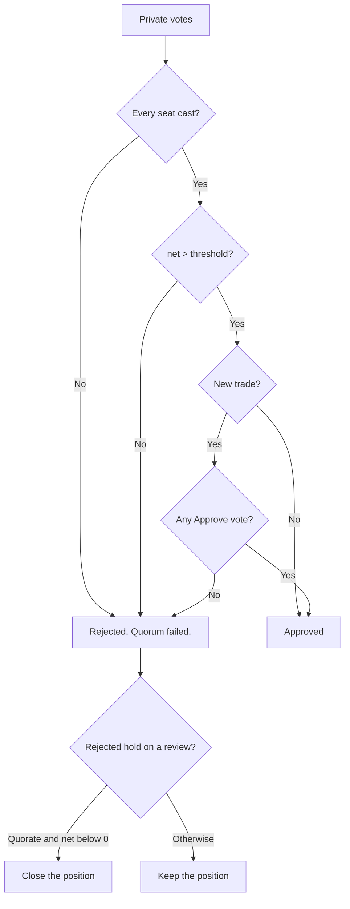

# Votes to Verdict

How the room's votes become a verdict, a size, and an order. Deterministic C# in
`VoteTally` and `WarRoomAgent`. No model touches it.




```text
net = Σ(+confidence approve, −confidence reject, 0 abstain) ÷ every voter

approved  = quorum met AND net > threshold AND (approvals > 0 for a new trade)
size      = approved ? clamp(net, 0, 1) : 0
contracts = approved ? clamp(round(desired × size), 1, desired) : 0
```

**The verdict is `Approved`, never the size.** The two are separate because a negative
threshold clears a proposal whose conviction is below zero, while the size floors at zero:
nothing may size up on negative conviction. Reading the verdict from the size therefore turned
every such approval back into a rejection and made a negative threshold impossible to use. A
cleared proposal always trades at least one contract, and never more than the proposer asked
for.

A faulted voter dilutes conviction rather than vanishing, so a half-broken room cannot look
unanimous, and under `RequireEveryVoter` a fault rejects outright whatever the threshold.

**A broken seat therefore closes the door for the whole session.** On 2026-09-03 two seats
failed on every call. Seven complete sittings were rejected as `1 approve, 0 reject, 1 abstain,
2 faulted`, and each row was stored with the code `ROOM_VOTE`. The rule is correct: a half-broken
room must not trade. The report is wrong, because a quorum failure is not an opinion about the
contract, and nothing stopped the room from sitting again. See
[session results](../operations/session-results.md) and
[improvements](../plans/improvements.md).

### Two thresholds, not one

| Purpose | Compiled default | Flag | Value used in every measured session |
|---|---|---|---|
| New trade | `0` | `--new-trade-approve-threshold` | `-0.15` |
| Position review | `0`, fixed | none | `0` |

**The compiled default is 0, not -0.15.** `Program.cs` starts `newTradeThreshold` at `0m` and
only the flag lowers it. `Properties/launchSettings.json` passes `-0.15`, so every session in
[session results](../operations/session-results.md) ran under a negative threshold that no
default reproduces. The examples below use `-0.15` for that reason. Which of the two becomes the
standing value is an open decision. See [improvements](../plans/improvements.md).

They are separate because one number moves both doors at once. A bar low enough to open a
position on weak conviction is equally low for the sitting that decides to close it, so the
room could flatten the position it had just opened. Closing needs a real majority.

At `-0.15` with four voters, one reject at 0.50 confidence still clears, one at 0.60 does not,
and two rejects never do. An abstention lowers conviction without blocking, which is what the
reviewer standard asks a weak objection to become. `RiskGuard` still judges the trade
afterwards and cannot be outvoted.

### An open also needs an approving seat

A negative threshold is cleared by a room that says nothing at all: four abstentions give a net
of exactly zero. On 2026-09-02 that opened META for 1,392 USD on `0 approve, 0 reject,
4 abstain`, and the log shows two seats sending `vote: abstain, confidence: 0,
profit_probability: 0.41`. The room bought a trade that nobody was for and that its own seats
gave 41 percent odds.

The threshold and the rule answer different questions. The threshold asks how much conviction
against is tolerable. The rule asks whether anybody was for it.

| Room | Net | Threshold | Verdict |
|---|---|---|---|
| 4 abstain | 0.00 | -0.15 | Rejected. No seat approved. |
| 1 approve at 0.50, 3 abstain | 0.125 | -0.15 | Approved, one contract. |
| 1 approve at 0.50, 2 reject at 0.90 | -0.325 | -0.15 | Rejected on conviction. |

`WarRoomOptions.RequireApprovalToOpen` carries the rule and is true. It applies to a new trade
only: a close must stay easy to authorise, so a position review is decided by its threshold
alone. Note that `ExposureRiskPersona` can only reject or abstain, so the approving seat is
always one of the three LLM reviewers.

### A rejected hold closes the position

A position review that proposes nothing is a hold. A rejected hold used to leave the position
open, so on 2026-09-02 the room rejected the META hold `0 approve, 3 reject` at a net of -0.53,
two seats wrote the exit arithmetic, and no order was sent. The room's own conclusion could not
reach the broker.

`WarRoomAgent` now returns a close for the reviewed position. Every condition is a guard:

- the purpose is a position review, and the proposal traded nothing;
- the verdict is `Rejected`, never `NoProposal` or `PreValidationRejected`;
- quorum was met and no seat faulted, because `RequireEveryVoter` also turns one broken seat
  into a rejection and a half-broken room must never sell the book;
- the net is below zero, so a 0.00 tie holds rather than closes.

A proposer withdrawal produces an empty tally, which fails the quorum condition and cannot
escalate.

`--approve-threshold` no longer exists. It fails startup rather than defaulting to 0 silently,
because there is no unknown-argument check and 0 is exactly the setting that opened nothing.

## Related lodes

- [War-room summary](summary.md)
- [Persona contracts](../llm/persona-contracts.md)
- [Live cycle](../trading/live-cycle.md)
- [Session results](../operations/session-results.md)
